# Candidate photography — review before any of this ships

**Generated by `npm run images:review-candidates`. Do not edit by hand.**

None of these photographs is published. They are staged in
`assets/recipe-candidates/`, which the app does not bundle and does not index.
A staged photograph reaches a recipe card only through `npm run images:promote`,
by name, after its recipe exists.

**A photograph passing the automatic checks does not prove it depicts the right
dish.** The checks read a title, a licence, a category and a pixel count. They
cannot see the picture. `data/images/rejected.json` is the record of what that
misses: an aerial view of the Turkish town of Menemen for the dish named after
it, a grape vine for stuffed vine leaves, breaded oysters for scrambled eggs.
Every one passed every automatic test.

### To reject one

Add its Commons title to `data/images/rejected.json` with the reason, delete the
staged file and its manifest entry, and re-run the acquisition. The refusal is
permanent, applies to production as well, and both validators refuse a manifest
that contains a refused file.

## batch-1-small-pantry

24 dishes that are genuinely five ingredient lines or fewer — counting every line, including salt and oil. The catalogue has FOUR of those against a target of about 44, and a short list is the strongest predictor of a recipe a real Egyptian kitchen can actually reach: the dataset audit finds 0 or 1 exact matches for a three-item pantry today. No recipe is written yet. These are dish identities, sent to the photography preflight first, so that the recipes get written for the dishes that can honestly be illustrated rather than the other way round.

**24 candidates: 11 reviewed and shipped, 13 waiting to be looked at, 0 with nothing acceptable.**

### Already promoted (11)

Reviewed, written as recipes, and now on a card. Their photographs live in
`assets/recipes/` and are validated by `npm run images:check`.

| Dish | Creator | Licence |
|---|---|---|
| Warm Sahlab with Pistachios (`sahlab`) | DesignbyNur | CC-BY-SA-3.0 |
| Roasted Sweet Potato (`batata-mashwiya`) | 국립국어원 | CC-BY-SA-2.0 |
| Tahini Sauce with Lemon (`salatet-tahina`) | Gilabrand | CC-BY-SA-3.0 |
| Honey-Soaked Dough Balls (`lokmet-el-qadi`) | Aldousari | CC-BY-SA-3.0 |
| Peanut and Sesame Dukkah (`dukkah-baladi`) | Miansari66 | CC0-1.0 |
| Fresh Lemonade with Mint (`aseer-limon`) | HarshLight | CC-BY-2.0 |
| Tomato Soup (`shorbet-tamatem`) | Ella Olsson from Stockholm, Sweden | CC-BY-2.0 |
| Grilled Halloumi with Lemon (`grilled-halloumi`) | Unknown | CC-BY-SA-3.0 |
| Olive Oil Flatbread (`focaccia`) | Fred Benenson | CC-BY-SA-4.0 |
| Garlic Butter Bread (`garlic-bread`) | Popo le Chien | CC-BY-SA-3.0 |
| French Toast (`french-toast`) | Jonathunder | CC-BY-SA-3.0 |

### Hibiscus Tea · كركديه

`karkade` · egyptian · `hibiscus`, `water`, `sugar`

Three ingredients, drunk hot in winter and iced all summer, and in almost every Egyptian house during Ramadan. Nothing in the catalogue covers it.

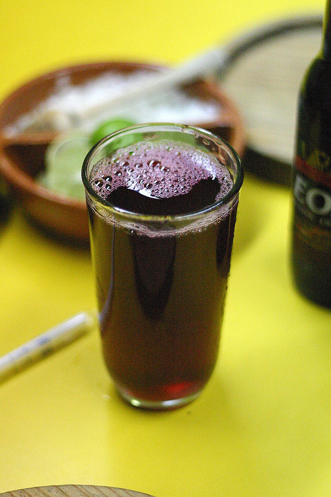

| | |
|---|---|
| Creator | stu_spivack |
| Licence | CC-BY-SA-2.0 |
| Attribution | stu_spivack · CC-BY-SA-2.0 · Wikimedia Commons |
| Source | https://commons.wikimedia.org/wiki/File:Homemade_sorrel_drink.jpg |
| Size | 1000×1507, 211 KB |

- [ ] This is a photograph of this dish, and I would put it on the card.

### Apricot Nectar · قمر الدين

`qamar-el-din` · egyptian · `dried-apricot`, `water`, `sugar`

The Ramadan drink, from the apricot sheet sold by the kilo. The ingredient row is literally named qamar el din and nothing cooks with it.

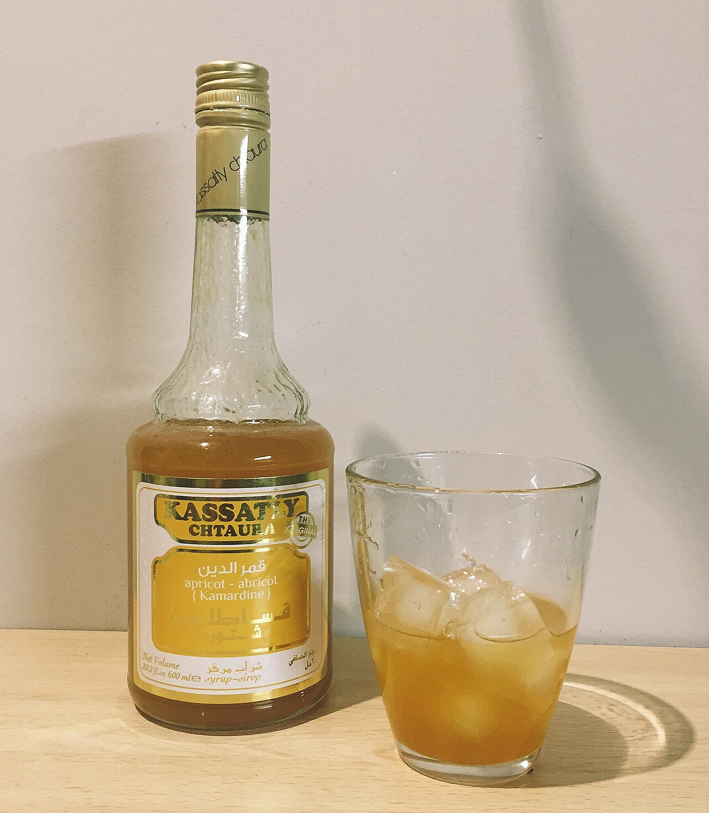

| | |
|---|---|
| Creator | Joe Mabel |
| Licence | CC-BY-SA-3.0 |
| Attribution | Joe Mabel · CC-BY-SA-3.0 · Wikimedia Commons |
| Source | https://commons.wikimedia.org/wiki/File:Syrian_apricot_paste_01.jpg |
| Size | 1000×664, 321 KB |

- [ ] This is a photograph of this dish, and I would put it on the card.

### Wheat Berries in Sweet Milk · بليلة

`belila` · egyptian · `wheat-berries`, `milk`, `sugar`, `cinnamon`

Breakfast and a Mawlid sweet. Four lines, one pot, and the cheapest hot breakfast in the catalogue if it lands. No image at all on the first pass; this is the one alternative-name attempt before it is deferred. `ashure` is the Turkish dish of the same wheat, which Commons does have a category for.

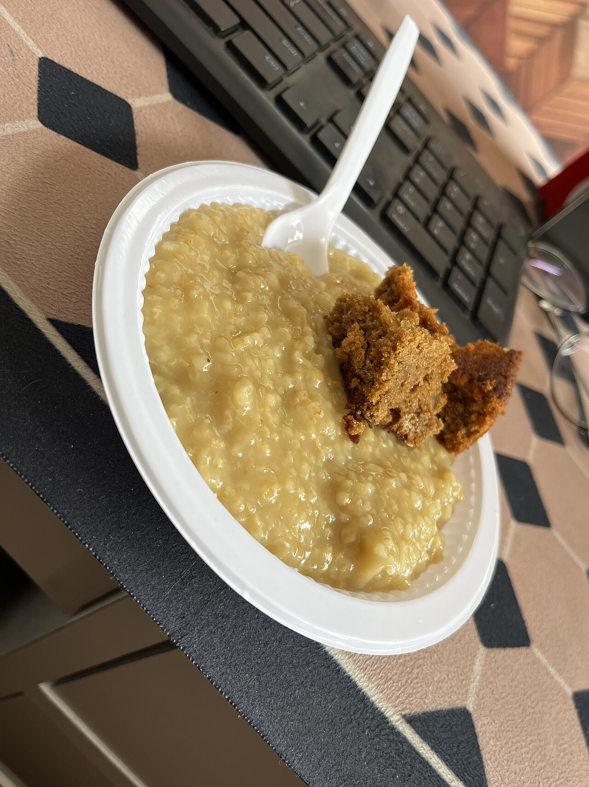

| | |
|---|---|
| Creator | Mnv179 |
| Licence | CC-BY-SA-4.0 |
| Attribution | Mnv179 · CC-BY-SA-4.0 · Wikimedia Commons |
| Source | https://commons.wikimedia.org/wiki/File:Roat_-_A_Punjabi_dish_served_with_daliya(cracked_wheat_porridge).jpg |
| Size | 1000×1333, 419 KB |

- [ ] This is a photograph of this dish, and I would put it on the card.

### Grilled Corn on the Cob · ذرة مشوية

`dura-mashwiya` · egyptian · `corn`, `butter`, `salt`, `lemon`

Street food on every corniche in the country, and four ingredients.

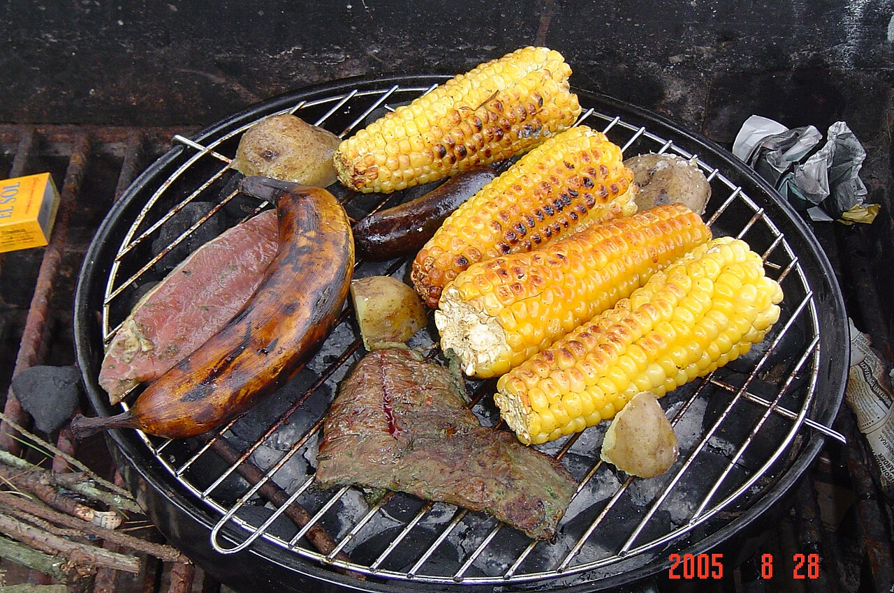

| | |
|---|---|
| Creator | 100yen |
| Licence | CC-BY-SA-3.0 |
| Attribution | 100yen · CC-BY-SA-3.0 · Wikimedia Commons |
| Source | https://commons.wikimedia.org/wiki/File:8line_corn.jpg |
| Size | 1000×1500, 775 KB |

- [ ] This is a photograph of this dish, and I would put it on the card.

### Eggs with Basterma · بيض بالبسطرمة

`beid-bel-basterma` · egyptian · `eggs`, `pastrami`, `ghee`, `salt`

The Egyptian breakfast that is worth getting up for, and the only savoury protein dish in this batch. Four lines.

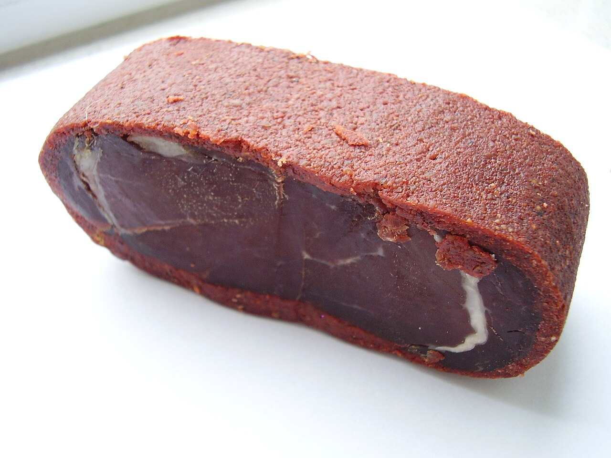

| | |
|---|---|
| Creator | E4024 |
| Licence | CC-BY-SA-4.0 |
| Attribution | E4024 · CC-BY-SA-4.0 · Wikimedia Commons |
| Source | https://commons.wikimedia.org/wiki/File:Past%C4%B1rmal%C4%B1_yumurta.jpg |
| Size | 1000×750, 333 KB |

- [ ] This is a photograph of this dish, and I would put it on the card.

### Pink Pickled Turnips · طرشي لفت

`torshi-lift` · egyptian · `turnip`, `beetroot`, `salt`, `vinegar`, `water`

On the table beside foul and koshari everywhere. Five ingredients and a jar; the beetroot is only there for the colour.

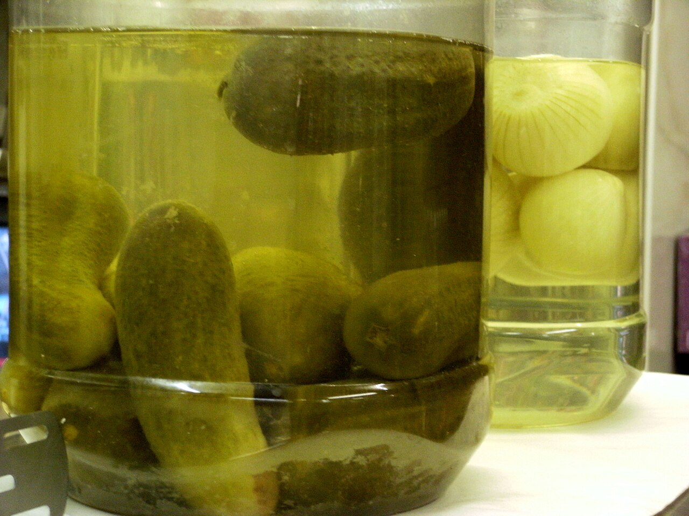

| | |
|---|---|
| Creator | Ankara |
| Licence | CC-BY-SA-3.0 |
| Attribution | Ankara · CC-BY-SA-3.0 · Wikimedia Commons |
| Source | https://commons.wikimedia.org/wiki/File:Pickled_food.JPG |
| Size | 1000×667, 226 KB |

- [ ] This is a photograph of this dish, and I would put it on the card.

### Pasta with Cheese and Pepper · مكرونة بالجبنة والفلفل

`cacio-e-pepe` · italian · `pasta`, `parmesan`, `black-pepper`, `butter`, `salt`

The one pasta in this batch, chosen because it is the shortest honest pasta there is.

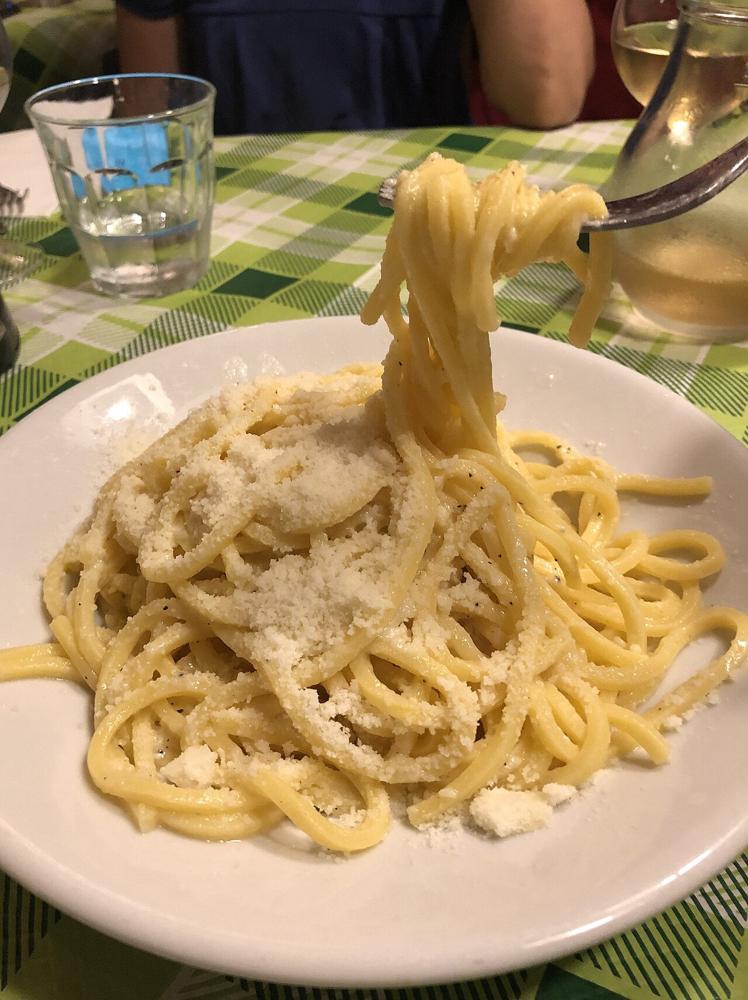

| | |
|---|---|
| Creator | Camelia.boban |
| Licence | CC-BY-SA-4.0 |
| Attribution | Camelia.boban · CC-BY-SA-4.0 · Wikimedia Commons |
| Source | https://commons.wikimedia.org/wiki/File:Tonnarelli_cacio_e_pepe.jpg |
| Size | 1000×750, 160 KB |

- [ ] This is a photograph of this dish, and I would put it on the card.

### Crisp Potato Hash Browns · بطاطس مقرمشة

`hash-browns` · american · `potatoes`, `onions`, `sunflower-oil`, `salt`, `black-pepper`

Potatoes and onions, which is what is in the kitchen when nothing else is.

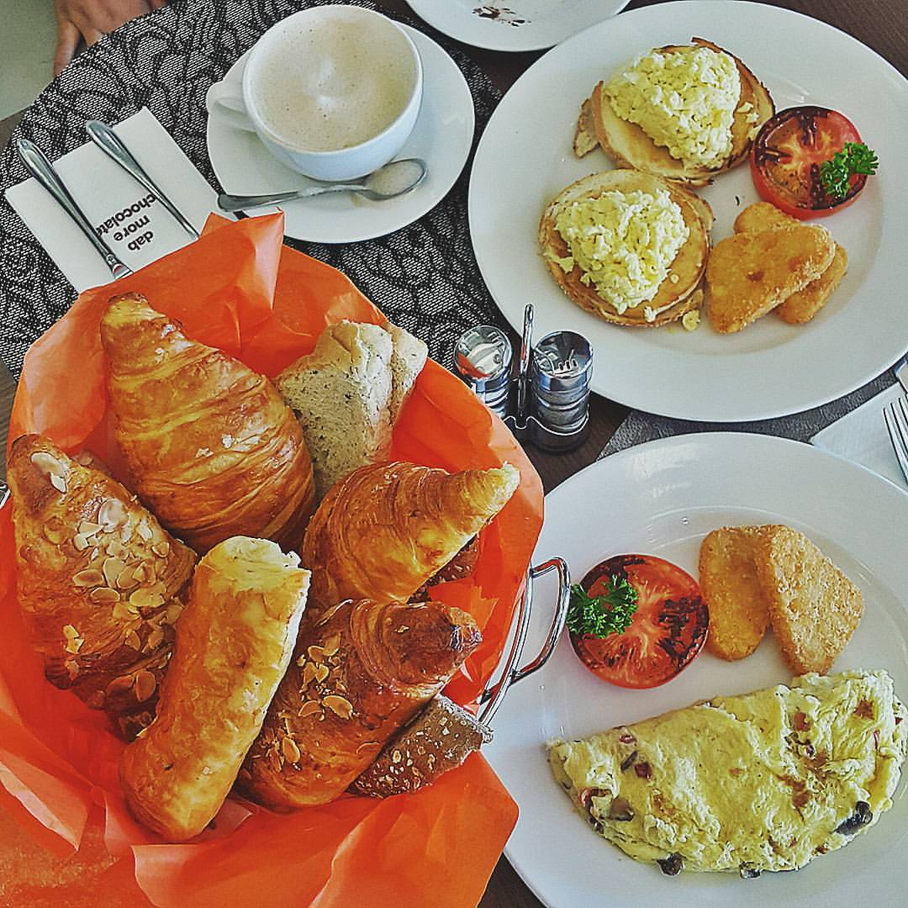

| | |
|---|---|
| Creator | Debbie Tingzon from Doha, Qatar |
| Licence | CC-BY-2.0 |
| Attribution | Debbie Tingzon from Doha, Qatar · CC-BY-2.0 · Wikimedia Commons |
| Source | https://commons.wikimedia.org/wiki/File:American_Breakfast_(28188218105).jpg |
| Size | 1000×1000, 171 KB |

- [ ] This is a photograph of this dish, and I would put it on the card.

### Buttery Mashed Potatoes · بطاطس مهروسة

`mashed-potatoes` · american · `potatoes`, `butter`, `milk`, `salt`, `black-pepper`

The side dish the catalogue has never had, at five lines.

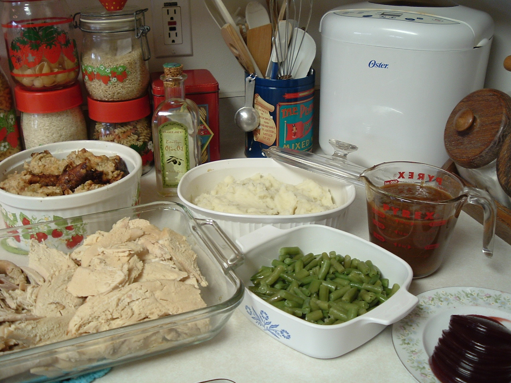

| | |
|---|---|
| Creator | Takeaway |
| Licence | CC-BY-SA-3.0 |
| Attribution | Takeaway · CC-BY-SA-3.0 · Wikimedia Commons |
| Source | https://commons.wikimedia.org/wiki/File:Akha_cuisine_Mochue_tong-uh.JPG |
| Size | 1000×1368, 459 KB |

- [ ] This is a photograph of this dish, and I would put it on the card.

### Mango Yogurt Drink · لاسي المانجو

`mango-lassi` · indian · `mango`, `yogurt`, `milk`, `sugar`, `cardamom`

Egypt grows more mangoes than it knows what to do with between June and September.

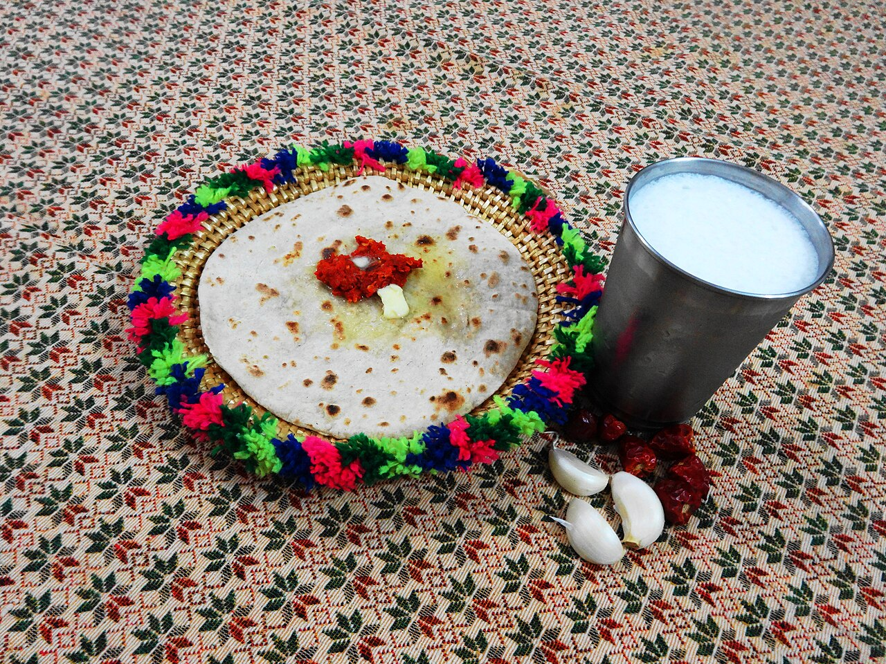

| | |
|---|---|
| Creator | Harshmander Rastogi |
| Licence | CC-BY-SA-4.0 |
| Attribution | Harshmander Rastogi · CC-BY-SA-4.0 · Wikimedia Commons |
| Source | https://commons.wikimedia.org/wiki/File:Banarasi_Lassi.jpg |
| Size | 1000×1238, 442 KB |

- [ ] This is a photograph of this dish, and I would put it on the card.

### Spiced Milk Tea · شاي بالحليب والبهارات

`masala-chai` · indian · `tea`, `milk`, `sugar`, `cardamom`, `cinnamon`

Five pantry items. The tea row is used by nothing at all.

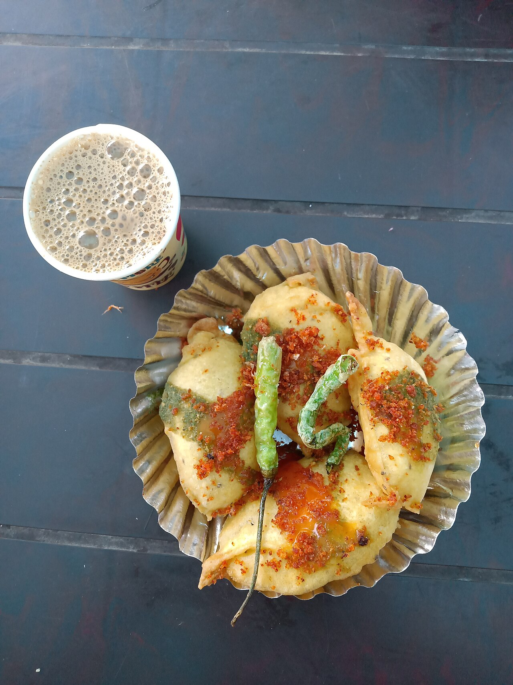

| | |
|---|---|
| Creator | Sumasa |
| Licence | CC-BY-SA-4.0 |
| Attribution | Sumasa · CC-BY-SA-4.0 · Wikimedia Commons |
| Source | https://commons.wikimedia.org/wiki/File:Kolkata_Wayside_Tea_Stall.jpg |
| Size | 1000×1333, 268 KB |

- [ ] This is a photograph of this dish, and I would put it on the card.

### Turkish Coffee · قهوة تركي

`turkish-coffee` · turkish · `coffee`, `water`, `sugar`

Three ingredients and a kanaka. Drunk in Egypt at least as much as in Turkey; tagged Turkish because that is what the dish is called.

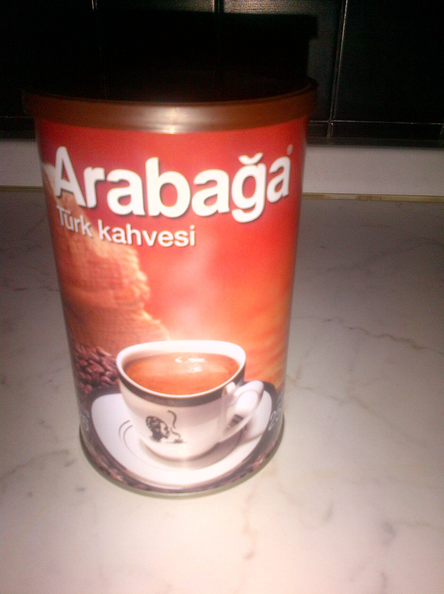

| | |
|---|---|
| Creator | E4024 |
| Licence | CC-BY-SA-4.0 |
| Attribution | E4024 · CC-BY-SA-4.0 · Wikimedia Commons |
| Source | https://commons.wikimedia.org/wiki/File:Arabaga.jpg |
| Size | 1000×1333, 384 KB |

- [ ] This is a photograph of this dish, and I would put it on the card.

### Mashed Spiced Beans · فاصوليا مهروسة

`refried-beans` · mexican · `kidney-beans`, `onions`, `garlic`, `cumin`, `sunflower-oil`

A tin of beans, an onion and a pan. Legumes are the catalogue's joint-largest protein group and this is the cheapest five-line member of it.

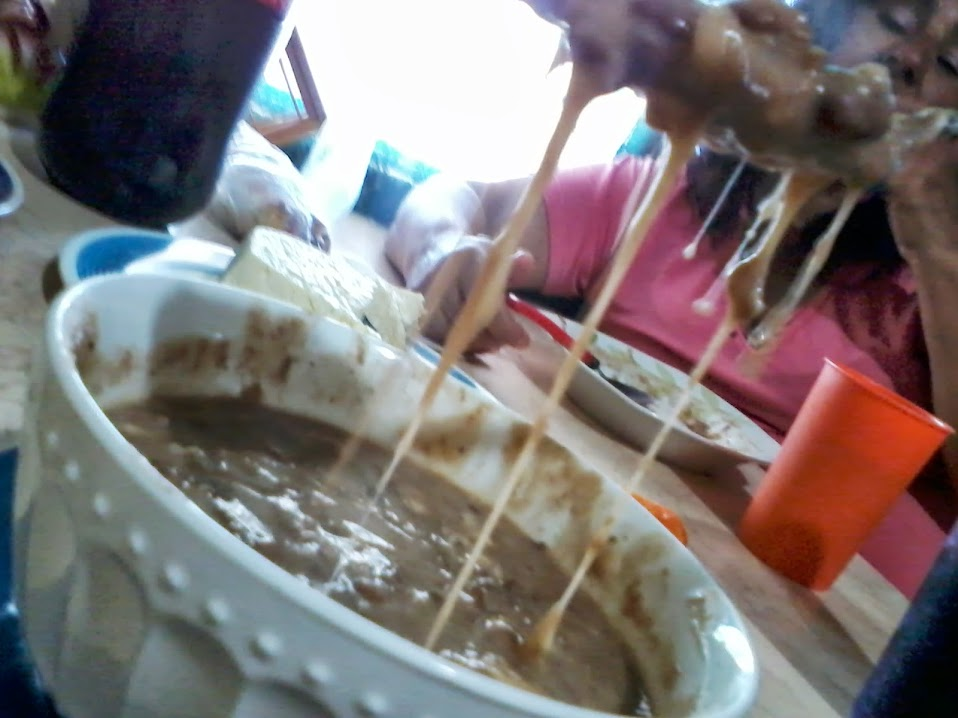

| | |
|---|---|
| Creator | Vegan Feast Catering |
| Licence | CC-BY-2.0 |
| Attribution | Vegan Feast Catering · CC-BY-2.0 · Wikimedia Commons |
| Source | https://commons.wikimedia.org/wiki/File:Refried_Black_Beans_(4646266085).jpg |
| Size | 1000×1333, 446 KB |

- [ ] This is a photograph of this dish, and I would put it on the card.

## batch-2-short-mains

17 new dishes to go with the 13 batch-1 candidates being re-attempted, making 30. Batch 1 converted 11 of 24, and it leaned heavily on drinks, sides and sweets; this one is weighted toward things a household actually eats for lunch and dinner, and toward Egyptian, because the catalogue is 25.0% Egyptian against a ≥30% goal. Nine of the seventeen are Egyptian and none is an invented Egyptian variant of a foreign dish. Protein spread is deliberate: liver, sausage, whole chicken, eggs, white cheese and chicken breast rather than another round of the same three. Every list is five lines or fewer counting water, salt and oil.

**17 candidates: 0 reviewed and shipped, 15 waiting to be looked at, 2 with nothing acceptable.**

### Macaroni in Red Sauce · مكرونة بالصلصة

`makarona-bel-salsa` · egyptian · `pasta`, `tomato-paste`, `garlic`, `sunflower-oil`, `salt`

Probably the most-cooked weeknight dinner in Egypt and the catalogue does not have it. Distinct from pasta-pomodoro: this is tomato PASTE fried with garlic, not fresh tomatoes and basil.

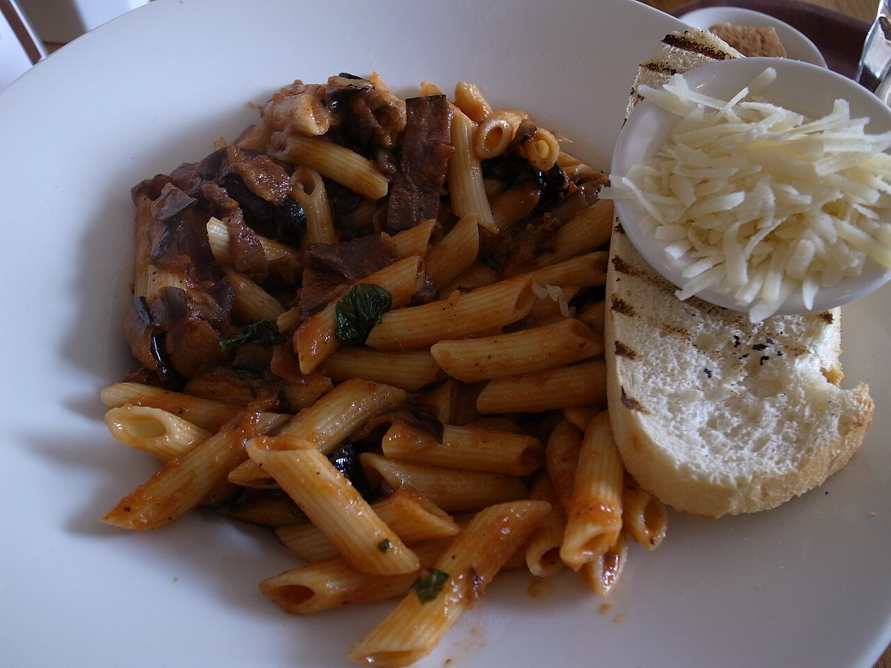

| | |
|---|---|
| Creator | pelican from Tokyo, Japan |
| Licence | CC-BY-SA-2.0 |
| Attribution | pelican from Tokyo, Japan · CC-BY-SA-2.0 · Wikimedia Commons |
| Source | https://commons.wikimedia.org/wiki/File:Pasta_with_tomato_sauce_(6178622998).jpg |
| Size | 1000×750, 194 KB |

- [ ] This is a photograph of this dish, and I would put it on the card.

### Rice with Vermicelli · رز بالشعرية

`roz-bel-shareya` · egyptian · `rice`, `vermicelli`, `sunflower-oil`, `salt`, `water`

The base under half the Egyptian dinners in the catalogue, and it has never been a recipe of its own. The vermicelli row is used by almost nothing.

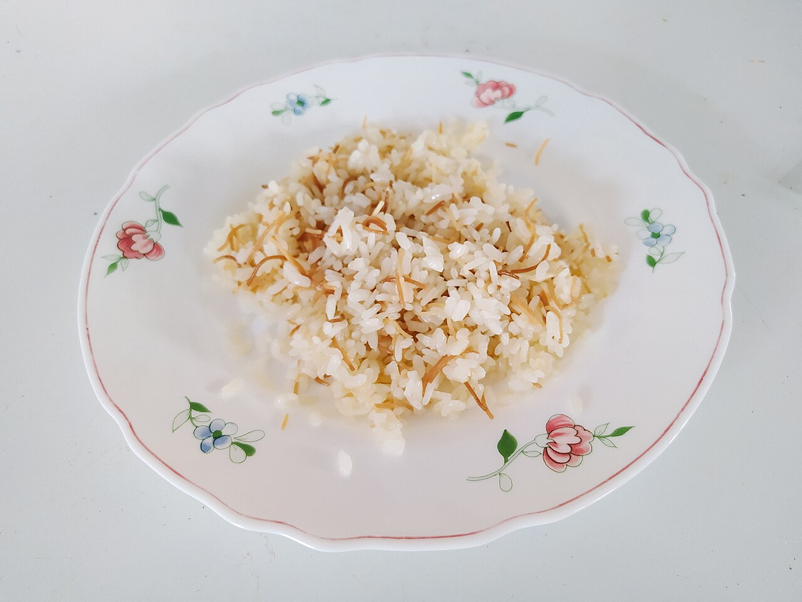

| | |
|---|---|
| Creator | El Mono Español |
| Licence | CC-BY-SA-4.0 |
| Attribution | El Mono Español · CC-BY-SA-4.0 · Wikimedia Commons |
| Source | https://commons.wikimedia.org/wiki/File:Arabic_rice.jpg |
| Size | 1000×750, 136 KB |

- [ ] This is a photograph of this dish, and I would put it on the card.

### Alexandrian Liver · كبدة اسكندراني

`kebda-eskandarani` · egyptian · `liver`, `garlic`, `chili-flakes`, `sunflower-oil`, `salt`

The Alexandria sandwich. Nothing in the catalogue uses the liver row, and offal is a protein group with no representation at all.

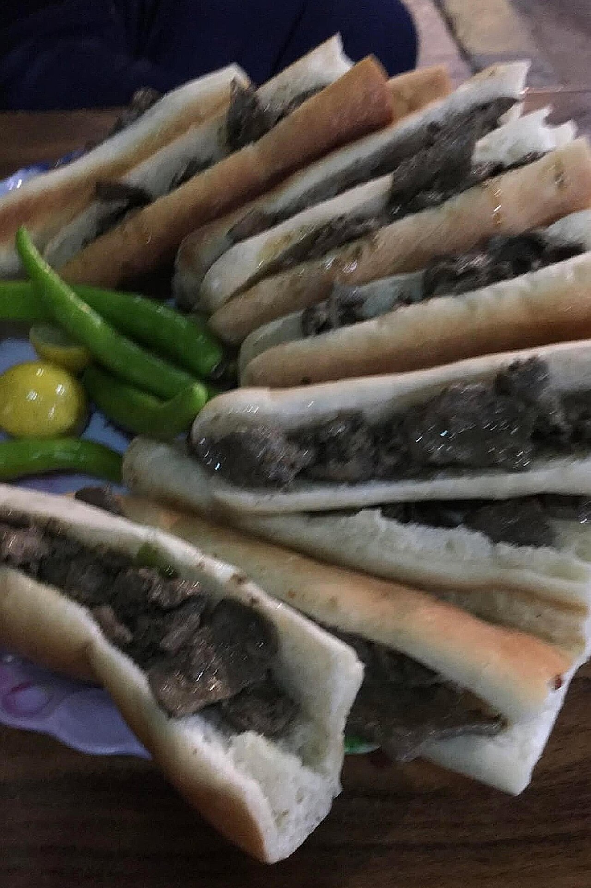

| | |
|---|---|
| Creator | Turnopoems |
| Licence | CC-BY-SA-4.0 |
| Attribution | Turnopoems · CC-BY-SA-4.0 · Wikimedia Commons |
| Source | https://commons.wikimedia.org/wiki/File:Kebda_eskandarani.jpg |
| Size | 1000×1502, 395 KB |

- [ ] This is a photograph of this dish, and I would put it on the card.

### Whole Chicken in the Oven with Cumin · فراخ في الفرن بالكمون

`firakh-bel-forn` · egyptian · `whole-chicken`, `cumin`, `lemon`, `sunflower-oil`, `salt`

Friday lunch. The whole-chicken row was added in Stage 2A specifically because a whole bird is not chicken breast, and no recipe has ever used it.

| | |
|---|---|
| Creator | JürnC |
| Licence | CC-BY-SA-3.0 |
| Attribution | JürnC · CC-BY-SA-3.0 · Wikimedia Commons |
| Source | https://commons.wikimedia.org/wiki/File:Broiler-Bar.jpg |
| Size | 1000×792, 293 KB |

- [ ] This is a photograph of this dish, and I would put it on the card.

### Eggs Scrambled with Tomato · بيض بالطماطم

`beid-bel-tamatem` · egyptian · `eggs`, `tomatoes`, `sunflower-oil`, `salt`

Four lines and it is dinner when there is nothing in the house. Distinct from shakshuka, which keeps the yolks whole and adds peppers and cheese.

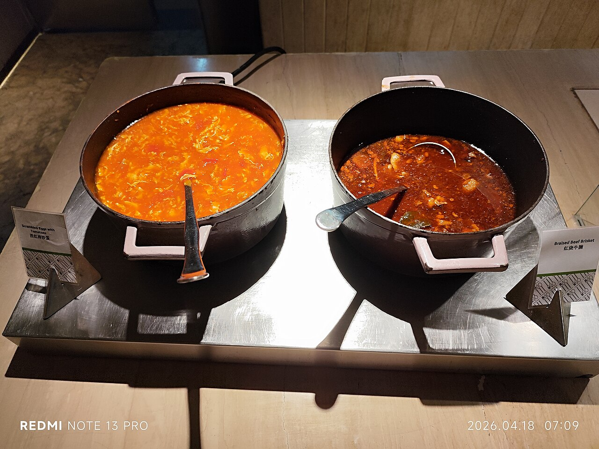

| | |
|---|---|
| Creator | LANENWM Meso Amermbalin |
| Licence | CC0-1.0 |
| Attribution | _none required_ |
| Source | https://commons.wikimedia.org/wiki/File:GD_%E5%BB%A3%E6%9D%B1_Guangdong_%E6%B2%B3%E6%BA%90%E5%B8%82_HeYuan_%E8%B6%8A%E7%8E%8B%E5%A4%A7%E9%81%93_YueWang_Avenue_Double_Tree_by_Hilton_Hotel_Open_Cafe_n_Restaurant_%E6%97%A9%E9%A4%90_breakfast_food_buffet_scrambled_egg_with_tomato_April_2026_N13P.jpg |
| Size | 1000×750, 273 KB |

- [ ] This is a photograph of this dish, and I would put it on the card.

### Fried Aubergine with Garlic and Vinegar · باذنجان مقلي بالتوم والخل

`betingan-mely` · egyptian · `eggplant`, `sunflower-oil`, `garlic`, `vinegar`, `salt`

A mezze plate in every Egyptian home, and cheap. The vinegar-and-garlic dressing is what makes it Egyptian rather than generic fried aubergine.

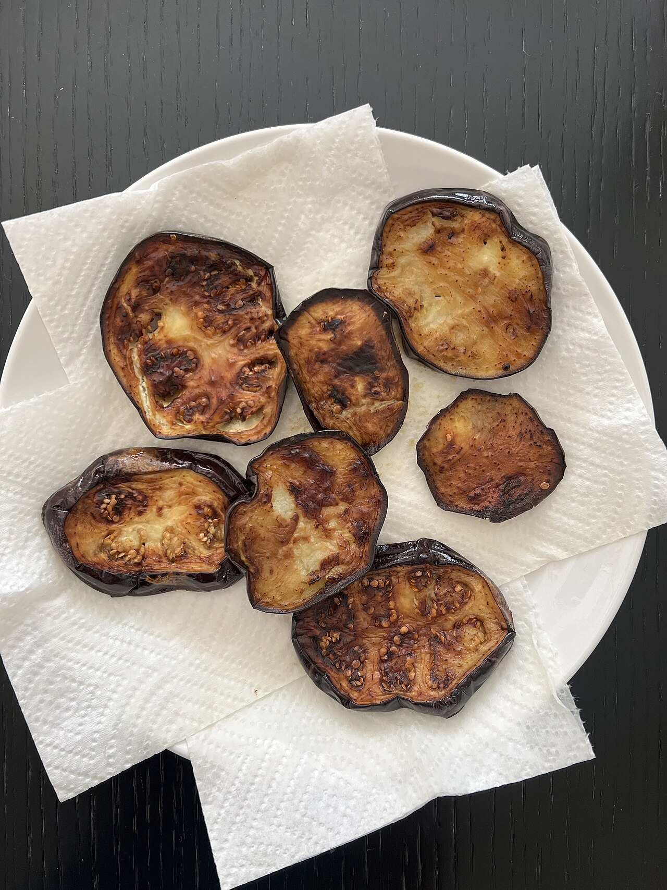

| | |
|---|---|
| Creator | Timo Tijhof |
| Licence | CC-BY-4.0 |
| Attribution | Timo Tijhof · CC-BY-4.0 · Wikimedia Commons |
| Source | https://commons.wikimedia.org/wiki/File:Berenjenas_con_Miel.jpg |
| Size | 1000×1060, 359 KB |

- [ ] This is a photograph of this dish, and I would put it on the card.

### Cheese Sambousek · سمبوسك بالجبنة

`sambousek` · egyptian · `phyllo`, `white-cheese`, `eggs`, `sunflower-oil`

Ramadan table, four lines. Uses bought phyllo, which is what an Egyptian kitchen actually does.

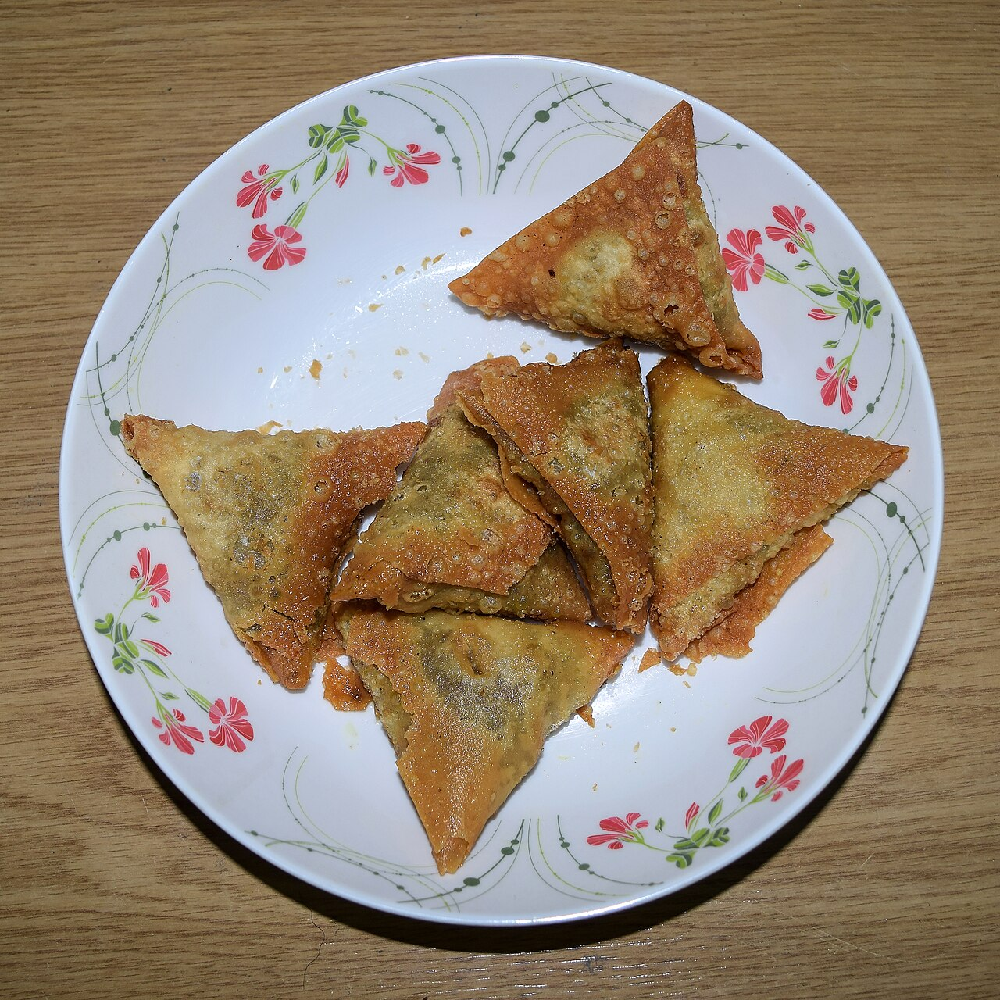

| | |
|---|---|
| Creator | Moheen Reeyad |
| Licence | CC-BY-SA-4.0 |
| Attribution | Moheen Reeyad · CC-BY-SA-4.0 · Wikimedia Commons |
| Source | https://commons.wikimedia.org/wiki/File:Samosas,_snack_food_at_Wikipedia%27s_16th_Birthday_celebration_in_Chittagong_(01).jpg |
| Size | 1000×1000, 451 KB |

- [ ] This is a photograph of this dish, and I would put it on the card.

### Spanish Potato Omelette · عجة البطاطس الإسبانية

`tortilla-espanola` · mediterranean · `potatoes`, `eggs`, `onions`, `olive-oil`, `salt`

Five lines, feeds four, keeps cold. One of the best cheap mains there is and the Commons category is enormous.

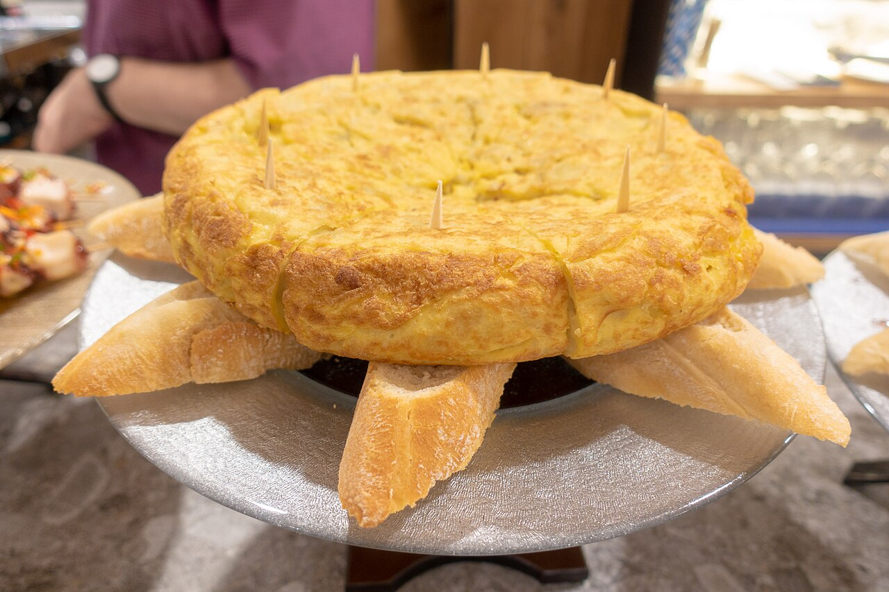

| | |
|---|---|
| Creator | Kent Wang |
| Licence | CC-BY-SA-2.0 |
| Attribution | Kent Wang · CC-BY-SA-2.0 · Wikimedia Commons |
| Source | https://commons.wikimedia.org/wiki/File:Tortilla_de_patata_-_San_Sebasti%C3%A1n.jpg |
| Size | 1000×667, 212 KB |

- [ ] This is a photograph of this dish, and I would put it on the card.

### Lemon and Oregano Chicken Skewers · أسياخ فراخ بالليمون والزعتر

`chicken-souvlaki` · mediterranean · `chicken-breast`, `olive-oil`, `lemon`, `oregano`, `garlic`

Five lines, and close enough to shish tawook that an Egyptian cook already owns everything in it.

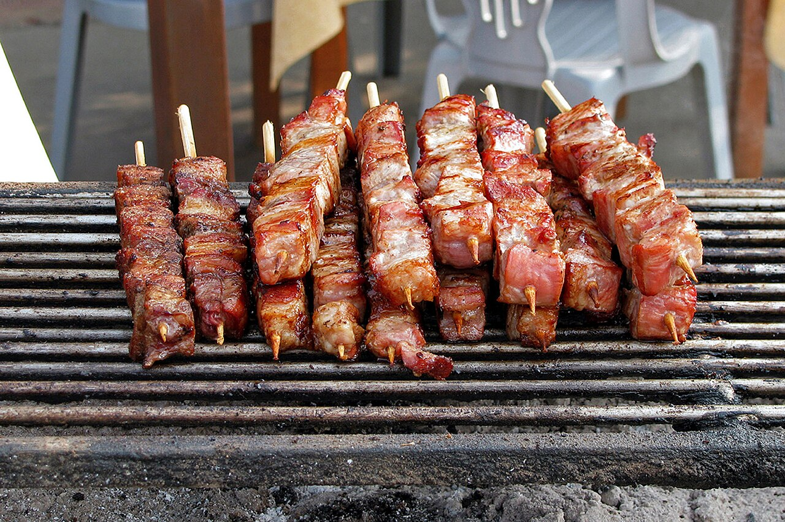

| | |
|---|---|
| Creator | EntaXoyas |
| Licence | CC-BY-SA-3.0 |
| Attribution | EntaXoyas · CC-BY-SA-3.0 · Wikimedia Commons |
| Source | https://commons.wikimedia.org/wiki/File:%CE%95%CE%BB%CE%BB%CE%B7%CE%BD%CE%B9%CE%BA%CF%8C_%CE%A3%CE%BF%CF%85%CE%B2%CE%BB%CE%AC%CE%BA%CE%B9_-_panoramio.jpg |
| Size | 1000×667, 398 KB |

- [ ] This is a photograph of this dish, and I would put it on the card.

### Greek Spinach Rice · رز بالسبانخ

`spanakorizo` · mediterranean · `spinach`, `rice`, `onions`, `olive-oil`, `lemon`

A one-pot vegan main at five lines. The catalogue's vegan mains are mostly legumes.

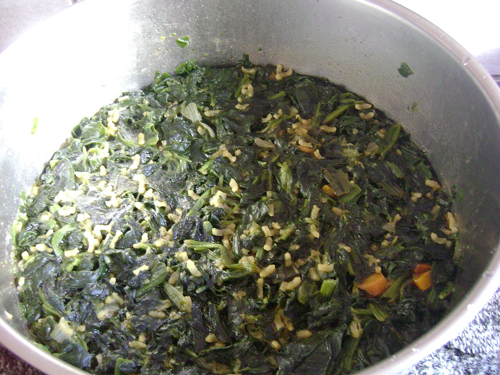

| | |
|---|---|
| Creator | KaterinaStrak |
| Licence | CC-BY-SA-4.0 |
| Attribution | KaterinaStrak · CC-BY-SA-4.0 · Wikimedia Commons |
| Source | https://commons.wikimedia.org/wiki/File:Spanakorizo.jpg |
| Size | 1000×750, 358 KB |

- [ ] This is a photograph of this dish, and I would put it on the card.

### Yogurt Flatbread · خبز النان

`naan` · indian · `flour`, `yogurt`, `yeast`, `salt`, `ghee`

Five pantry lines and a hot pan. No oven needed, which matters in a kitchen that may not have one.

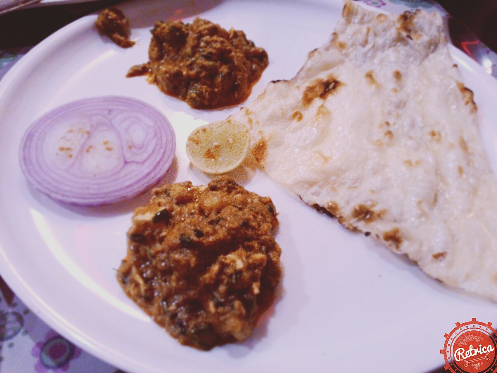

| | |
|---|---|
| Creator | Alpha from Melbourne, Australia |
| Licence | CC-BY-SA-2.0 |
| Attribution | Alpha from Melbourne, Australia · CC-BY-SA-2.0 · Wikimedia Commons |
| Source | https://commons.wikimedia.org/wiki/File:AUD9_Buffet_-_Green_Pepper_(2110184894).jpg |
| Size | 1000×750, 333 KB |

- [ ] This is a photograph of this dish, and I would put it on the card.

### Crumbed Chicken Cutlet · فراخ بانيه

`chicken-katsu` · asian · `chicken-breast`, `breadcrumbs`, `eggs`, `flour`, `sunflower-oil`

This is بانيه — one of the most ordered things in Egypt — and the catalogue has no crumbed cutlet at all. Tagged asian because the dish is katsu; the Egyptian name is in the title.

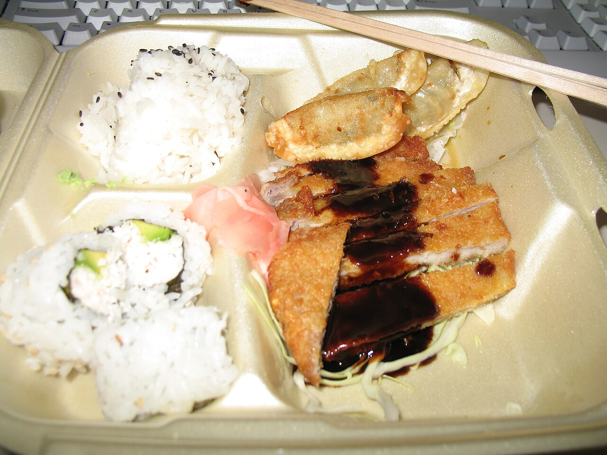

| | |
|---|---|
| Creator | Andy Li |
| Licence | CC0-1.0 |
| Attribution | _none required_ |
| Source | https://commons.wikimedia.org/wiki/File:Chicken_katsu_curry_rice_-_Korpan.jpg |
| Size | 1000×1333, 491 KB |

- [ ] This is a photograph of this dish, and I would put it on the card.

### Cabbage and Carrot Slaw · سلطة كول سلو

`coleslaw` · american · `cabbage`, `carrots`, `mayonnaise`, `vinegar`, `salt`

Sold beside every roast chicken in Egypt. Five lines, no cooking, keeps for days.

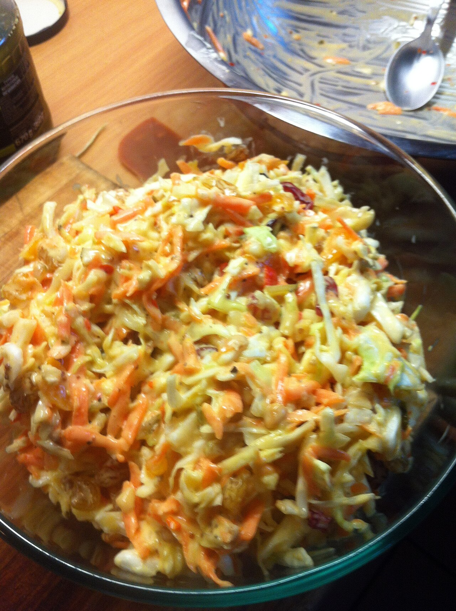

| | |
|---|---|
| Creator | Boston at English Wikipedia John Stephen Dwyer |
| Licence | CC-BY-SA-3.0 |
| Attribution | Boston at English Wikipedia John Stephen Dwyer · CC-BY-SA-3.0 · Wikimedia Commons |
| Source | https://commons.wikimedia.org/wiki/File:Bartley%27s.jpg |
| Size | 1000×750, 335 KB |

- [ ] This is a photograph of this dish, and I would put it on the card.

### Potato and Egg Salad · سلطة بطاطس بالبيض

`potato-salad` · american · `potatoes`, `eggs`, `mayonnaise`, `parsley`, `salt`

Cheap, filling, and the Commons category is very large.

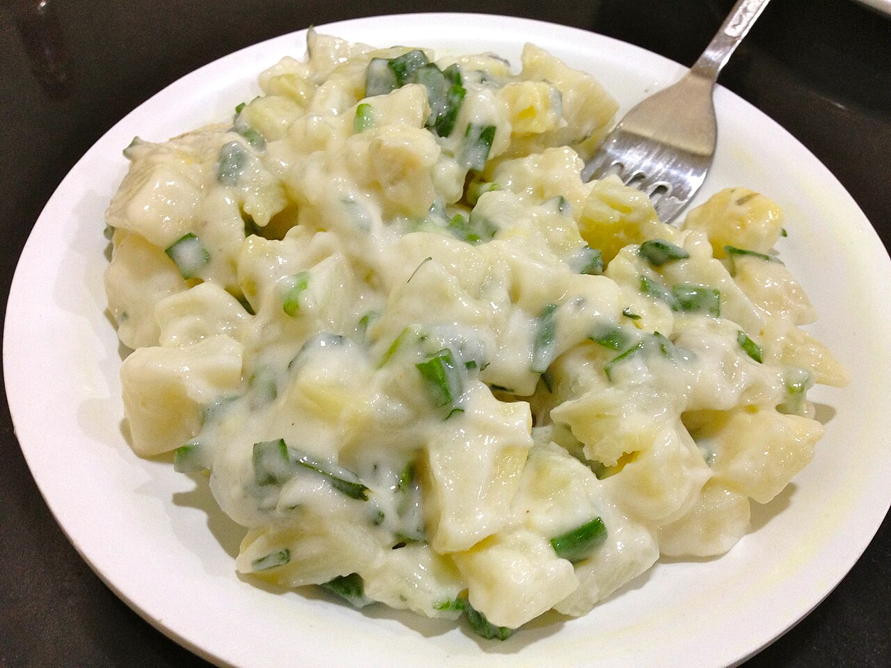

| | |
|---|---|
| Creator | SajjadF |
| Licence | CC-BY-SA-3.0 |
| Attribution | SajjadF · CC-BY-SA-3.0 · Wikimedia Commons |
| Source | https://commons.wikimedia.org/wiki/File:Potato_salad_(1).jpg |
| Size | 1000×750, 240 KB |

- [ ] This is a photograph of this dish, and I would put it on the card.

### Pocket Flatbread · عيش شامي

`pita-bread` · levantine · `flour`, `water`, `yeast`, `salt`, `sunflower-oil`

Five lines, nothing perishable, and it is the bread half the levantine recipes in the catalogue assume you have.

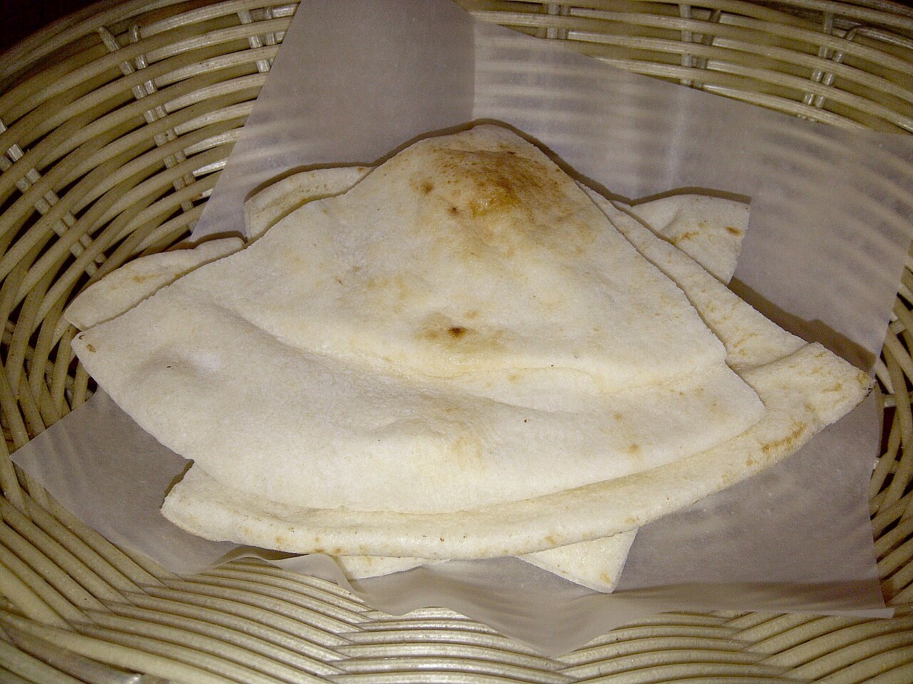

| | |
|---|---|
| Creator | Azure Dragon of the East |
| Licence | CC-BY-SA-3.0 |
| Attribution | Azure Dragon of the East · CC-BY-SA-3.0 · Wikimedia Commons |
| Source | https://commons.wikimedia.org/wiki/File:Pita_Bread.jpg |
| Size | 1000×750, 339 KB |

- [ ] This is a photograph of this dish, and I would put it on the card.

### No acceptable image (2)

These keep nothing. A generic photograph of something else is not a
substitute — it tells the user something false about what they are cooking.

| Dish | Why |
|---|---|
| Egyptian Sausage in Tomato (`sogo2-bel-salsa`) | no relevant openly-licensed image found |
| White Cheese with Tomato and Mint (`gibna-bel-tamatem`) | no relevant openly-licensed image found |

