# Candidate photography — review before any of this ships

**Generated by `npm run images:review-candidates`. Do not edit by hand.**

None of these photographs is published. They are staged in
`assets/recipe-candidates/`, which the app does not bundle and does not index.
A staged photograph reaches a recipe card only through `npm run images:promote`,
by name, after its recipe exists.

**A photograph passing the automatic checks does not prove it depicts the right
dish.** The checks read a title, a licence, a category and a pixel count. They
cannot see the picture. `data/images/rejected.json` is the record of what that
misses: an aerial view of the Turkish town of Menemen for the dish named after
it, a grape vine for stuffed vine leaves, breaded oysters for scrambled eggs.
Every one passed every automatic test.

### To reject one

Add its Commons title to `data/images/rejected.json` with the reason, delete the
staged file and its manifest entry, and re-run the acquisition. The refusal is
permanent, applies to production as well, and both validators refuse a manifest
that contains a refused file.

## batch-1-small-pantry

24 dishes that are genuinely five ingredient lines or fewer — counting every line, including salt and oil. The catalogue has FOUR of those against a target of about 44, and a short list is the strongest predictor of a recipe a real Egyptian kitchen can actually reach: the dataset audit finds 0 or 1 exact matches for a three-item pantry today. No recipe is written yet. These are dish identities, sent to the photography preflight first, so that the recipes get written for the dishes that can honestly be illustrated rather than the other way round.

**24 candidates: 15 reviewed and shipped, 0 waiting to be looked at, 9 with nothing acceptable.**

### Already promoted (15)

Reviewed, written as recipes, and now on a card. Their photographs live in
`assets/recipes/` and are validated by `npm run images:check`.

| Dish | Creator | Licence |
|---|---|---|
| Hibiscus Tea (`karkade`) | stu_spivack | CC-BY-SA-2.0 |
| Warm Sahlab with Pistachios (`sahlab`) | DesignbyNur | CC-BY-SA-3.0 |
| Grilled Corn on the Cob (`dura-mashwiya`) | 100yen | CC-BY-SA-3.0 |
| Roasted Sweet Potato (`batata-mashwiya`) | 국립국어원 | CC-BY-SA-2.0 |
| Tahini Sauce with Lemon (`salatet-tahina`) | Gilabrand | CC-BY-SA-3.0 |
| Honey-Soaked Dough Balls (`lokmet-el-qadi`) | Aldousari | CC-BY-SA-3.0 |
| Peanut and Sesame Dukkah (`dukkah-baladi`) | Miansari66 | CC0-1.0 |
| Fresh Lemonade with Mint (`aseer-limon`) | HarshLight | CC-BY-2.0 |
| Tomato Soup (`shorbet-tamatem`) | Ella Olsson from Stockholm, Sweden | CC-BY-2.0 |
| Eggs with Basterma (`beid-bel-basterma`) | E4024 | CC-BY-SA-4.0 |
| Grilled Halloumi with Lemon (`grilled-halloumi`) | Unknown | CC-BY-SA-3.0 |
| Parmesan and Black Pepper Pasta (`parmesan-pepper-pasta`) | Camelia.boban | CC-BY-SA-4.0 |
| Olive Oil Flatbread (`focaccia`) | Fred Benenson | CC-BY-SA-4.0 |
| Garlic Butter Bread (`garlic-bread`) | Popo le Chien | CC-BY-SA-3.0 |
| French Toast (`french-toast`) | Jonathunder | CC-BY-SA-3.0 |

### No acceptable image (9)

These keep nothing. A generic photograph of something else is not a
substitute — it tells the user something false about what they are cooking.

| Dish | Why |
|---|---|
| Apricot Nectar (`qamar-el-din`) | refused on human review — see data/images/rejected.json |
| Wheat Berries in Sweet Milk (`belila`) | refused on human review — see data/images/rejected.json |
| Pink Pickled Turnips (`torshi-lift`) | refused on human review — see data/images/rejected.json |
| Crisp Potato Hash Browns (`hash-browns`) | refused on human review — see data/images/rejected.json |
| Buttery Mashed Potatoes (`mashed-potatoes`) | refused on human review — see data/images/rejected.json |
| Mango Yogurt Drink (`mango-lassi`) | refused on human review — see data/images/rejected.json |
| Spiced Milk Tea (`masala-chai`) | refused on human review — see data/images/rejected.json |
| Turkish Coffee (`turkish-coffee`) | refused on human review — see data/images/rejected.json |
| Mashed Spiced Beans (`refried-beans`) | refused on human review — see data/images/rejected.json |

## batch-2-short-mains

17 new dishes to go with the 13 batch-1 candidates being re-attempted, making 30. Batch 1 converted 11 of 24, and it leaned heavily on drinks, sides and sweets; this one is weighted toward things a household actually eats for lunch and dinner, and toward Egyptian, because the catalogue is 25.0% Egyptian against a ≥30% goal. Nine of the seventeen are Egyptian and none is an invented Egyptian variant of a foreign dish. Protein spread is deliberate: liver, sausage, whole chicken, eggs, white cheese and chicken breast rather than another round of the same three. Every list is five lines or fewer counting water, salt and oil.

**17 candidates: 6 reviewed and shipped, 7 waiting to be looked at, 4 with nothing acceptable.**

### Already promoted (6)

Reviewed, written as recipes, and now on a card. Their photographs live in
`assets/recipes/` and are validated by `npm run images:check`.

| Dish | Creator | Licence |
|---|---|---|
| Rice with Vermicelli (`roz-bel-shareya`) | El Mono Español | CC-BY-SA-4.0 |
| Alexandrian Liver (`kebda-eskandarani`) | Turnopoems | CC-BY-SA-4.0 |
| Spanish Potato Omelette (`tortilla-espanola`) | Kent Wang | CC-BY-SA-2.0 |
| Greek Spinach Rice (`spanakorizo`) | KaterinaStrak | CC-BY-SA-4.0 |
| Potato and Egg Salad (`potato-salad`) | SajjadF | CC-BY-SA-3.0 |
| Pocket Flatbread (`pita-bread`) | Azure Dragon of the East | CC-BY-SA-3.0 |

### Macaroni in Red Sauce · مكرونة بالصلصة

`makarona-bel-salsa` · egyptian · `pasta`, `tomato-paste`, `garlic`, `sunflower-oil`, `salt`

Probably the most-cooked weeknight dinner in Egypt and the catalogue does not have it. Distinct from pasta-pomodoro: this is tomato PASTE fried with garlic, not fresh tomatoes and basil.

| | |
|---|---|
| Creator | 10Rosso |
| Licence | CC-BY-2.0 |
| Attribution | 10Rosso · CC-BY-2.0 · Wikimedia Commons |
| Source | https://commons.wikimedia.org/wiki/File:Pasta_al_pomodoro_2.jpg |
| Size | 1000×750, 285 KB |

- [ ] This is a photograph of this dish, and I would put it on the card.

### Whole Chicken in the Oven with Cumin · فراخ في الفرن بالكمون

`firakh-bel-forn` · egyptian · `whole-chicken`, `cumin`, `lemon`, `sunflower-oil`, `salt`

Friday lunch. The whole-chicken row was added in Stage 2A specifically because a whole bird is not chicken breast, and no recipe has ever used it.

| | |
|---|---|
| Creator | Rajeeb Dutta |
| Licence | CC-BY-SA-4.0 |
| Attribution | Rajeeb Dutta · CC-BY-SA-4.0 · Wikimedia Commons |
| Source | https://commons.wikimedia.org/wiki/File:Roasted_chicken_leg_piece-MB20.jpg |
| Size | 1000×750, 311 KB |

- [ ] This is a photograph of this dish, and I would put it on the card.

### Eggs Scrambled with Tomato · بيض بالطماطم

`beid-bel-tamatem` · egyptian · `eggs`, `tomatoes`, `sunflower-oil`, `salt`

Four lines and it is dinner when there is nothing in the house. Distinct from shakshuka, which keeps the yolks whole and adds peppers and cheese.

| | |
|---|---|
| Creator | NNU-10-HanRongrong |
| Licence | CC-BY-3.0 |
| Attribution | NNU-10-HanRongrong · CC-BY-3.0 · Wikimedia Commons |
| Source | https://commons.wikimedia.org/wiki/File:Tomato_and_egg_soup.jpg |
| Size | 1000×750, 238 KB |

- [ ] This is a photograph of this dish, and I would put it on the card.

### Fried Aubergine with Garlic and Vinegar · باذنجان مقلي بالتوم والخل

`betingan-mely` · egyptian · `eggplant`, `sunflower-oil`, `garlic`, `vinegar`, `salt`

A mezze plate in every Egyptian home, and cheap. The vinegar-and-garlic dressing is what makes it Egyptian rather than generic fried aubergine.

| | |
|---|---|
| Creator | HaJunkiyada |
| Licence | CC-BY-SA-4.0 |
| Attribution | HaJunkiyada · CC-BY-SA-4.0 · Wikimedia Commons |
| Source | https://commons.wikimedia.org/wiki/File:Liat_Portal_for_Foodie_Disorder_-_Fried_Eggplant_Slices.jpg |
| Size | 1000×1333, 498 KB |

- [ ] This is a photograph of this dish, and I would put it on the card.

### Yogurt Flatbread · خبز النان

`naan` · indian · `flour`, `yogurt`, `yeast`, `salt`, `ghee`

Five pantry lines and a hot pan. No oven needed, which matters in a kitchen that may not have one.

| | |
|---|---|
| Creator | Mmroy |
| Licence | CC-BY-SA-4.0 |
| Attribution | Mmroy · CC-BY-SA-4.0 · Wikimedia Commons |
| Source | https://commons.wikimedia.org/wiki/File:BUTTER_NON_with_GOBI_PANEER_%2B_VEG_MIX.jpg |
| Size | 1000×750, 164 KB |

- [ ] This is a photograph of this dish, and I would put it on the card.

### Crumbed Chicken Cutlet · فراخ بانيه

`chicken-katsu` · asian · `chicken-breast`, `breadcrumbs`, `eggs`, `flour`, `sunflower-oil`

This is بانيه — one of the most ordered things in Egypt — and the catalogue has no crumbed cutlet at all. Tagged asian because the dish is katsu; the Egyptian name is in the title.

| | |
|---|---|
| Creator | richardmasoner |
| Licence | CC-BY-SA-2.0 |
| Attribution | richardmasoner · CC-BY-SA-2.0 · Wikimedia Commons |
| Source | https://commons.wikimedia.org/wiki/File:Bento_of_tonkatsu,_jiaozi,_California_Rolls_and_rice_with_black_sesame.jpg |
| Size | 1000×750, 246 KB |

- [ ] This is a photograph of this dish, and I would put it on the card.

### Cabbage and Carrot Slaw · سلطة كول سلو

`coleslaw` · american · `cabbage`, `carrots`, `mayonnaise`, `vinegar`, `salt`

Sold beside every roast chicken in Egypt. Five lines, no cooking, keeps for days.

| | |
|---|---|
| Creator | David Louw |
| Licence | CC-BY-SA-4.0 |
| Attribution | David Louw · CC-BY-SA-4.0 · Wikimedia Commons |
| Source | https://commons.wikimedia.org/wiki/File:A_traditional_coleslaw_with_added_honey,_mixed_nuts,_dried_apricots_%26_mustard_seed_for_serving.JPG |
| Size | 1000×1339, 597 KB |

- [ ] This is a photograph of this dish, and I would put it on the card.

### No acceptable image (4)

These keep nothing. A generic photograph of something else is not a
substitute — it tells the user something false about what they are cooking.

| Dish | Why |
|---|---|
| Egyptian Sausage in Tomato (`sogo2-bel-salsa`) | no relevant openly-licensed image found |
| White Cheese with Tomato and Mint (`gibna-bel-tamatem`) | no relevant openly-licensed image found |
| Cheese Sambousek (`sambousek`) | File:Samosas, snack food at Wikipedia's 16th Birthday celebration in Chittagong (01).jpg: refused on review — Fried samosas with a green potato-and-pea filling, photographed at an event. The shape is right and the filling visibly is not: this recipe is cheese sambousek. |
| Lemon and Oregano Chicken Skewers (`chicken-souvlaki`) | refused on human review — see data/images/rejected.json |

## batch-3-egyptian-weeknight

30 candidates: 20 new and 10 second attempts at batch-2 dishes that were refused once. Fifteen of the thirty are Egyptian — half the pool — because the catalogue is 26.4% Egyptian against a ≥30% goal, and none of them is a foreign dish wearing an Egyptian name to move the number. The weighting is to real meals: a baked tilapia, white beans with beef, a tray of torly, chicken livers, two breakfasts built on cheese and eggs. The nine dishes refused twice in batches 1 and 2 are NOT here — they are retired from automated attempts and kept in the backlog for a human with a known-good source. Belila, gibna-bel-tamatem and sogo2-bel-salsa found nothing twice and are deferred.

**30 candidates: 0 reviewed and shipped, 26 waiting to be looked at, 4 with nothing acceptable.**

### Baked Tilapia with Cumin · سمك بلطي في الفرن

`samak-bel-forn` · egyptian · `tilapia`, `lemon`, `cumin`, `sunflower-oil`, `salt`

Bolti is the fish Egypt actually eats and the catalogue has no baked whole fish. Five lines and an oven.

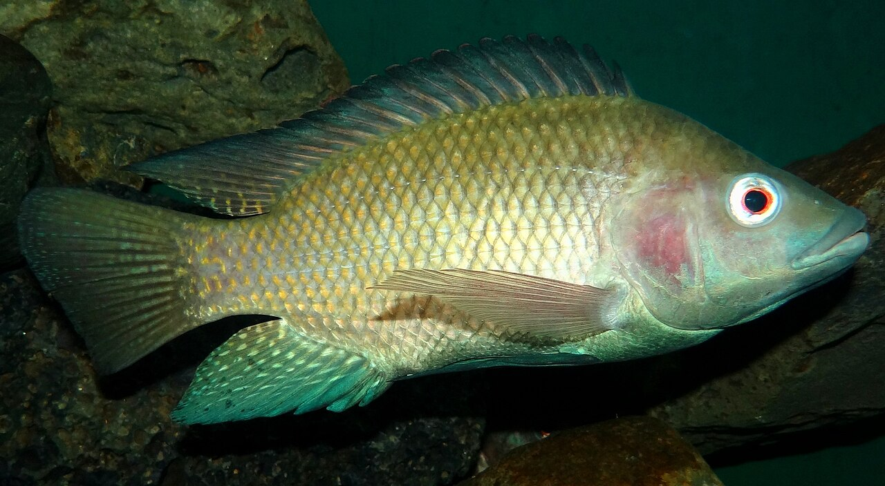

| | |
|---|---|
| Creator | Bjørn Christian Tørrissen |
| Licence | CC-BY-SA-3.0 |
| Attribution | Bjørn Christian Tørrissen · CC-BY-SA-3.0 · Wikimedia Commons |
| Source | https://commons.wikimedia.org/wiki/File:Oreochromis-niloticus-Nairobi.JPG |
| Size | 1000×550, 197 KB |

- [ ] This is a photograph of this dish, and I would put it on the card.

### Baked Mixed Vegetables in Tomato · طورلي

`torly` · egyptian · `eggplant`, `zucchini`, `potatoes`, `tomato-paste`, `onions`, `sunflower-oil`, `salt`

One tray, whatever vegetables are in the house, tomato over the top. The cheapest way to feed a family in this catalogue if it lands.

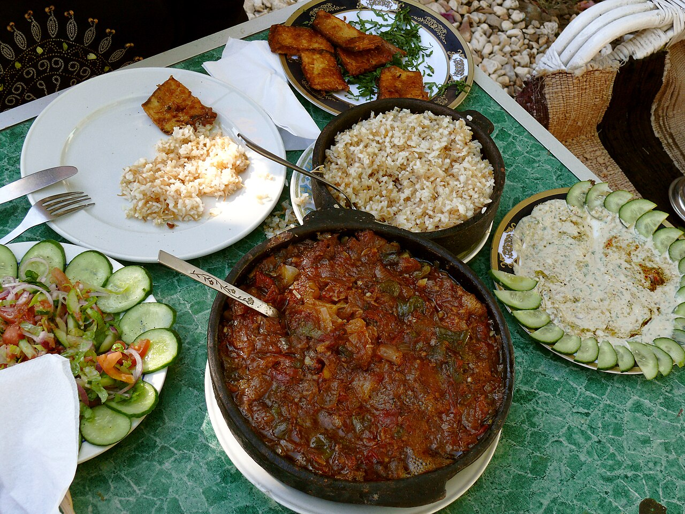

| | |
|---|---|
| Creator | Orientalist |
| Licence | CC0-1.0 |
| Attribution | _none required_ |
| Source | https://commons.wikimedia.org/wiki/File:%C3%84gyptisches_Mittagessen.JPG |
| Size | 1000×750, 434 KB |

- [ ] This is a photograph of this dish, and I would put it on the card.

### Chicken Livers with Onion · كبدة فراخ بالبصل

`kebda-firakh` · egyptian · `chicken-liver`, `onions`, `garlic`, `cumin`, `sunflower-oil`, `salt`

Cheaper and softer than the Alexandrian beef liver, and a different dish. The chicken-liver row is used by nothing.

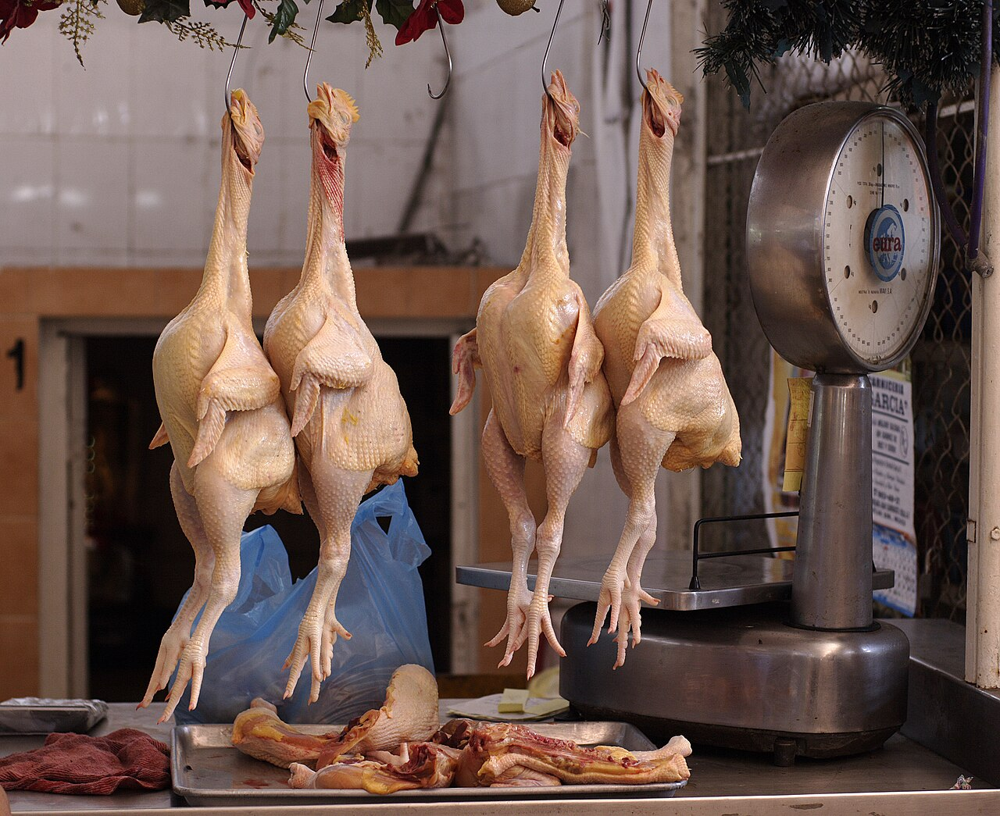

| | |
|---|---|
| Creator | Tomás Castelazo |
| Licence | CC-BY-SA-3.0 |
| Attribution | Tomás Castelazo · CC-BY-SA-3.0 · Wikimedia Commons |
| Source | https://commons.wikimedia.org/wiki/File:Chickens_in_market.jpg |
| Size | 1000×817, 314 KB |

- [ ] This is a photograph of this dish, and I would put it on the card.

### Eggs with White Cheese · بيض بالجبنة البيضا

`beid-bel-gibna` · egyptian · `eggs`, `white-cheese`, `butter`, `salt`

Four lines. Breakfast is still the thinnest meal type in the catalogue.

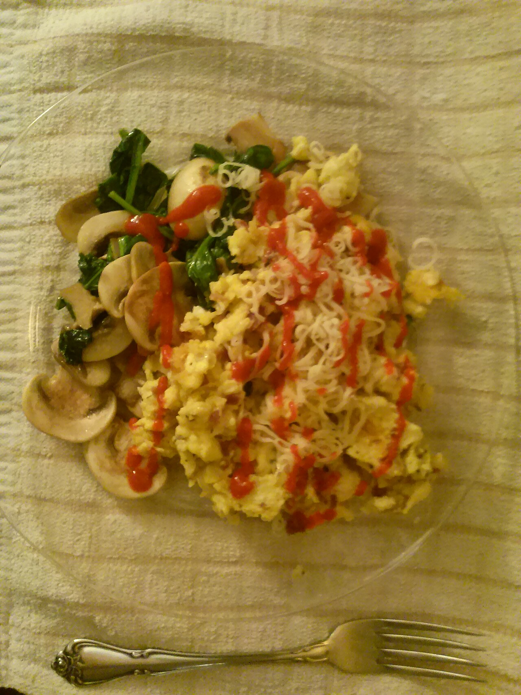

| | |
|---|---|
| Creator | JacquesDemien |
| Licence | CC0-1.0 |
| Attribution | _none required_ |
| Source | https://commons.wikimedia.org/wiki/File:Eggs_with_cheese,_mushrooms,_and_basil.jpg |
| Size | 1000×1333, 376 KB |

- [ ] This is a photograph of this dish, and I would put it on the card.

### Dried Fruit Compote · خشاف

`khoshaf` · egyptian · `dried-apricot`, `prunes`, `raisins`, `water`, `sugar`

Soaked overnight, eaten at iftar. Five lines, no cooking, and it uses three dried-fruit rows that no recipe touches.

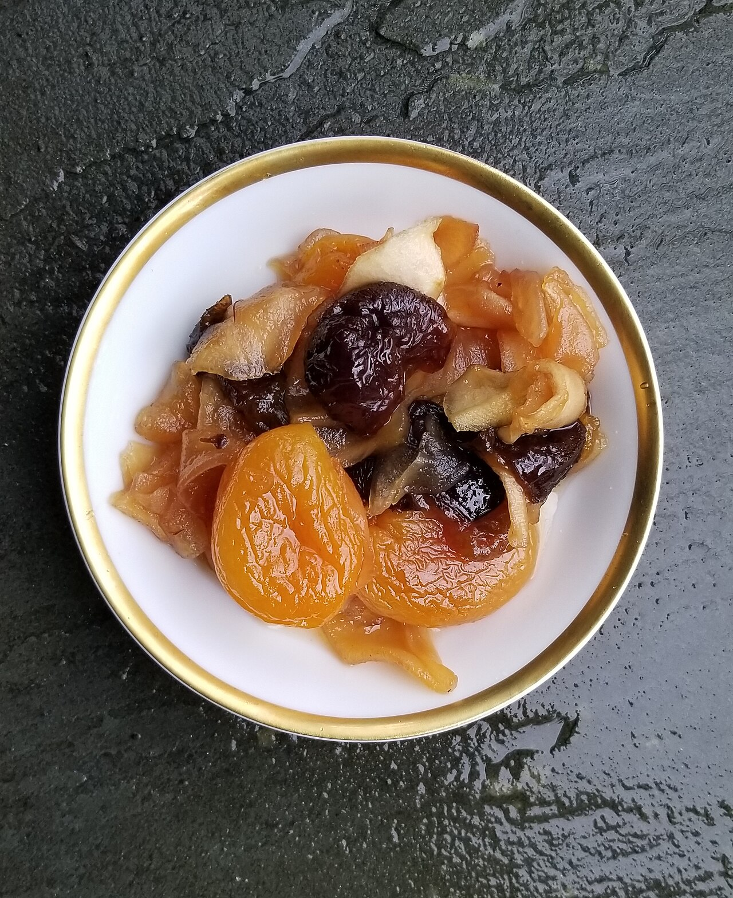

| | |
|---|---|
| Creator | CallMeBarcode |
| Licence | CC-BY-SA-4.0 |
| Attribution | CallMeBarcode · CC-BY-SA-4.0 · Wikimedia Commons |
| Source | https://commons.wikimedia.org/wiki/File:Persian_Dried_Fruit_Compote.jpg |
| Size | 1000×1225, 553 KB |

- [ ] This is a photograph of this dish, and I would put it on the card.

### Stuffed Ramadan Pancakes · قطايف

`qatayef` · egyptian · `flour`, `semolina`, `sugar`, `yeast`, `water`, `nuts-mix`

The Ramadan sweet. Six lines; the batter is flour, semolina and yeast and the filling is nuts.

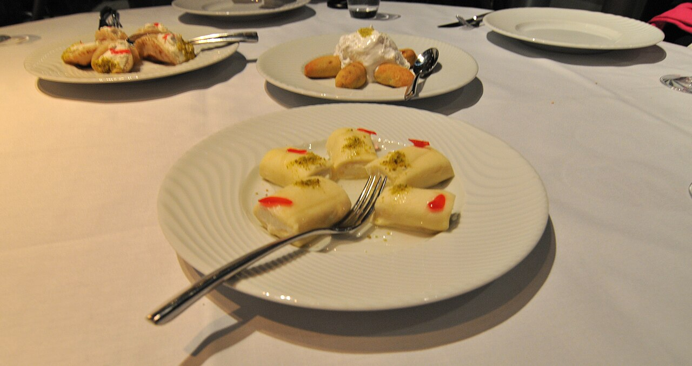

| | |
|---|---|
| Creator | Serge Melki |
| Licence | CC-BY-2.0 |
| Attribution | Serge Melki · CC-BY-2.0 · Wikimedia Commons |
| Source | https://commons.wikimedia.org/wiki/File:Noura_-_Lebanese_sweets.jpg |
| Size | 1000×529, 114 KB |

- [ ] This is a photograph of this dish, and I would put it on the card.

### Tamarind Drink · تمر هندي

`tamr-hindi` · egyptian · `tamarind`, `water`, `sugar`

Three lines, and the tamarind row exists for exactly this and is used by nothing.

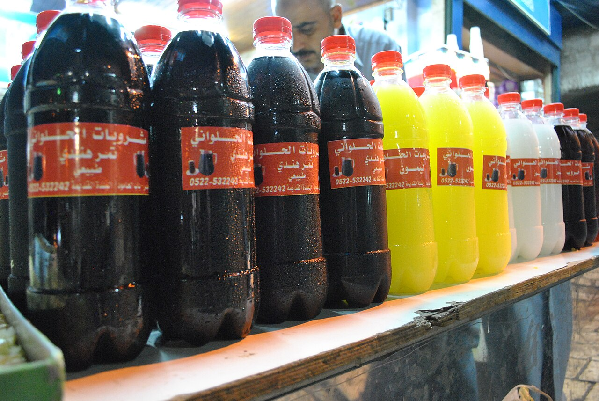

| | |
|---|---|
| Creator | ProtoplasmaKid |
| Licence | CC-BY-SA-3.0 |
| Attribution | ProtoplasmaKid · CC-BY-SA-3.0 · Wikimedia Commons |
| Source | https://commons.wikimedia.org/wiki/File:Beverages_in_Coke_bottles.JPG |
| Size | 1000×669, 269 KB |

- [ ] This is a photograph of this dish, and I would put it on the card.

### Bread Pudding in Syrup · عيش السرايا

`eish-el-saraya` · egyptian · `toast-bread`, `sugar`, `water`, `cream`, `nuts-mix`

Stale bread, syrup and cream. A real Egyptian dessert built out of what is going hard in the bread bin.

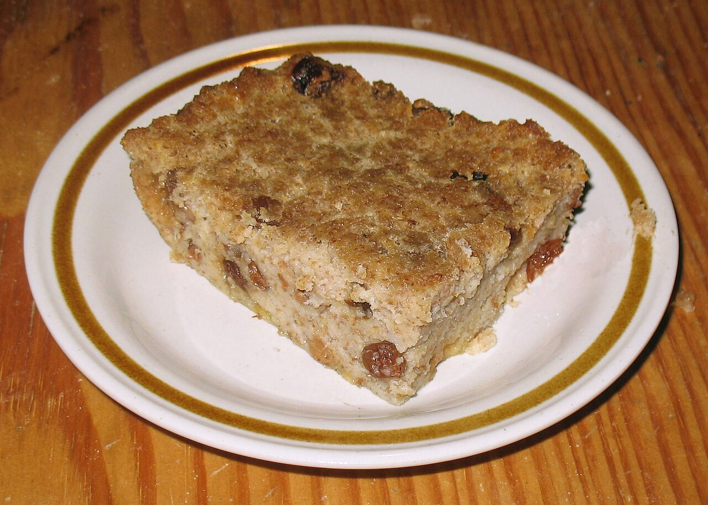

| | |
|---|---|
| Creator | Roly Williams |
| Licence | CC-BY-SA-3.0 |
| Attribution | Roly Williams · CC-BY-SA-3.0 · Wikimedia Commons |
| Source | https://commons.wikimedia.org/wiki/File:Rew13c05-745a_Bread_Pudding.JPG |
| Size | 1000×715, 255 KB |

- [ ] This is a photograph of this dish, and I would put it on the card.

### Cheese Börek · بوريك بالجبنة

`borek` · turkish · `phyllo`, `white-cheese`, `eggs`, `butter`

Four lines from bought phyllo. Turkey's version of the same idea as sambousek and a different shape on the plate.

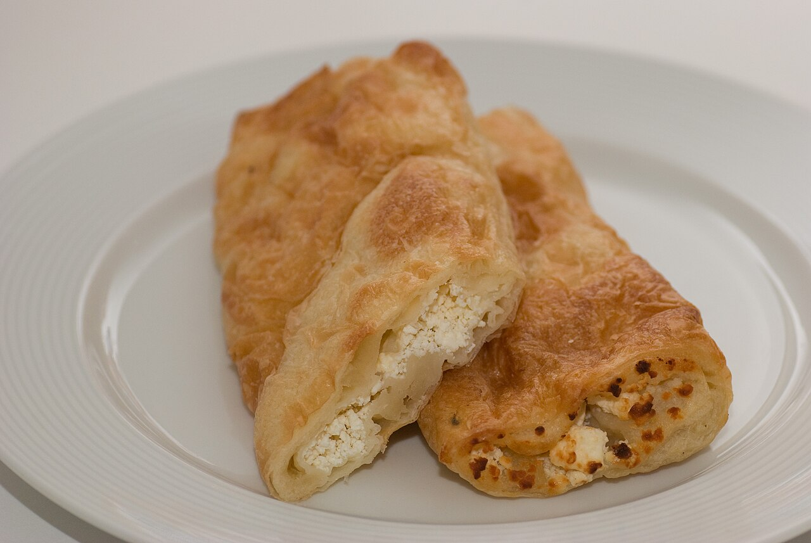

| | |
|---|---|
| Creator | Alice Wiegand |
| Licence | CC-BY-SA-3.0 |
| Attribution | Alice Wiegand · CC-BY-SA-3.0 · Wikimedia Commons |
| Source | https://commons.wikimedia.org/wiki/File:B%C3%B6rek_mit_K%C3%A4se.jpg |
| Size | 1000×669, 131 KB |

- [ ] This is a photograph of this dish, and I would put it on the card.

### Chilled Tomato Soup · شوربة طماطم باردة

`gazpacho` · mediterranean · `tomatoes`, `cucumber`, `bell-pepper`, `olive-oil`, `vinegar`, `salt`

No cooking at all, served cold, which matters somewhere that is 38°C in August.

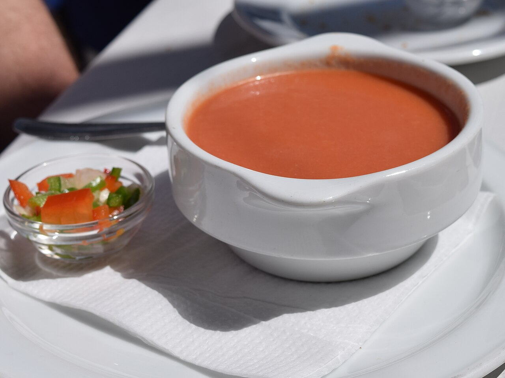

| | |
|---|---|
| Creator | Haydn Blackey |
| Licence | CC-BY-SA-2.0 |
| Attribution | Haydn Blackey · CC-BY-SA-2.0 · Wikimedia Commons |
| Source | https://commons.wikimedia.org/wiki/File:Gazpacho_Malague%C3%B1o_con_su_%E2%80%9Cpica%C3%ADto%E2%80%9D_-_Moreno,_Playa_Burriana_(cropped).jpg |
| Size | 1000×749, 105 KB |

- [ ] This is a photograph of this dish, and I would put it on the card.

### Greek Egg and Lemon Soup · شوربة البيض والليمون

`avgolemono` · mediterranean · `rice`, `eggs`, `lemon`, `stock-cube`, `water`, `salt`

Rice, egg and lemon whisked into a broth. Cheap, restorative, and nothing like it in the catalogue.

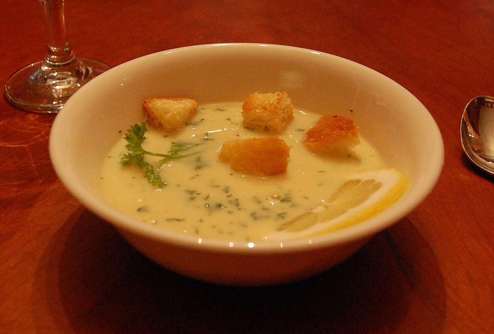

| | |
|---|---|
| Creator | robin.norwood |
| Licence | CC-BY-SA-2.0 |
| Attribution | robin.norwood · CC-BY-SA-2.0 · Wikimedia Commons |
| Source | https://commons.wikimedia.org/wiki/File:Avgolemono_soup.jpg |
| Size | 1000×678, 194 KB |

- [ ] This is a photograph of this dish, and I would put it on the card.

### Lentil and Chickpea Soup · حريرة

`harira` · mediterranean · `lentils`, `chickpeas`, `tomatoes`, `onions`, `coriander`, `water`

The Moroccan Ramadan soup. Legumes are the catalogue's joint-largest protein group and this is a substantial one.

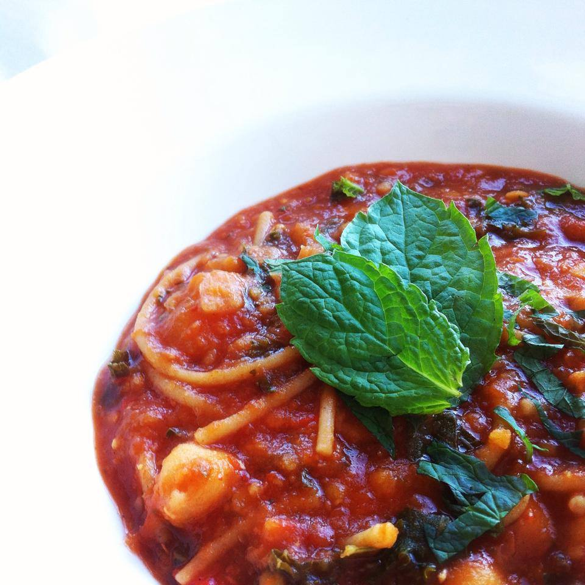

| | |
|---|---|
| Creator | Interstates |
| Licence | CC-BY-3.0 |
| Attribution | Interstates · CC-BY-3.0 · Wikimedia Commons |
| Source | https://commons.wikimedia.org/wiki/File:Harira_fyldig_marrokansk_suppe.jpg |
| Size | 960×960, 109 KB |

- [ ] This is a photograph of this dish, and I would put it on the card.

### Onion Soup with Cheese Toast · شوربة بصل بالجبنة

`french-onion-soup` · mediterranean · `onions`, `butter`, `stock-cube`, `baladi-bread`, `roumy-cheese`, `water`

A kilo of onions and almost nothing else. Made here with roumy on baladi bread, which is what an Egyptian kitchen has.

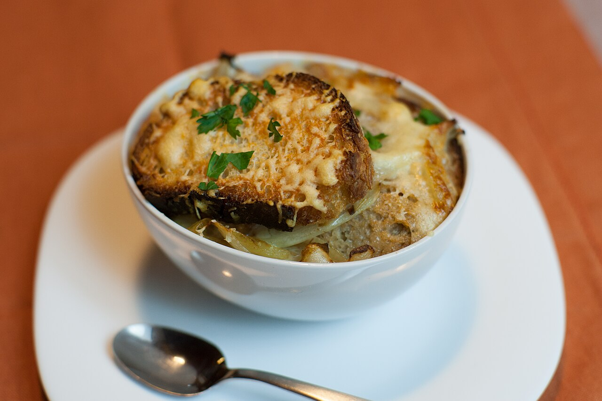

| | |
|---|---|
| Creator | Ludovic Péron |
| Licence | CC-BY-SA-3.0 |
| Attribution | Ludovic Péron · CC-BY-SA-3.0 · Wikimedia Commons |
| Source | https://commons.wikimedia.org/wiki/File:Soupe_%C3%A0_l%27oignon.jpg |
| Size | 1000×667, 133 KB |

- [ ] This is a photograph of this dish, and I would put it on the card.

### Tomato and Bread Salad · سلطة الطماطم والعيش

`panzanella` · italian · `toast-bread`, `tomatoes`, `cucumber`, `olive-oil`, `vinegar`, `basil`

The other stale-bread dish, and the summer counterpart to fattoush.

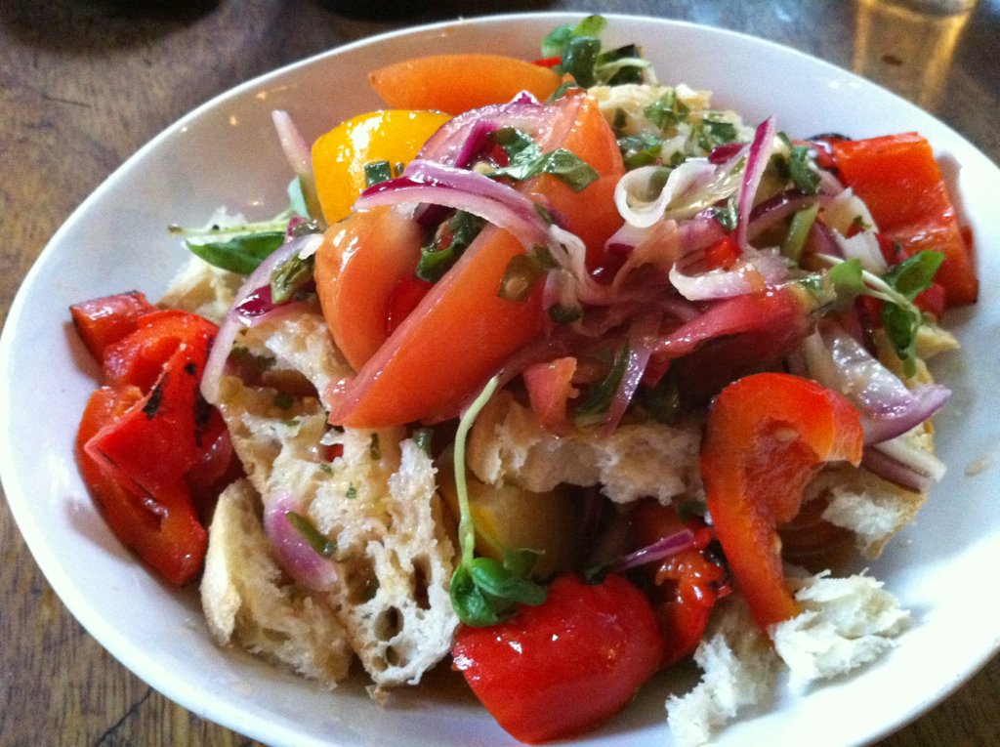

| | |
|---|---|
| Creator | thefoodplace.co.uk |
| Licence | CC-BY-2.0 |
| Attribution | thefoodplace.co.uk · CC-BY-2.0 · Wikimedia Commons |
| Source | https://commons.wikimedia.org/wiki/File:Proper_Panzanella_Salad,_Jamies_Italian,_Leeds.jpg |
| Size | 1000×747, 880 KB |

- [ ] This is a photograph of this dish, and I would put it on the card.

### Potato-Stuffed Flatbread · خبز محشي بالبطاطس

`aloo-paratha` · indian · `flour`, `potatoes`, `cumin`, `chili-pepper`, `ghee`, `salt`

Six pantry lines and a dry pan. Filling, cheap, and no oven needed.

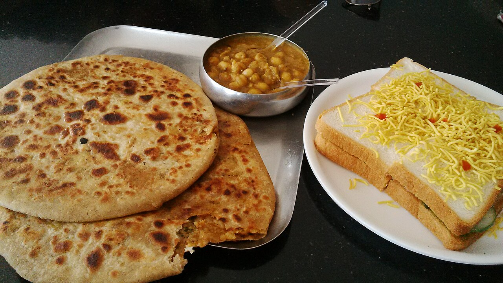

| | |
|---|---|
| Creator | Manna16 |
| Licence | CC-BY-SA-4.0 |
| Attribution | Manna16 · CC-BY-SA-4.0 · Wikimedia Commons |
| Source | https://commons.wikimedia.org/wiki/File:Aho_ji_nashta_kijie.jpg |
| Size | 1000×563, 247 KB |

- [ ] This is a photograph of this dish, and I would put it on the card.

### Eggs in Spiced Tomato · بيض بالكاري

`egg-curry` · indian · `eggs`, `tomatoes`, `onions`, `turmeric`, `sunflower-oil`, `salt`

Boiled eggs simmered in tomato. A main built on the cheapest protein there is.

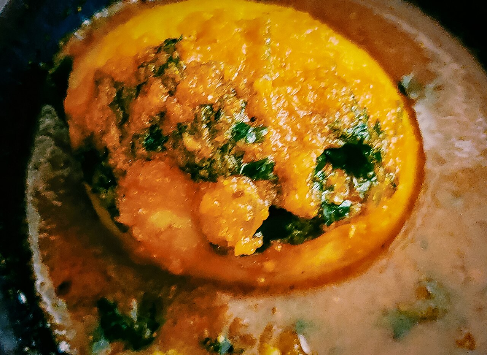

| | |
|---|---|
| Creator | Ekabhishek |
| Licence | CC-BY-SA-4.0 |
| Attribution | Ekabhishek · CC-BY-SA-4.0 · Wikimedia Commons |
| Source | https://commons.wikimedia.org/wiki/File:Egg_curry_pic.jpg |
| Size | 1000×730, 313 KB |

- [ ] This is a photograph of this dish, and I would put it on the card.

### Beans in Tomato Molasses · فاصوليا بالطماطم والعسل الأسود

`baked-beans` · american · `white-beans`, `tomato-paste`, `onions`, `molasses`, `salt`

Five lines and it keeps for days. The molasses row is Egyptian black honey and is used by almost nothing.

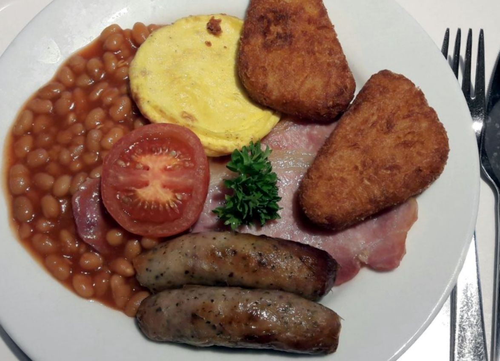

| | |
|---|---|
| Creator | Silar |
| Licence | CC-BY-SA-4.0 |
| Attribution | Silar · CC-BY-SA-4.0 · Wikimedia Commons |
| Source | https://commons.wikimedia.org/wiki/File:020170717_Polish_-_english_breakfast_in_London.jpg |
| Size | 1000×723, 124 KB |

- [ ] This is a photograph of this dish, and I would put it on the card.

### Salted Rice Parcels · كور رز بالنوري

`onigiri` · asian · `rice`, `nori`, `salt`

Three lines. Cold lunch, travels well, and it uses the nori row that nothing else does.

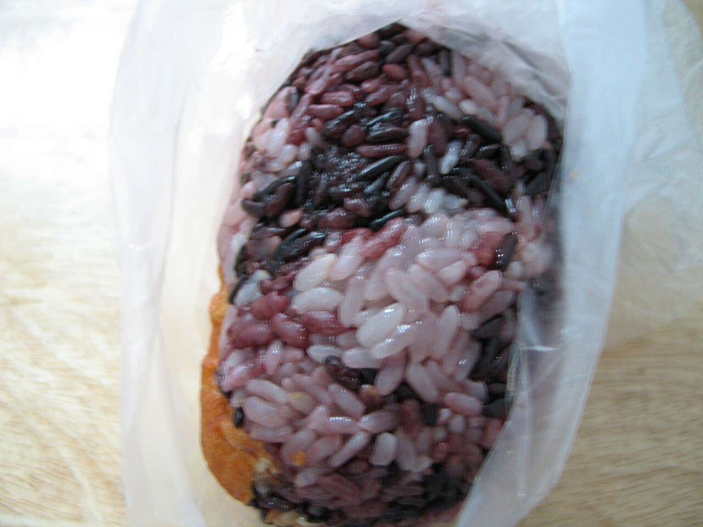

| | |
|---|---|
| Creator | Adonis Chen from Hengshan, Hsinchu County, Taiwan |
| Licence | CC-BY-2.0 |
| Attribution | Adonis Chen from Hengshan, Hsinchu County, Taiwan · CC-BY-2.0 · Wikimedia Commons |
| Source | https://commons.wikimedia.org/wiki/File:Black_rice_onigiri_by_Adonis_Chen_in_Hsinchu.jpg |
| Size | 1000×750, 177 KB |

- [ ] This is a photograph of this dish, and I would put it on the card.

### Spiced Bean Soup · شوربة فاصوليا بالكمون

`black-bean-soup` · mexican · `kidney-beans`, `onions`, `garlic`, `cumin`, `water`, `salt`

A tin of beans into a blender. Six lines, one pot, under half an hour.

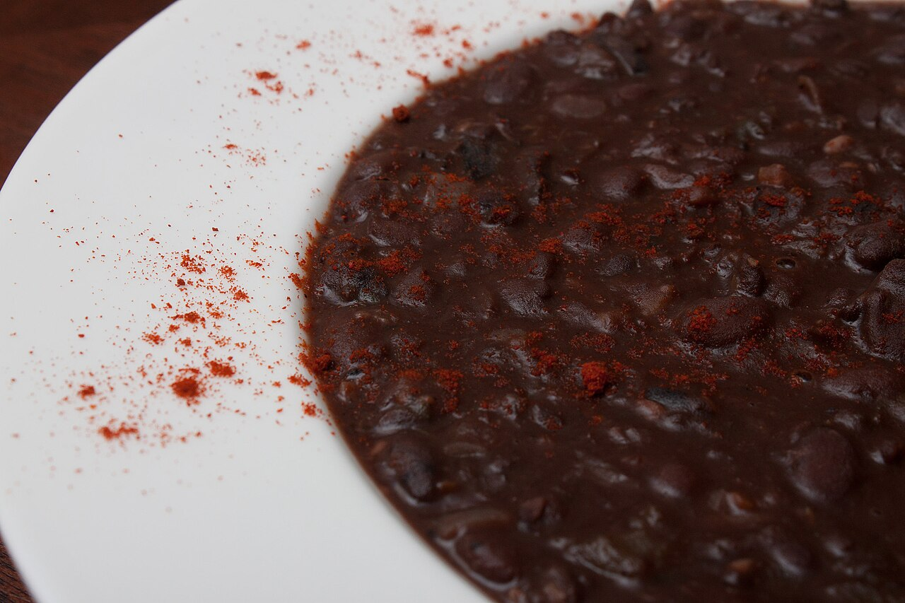

| | |
|---|---|
| Creator | J Doll |
| Licence | CC-BY-3.0 |
| Attribution | J Doll · CC-BY-3.0 · Wikimedia Commons |
| Source | https://commons.wikimedia.org/wiki/File:Black_Bean_Soup_(140491813).jpeg |
| Size | 1000×667, 177 KB |

- [ ] This is a photograph of this dish, and I would put it on the card.

### Macaroni in Red Sauce · مكرونة بالصلصة

`makarona-bel-salsa` · egyptian · `pasta`, `tomato-paste`, `garlic`, `sunflower-oil`, `salt`

SECOND ATTEMPT. The first candidate was a pasta alla norma with aubergine and cheese in it. Probably the most-cooked weeknight dinner in Egypt, so it is worth one more try.

| | |
|---|---|
| Creator | 10Rosso |
| Licence | CC-BY-2.0 |
| Attribution | 10Rosso · CC-BY-2.0 · Wikimedia Commons |
| Source | https://commons.wikimedia.org/wiki/File:Pasta_al_pomodoro_2.jpg |
| Size | 1000×750, 285 KB |

- [ ] This is a photograph of this dish, and I would put it on the card.

### Eggs Scrambled with Tomato · بيض بالطماطم

`beid-bel-tamatem` · egyptian · `eggs`, `tomatoes`, `sunflower-oil`, `salt`

SECOND ATTEMPT. The first candidate was a hotel buffet chafing dish with its label showing.

| | |
|---|---|
| Creator | NNU-10-HanRongrong |
| Licence | CC-BY-3.0 |
| Attribution | NNU-10-HanRongrong · CC-BY-3.0 · Wikimedia Commons |
| Source | https://commons.wikimedia.org/wiki/File:Tomato_and_egg_soup.jpg |
| Size | 1000×750, 238 KB |

- [ ] This is a photograph of this dish, and I would put it on the card.

### Fried Aubergine with Garlic and Vinegar · باذنجان مقلي بالتوم والخل

`betingan-mely` · egyptian · `eggplant`, `sunflower-oil`, `garlic`, `vinegar`, `salt`

SECOND ATTEMPT. The first candidate was Spanish berenjenas con miel — battered and drizzled with honey.

| | |
|---|---|
| Creator | HaJunkiyada |
| Licence | CC-BY-SA-4.0 |
| Attribution | HaJunkiyada · CC-BY-SA-4.0 · Wikimedia Commons |
| Source | https://commons.wikimedia.org/wiki/File:Liat_Portal_for_Foodie_Disorder_-_Fried_Eggplant_Slices.jpg |
| Size | 1000×1333, 498 KB |

- [ ] This is a photograph of this dish, and I would put it on the card.

### Whole Chicken in the Oven with Cumin · فراخ في الفرن بالكمون

`firakh-bel-forn` · egyptian · `whole-chicken`, `cumin`, `lemon`, `sunflower-oil`, `salt`

SECOND ATTEMPT. The first candidate was a painted restaurant sign reading BROILER-BAR. The whole-chicken row still has no recipe.

| | |
|---|---|
| Creator | Rajeeb Dutta |
| Licence | CC-BY-SA-4.0 |
| Attribution | Rajeeb Dutta · CC-BY-SA-4.0 · Wikimedia Commons |
| Source | https://commons.wikimedia.org/wiki/File:Roasted_chicken_leg_piece-MB20.jpg |
| Size | 1000×750, 311 KB |

- [ ] This is a photograph of this dish, and I would put it on the card.

### Yogurt Flatbread · خبز النان

`naan` · indian · `flour`, `yogurt`, `yeast`, `salt`, `ghee`

SECOND ATTEMPT. The first candidate was a restaurant buffet line with a basket of naan in the corner.

| | |
|---|---|
| Creator | Mmroy |
| Licence | CC-BY-SA-4.0 |
| Attribution | Mmroy · CC-BY-SA-4.0 · Wikimedia Commons |
| Source | https://commons.wikimedia.org/wiki/File:BUTTER_NON_with_GOBI_PANEER_%2B_VEG_MIX.jpg |
| Size | 1000×750, 164 KB |

- [ ] This is a photograph of this dish, and I would put it on the card.

### Cabbage and Carrot Slaw · سلطة كول سلو

`coleslaw` · american · `cabbage`, `carrots`, `mayonnaise`, `vinegar`, `salt`

SECOND ATTEMPT. The first candidate was a diner plate of corn dogs with a ramekin of slaw at the edge.

| | |
|---|---|
| Creator | David Louw |
| Licence | CC-BY-SA-4.0 |
| Attribution | David Louw · CC-BY-SA-4.0 · Wikimedia Commons |
| Source | https://commons.wikimedia.org/wiki/File:A_traditional_coleslaw_with_added_honey,_mixed_nuts,_dried_apricots_%26_mustard_seed_for_serving.JPG |
| Size | 1000×1339, 597 KB |

- [ ] This is a photograph of this dish, and I would put it on the card.

### Crumbed Chicken Cutlet · فراخ بانيه

`chicken-katsu` · asian · `chicken-breast`, `breadcrumbs`, `eggs`, `flour`, `sunflower-oil`

SECOND ATTEMPT. The first candidate was katsu CURRY — the sauce was most of the plate. This is بانيه, one of the most ordered things in Egypt, and the catalogue has no crumbed cutlet.

| | |
|---|---|
| Creator | richardmasoner |
| Licence | CC-BY-SA-2.0 |
| Attribution | richardmasoner · CC-BY-SA-2.0 · Wikimedia Commons |
| Source | https://commons.wikimedia.org/wiki/File:Bento_of_tonkatsu,_jiaozi,_California_Rolls_and_rice_with_black_sesame.jpg |
| Size | 1000×750, 246 KB |

- [ ] This is a photograph of this dish, and I would put it on the card.

### No acceptable image (4)

These keep nothing. A generic photograph of something else is not a
substitute — it tells the user something false about what they are cooking.

| Dish | Why |
|---|---|
| White Beans with Beef (`fasolia-bel-lahma`) | no relevant openly-licensed image found |
| Areesh Cheese with Oil and Tomato (`gibna-areesh`) | no relevant openly-licensed image found |
| Lemon and Oregano Roast Potatoes (`greek-lemon-potatoes`) | no relevant openly-licensed image found |
| Cheese Sambousek (`sambousek`) | File:Samosas, snack food at Wikipedia's 16th Birthday celebration in Chittagong (01).jpg: refused on review — Fried samosas with a green potato-and-pea filling, photographed at an event. The shape is right and the filling visibly is not: this recipe is cheese sambousek. |

