# Candidate photography — review before any of this ships

**Generated by `npm run images:review-candidates`. Do not edit by hand.**

None of these photographs is published. They are staged in
`assets/recipe-candidates/`, which the app does not bundle and does not index.
A staged photograph reaches a recipe card only through `npm run images:promote`,
by name, after its recipe exists.

**A photograph passing the automatic checks does not prove it depicts the right
dish.** The checks read a title, a licence, a category and a pixel count. They
cannot see the picture. `data/images/rejected.json` is the record of what that
misses: an aerial view of the Turkish town of Menemen for the dish named after
it, a grape vine for stuffed vine leaves, breaded oysters for scrambled eggs.
Every one passed every automatic test.

### To reject one

Add its Commons title to `data/images/rejected.json` with the reason, delete the
staged file and its manifest entry, and re-run the acquisition. The refusal is
permanent, applies to production as well, and both validators refuse a manifest
that contains a refused file.

## batch-1-small-pantry

24 dishes that are genuinely five ingredient lines or fewer — counting every line, including salt and oil. The catalogue has FOUR of those against a target of about 44, and a short list is the strongest predictor of a recipe a real Egyptian kitchen can actually reach: the dataset audit finds 0 or 1 exact matches for a three-item pantry today. No recipe is written yet. These are dish identities, sent to the photography preflight first, so that the recipes get written for the dishes that can honestly be illustrated rather than the other way round.

**23 of 24 have a candidate photograph.**

### Hibiscus Tea · كركديه

`karkade` · egyptian · `hibiscus`, `water`, `sugar`

Three ingredients, drunk hot in winter and iced all summer, and in almost every Egyptian house during Ramadan. Nothing in the catalogue covers it.

| | |
|---|---|
| Creator | Meutia Chaerani / Indradi Soemardjan http://www.indrani.net |
| Licence | CC-BY-2.5 |
| Attribution | Meutia Chaerani / Indradi Soemardjan http://www.indrani.net · CC-BY-2.5 · Wikimedia Commons |
| Source | https://commons.wikimedia.org/wiki/File:Agua_de_Jamaica.jpg |
| Size | 800×1200, 494 KB |

- [ ] This is a photograph of this dish, and I would put it on the card.

### Warm Sahlab with Pistachios · سحلب

`sahlab` · egyptian · `milk`, `sahlab`, `sugar`, `pistachios`

The winter drink. The sahlab row was added in Stage 2D and no recipe uses it.

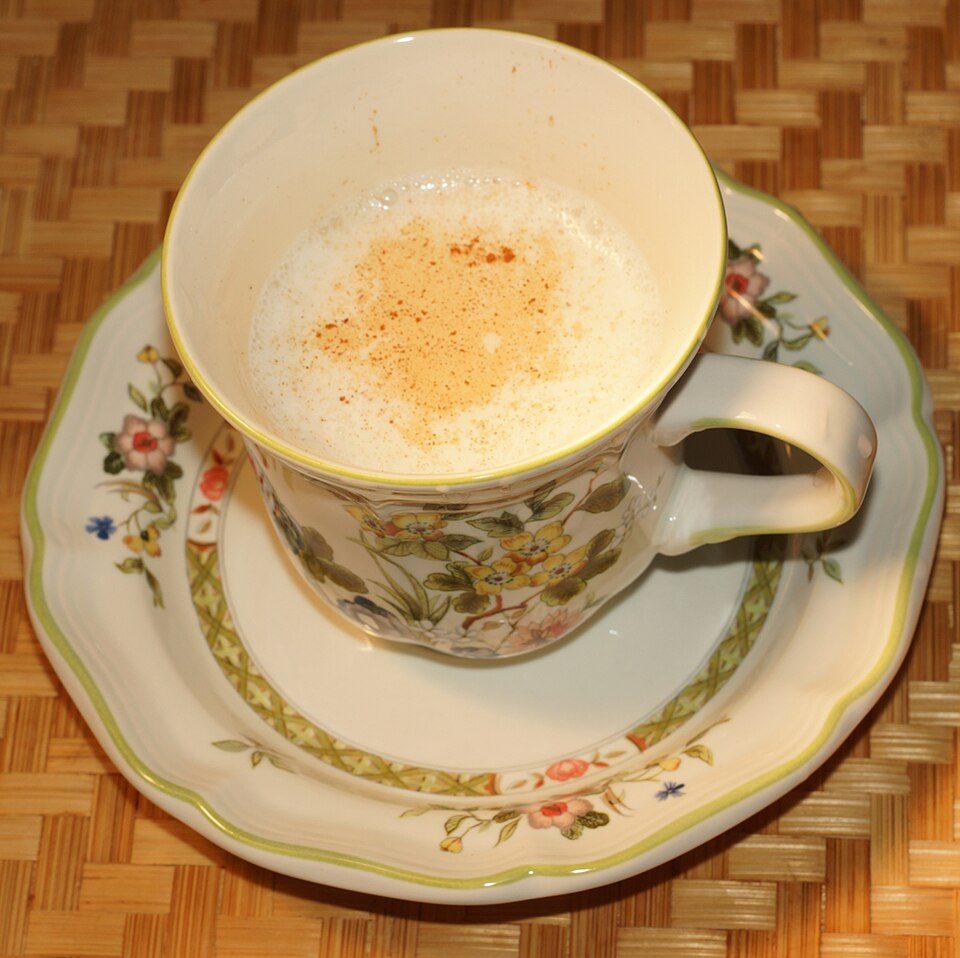

| | |
|---|---|
| Creator | DesignbyNur |
| Licence | CC-BY-SA-3.0 |
| Attribution | DesignbyNur · CC-BY-SA-3.0 · Wikimedia Commons |
| Source | https://commons.wikimedia.org/wiki/File:Salep_drink.jpg |
| Size | 800×799, 134 KB |

- [ ] This is a photograph of this dish, and I would put it on the card.

### Apricot Nectar · قمر الدين

`qamar-el-din` · egyptian · `dried-apricot`, `water`, `sugar`

The Ramadan drink, from the apricot sheet sold by the kilo. The ingredient row is literally named qamar el din and nothing cooks with it.

| | |
|---|---|
| Creator | Galjundi7 |
| Licence | CC-BY-SA-4.0 |
| Attribution | Galjundi7 · CC-BY-SA-4.0 · Wikimedia Commons |
| Source | https://commons.wikimedia.org/wiki/File:QAMAR_AD-DIN.jpg |
| Size | 1000×1145, 360 KB |

- [ ] This is a photograph of this dish, and I would put it on the card.

### Grilled Corn on the Cob · ذرة مشوية

`dura-mashwiya` · egyptian · `corn`, `butter`, `salt`, `lemon`

Street food on every corniche in the country, and four ingredients.

| | |
|---|---|
| Creator | No machine-readable author provided. Tequendamia assumed (based on copyright claims). |
| Licence | CC0-1.0 |
| Attribution | _none required_ |
| Source | https://commons.wikimedia.org/wiki/File:Asado_Bogotano.jpg |
| Size | 1000×664, 394 KB |

- [ ] This is a photograph of this dish, and I would put it on the card.

### Roasted Sweet Potato · بطاطا مشوية

`batata-mashwiya` · egyptian · `sweet-potato`, `butter`, `honey`, `cinnamon`

The winter counterpart to the corn cart. Cheap, filling, and nothing in the catalogue uses sweet potato except air-fryer fries.

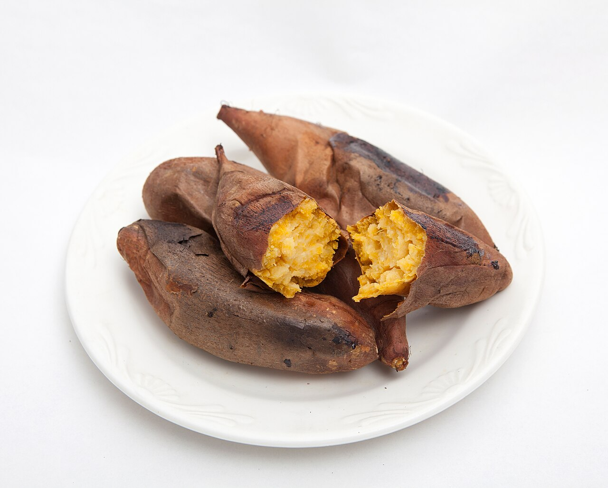

| | |
|---|---|
| Creator | 국립국어원 |
| Licence | CC-BY-SA-2.0 |
| Attribution | 국립국어원 · CC-BY-SA-2.0 · Wikimedia Commons |
| Source | https://commons.wikimedia.org/wiki/File:Gungoguma_(roasted_sweet_potatoes)_2.jpg |
| Size | 1000×804, 146 KB |

- [ ] This is a photograph of this dish, and I would put it on the card.

### Tahini Sauce with Lemon · سلطة طحينة

`salatet-tahina` · egyptian · `tahini`, `lemon`, `garlic`, `water`, `salt`

Poured over taameya, fish, koshari and half the rest of the catalogue. It exists as an assumed accompaniment everywhere and as a recipe nowhere.

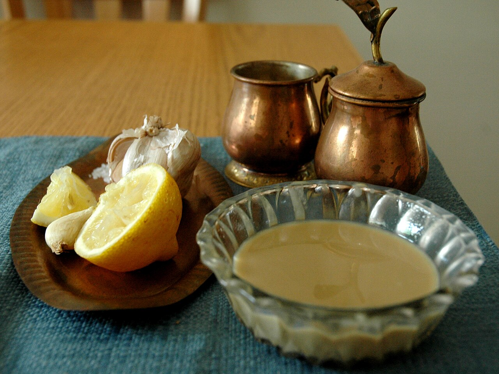

| | |
|---|---|
| Creator | Gilabrand |
| Licence | CC-BY-SA-3.0 |
| Attribution | Gilabrand · CC-BY-SA-3.0 · Wikimedia Commons |
| Source | https://commons.wikimedia.org/wiki/File:Tahina.JPG |
| Size | 1000×751, 240 KB |

- [ ] This is a photograph of this dish, and I would put it on the card.

### Honey-Soaked Dough Balls · لقمة القاضي

`lokmet-el-qadi` · egyptian · `flour`, `yeast`, `sugar`, `sunflower-oil`, `honey`

Ramadan dessert made from flour and nothing else expensive. Five lines exactly.

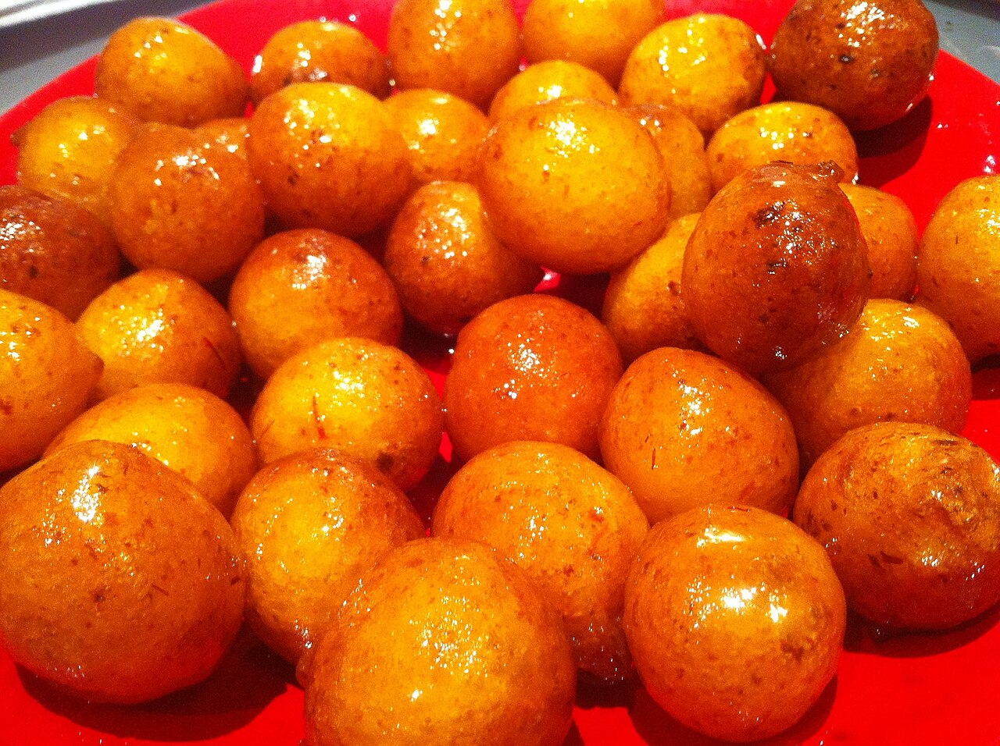

| | |
|---|---|
| Creator | Aldousari |
| Licence | CC-BY-SA-3.0 |
| Attribution | Aldousari · CC-BY-SA-3.0 · Wikimedia Commons |
| Source | https://commons.wikimedia.org/wiki/File:Lgemat.JPG |
| Size | 1000×747, 360 KB |

- [ ] This is a photograph of this dish, and I would put it on the card.

### Peanut and Sesame Dukkah · دقة بلدي

`dukkah-baladi` · egyptian · `peanuts`, `sesame-seeds`, `coriander-ground`, `cumin`, `salt`

Bread dipped in oil then in this. The dukkah row exists as a bought blend; making it is five pantry items and a pan.

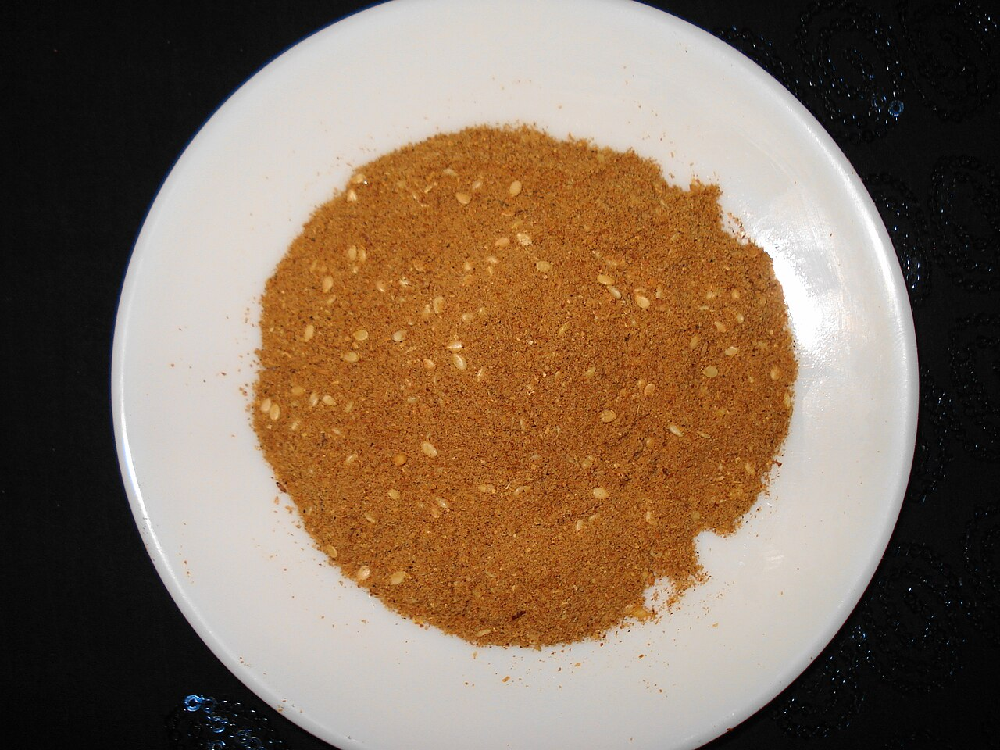

| | |
|---|---|
| Creator | Miansari66 |
| Licence | CC0-1.0 |
| Attribution | _none required_ |
| Source | https://commons.wikimedia.org/wiki/File:Dukka_Masala.JPG |
| Size | 1000×750, 242 KB |

- [ ] This is a photograph of this dish, and I would put it on the card.

### Fresh Lemonade with Mint · عصير ليمون بالنعناع

`aseer-limon` · egyptian · `lemon`, `sugar`, `water`, `mint`

Four ingredients, and the thing an Egyptian kitchen makes when it has lemons and nothing else.

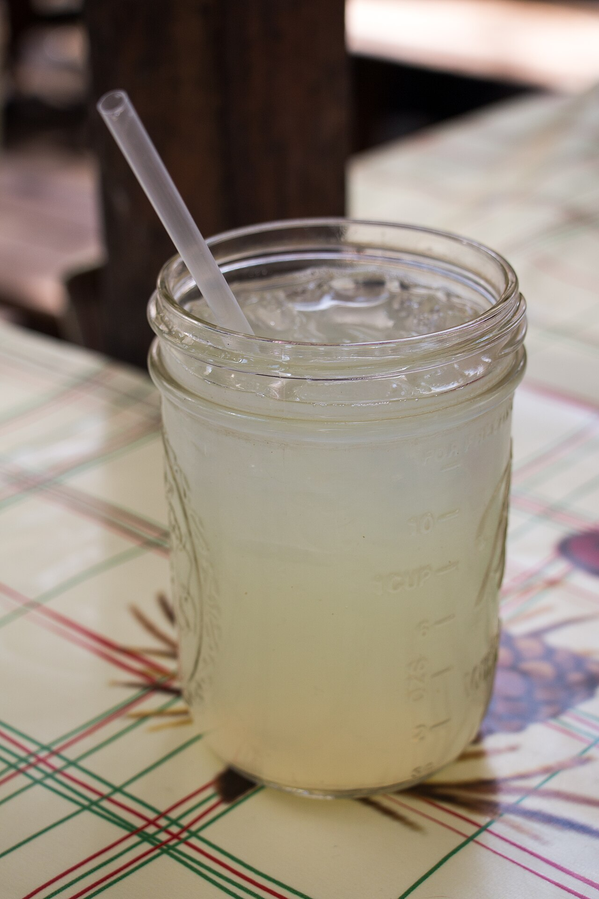

| | |
|---|---|
| Creator | HarshLight |
| Licence | CC-BY-2.0 |
| Attribution | HarshLight · CC-BY-2.0 · Wikimedia Commons |
| Source | https://commons.wikimedia.org/wiki/File:Lemonade_-_27682817724.jpg |
| Size | 1000×1500, 245 KB |

- [ ] This is a photograph of this dish, and I would put it on the card.

### Tomato Soup · شوربة طماطم

`shorbet-tamatem` · egyptian · `tomatoes`, `onions`, `butter`, `salt`, `black-pepper`

The soup made from whatever tomatoes are going soft. Five lines, no stock, no cream.

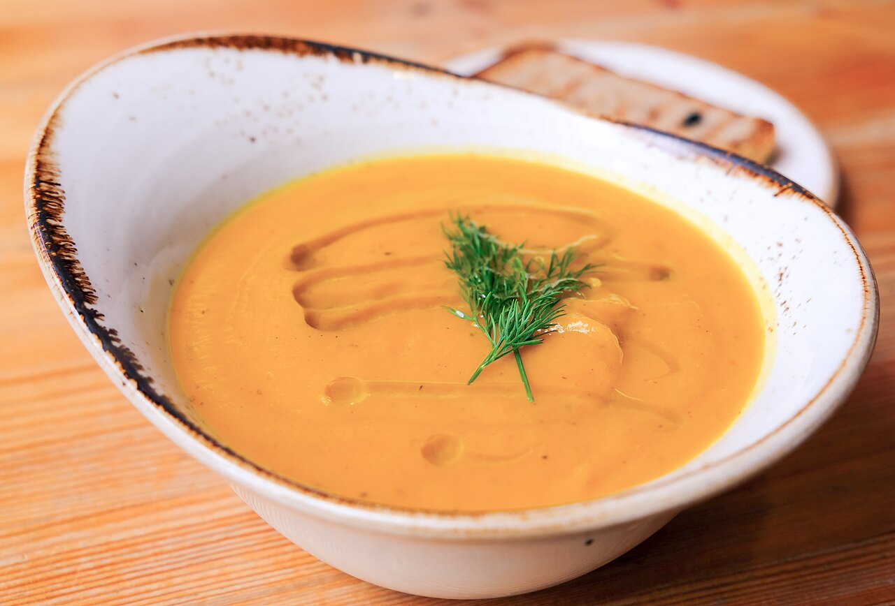

| | |
|---|---|
| Creator | Ella Olsson from Stockholm, Sweden |
| Licence | CC-BY-2.0 |
| Attribution | Ella Olsson from Stockholm, Sweden · CC-BY-2.0 · Wikimedia Commons |
| Source | https://commons.wikimedia.org/wiki/File:Tomato_soup,_plant-based_(44040252791).jpg |
| Size | 1000×678, 123 KB |

- [ ] This is a photograph of this dish, and I would put it on the card.

### Eggs with Basterma · بيض بالبسطرمة

`beid-bel-basterma` · egyptian · `eggs`, `pastrami`, `ghee`, `salt`

The Egyptian breakfast that is worth getting up for, and the only savoury protein dish in this batch. Four lines.

| | |
|---|---|
| Creator | RosarioVanTulpe |
| Licence | CC0-1.0 |
| Attribution | _none required_ |
| Source | https://commons.wikimedia.org/wiki/File:Basturma_or_Pastroma_from_Armenia_2.JPG |
| Size | 1000×750, 191 KB |

- [ ] This is a photograph of this dish, and I would put it on the card.

### Pink Pickled Turnips · طرشي لفت

`torshi-lift` · egyptian · `turnip`, `beetroot`, `salt`, `vinegar`, `water`

On the table beside foul and koshari everywhere. Five ingredients and a jar; the beetroot is only there for the colour.

| | |
|---|---|
| Creator | Liz Sullivan |
| Licence | CC-BY-SA-4.0 |
| Attribution | Liz Sullivan · CC-BY-SA-4.0 · Wikimedia Commons |
| Source | https://commons.wikimedia.org/wiki/File:Gherkins_and_Onions.JPG |
| Size | 1000×750, 213 KB |

- [ ] This is a photograph of this dish, and I would put it on the card.

### Grilled Halloumi with Lemon · حلومي مشوي

`grilled-halloumi` · levantine · `halloumi`, `olive-oil`, `lemon`, `mint`

Four ingredients and eight minutes. The halloumi row is used by nothing.

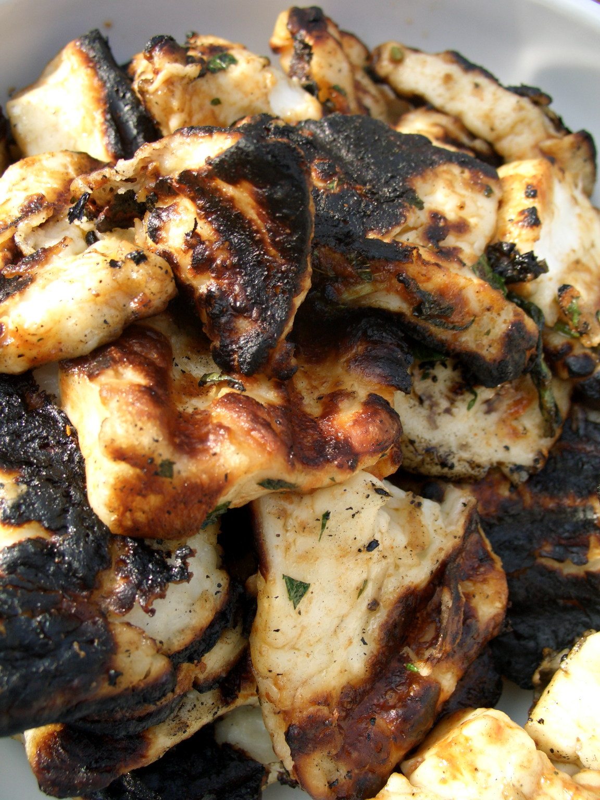

| | |
|---|---|
| Creator | Unknown |
| Licence | CC-BY-SA-3.0 |
| Attribution | Unknown · CC-BY-SA-3.0 · Wikimedia Commons |
| Source | https://commons.wikimedia.org/wiki/File:Grilled_haloumi_cheese.jpg |
| Size | 1000×1333, 477 KB |

- [ ] This is a photograph of this dish, and I would put it on the card.

### Pasta with Cheese and Pepper · مكرونة بالجبنة والفلفل

`cacio-e-pepe` · italian · `pasta`, `parmesan`, `black-pepper`, `butter`, `salt`

The one pasta in this batch, chosen because it is the shortest honest pasta there is.

| | |
|---|---|
| Creator | Schellack |
| Licence | CC-BY-SA-4.0 |
| Attribution | Schellack · CC-BY-SA-4.0 · Wikimedia Commons |
| Source | https://commons.wikimedia.org/wiki/File:Cacio_e_pepe_at_trattoria_in_Rome.jpg |
| Size | 1000×1336, 399 KB |

- [ ] This is a photograph of this dish, and I would put it on the card.

### Olive Oil Flatbread · فوكاتشيا

`focaccia` · italian · `flour`, `water`, `olive-oil`, `salt`, `yeast`

Five ingredients, none of them perishable, and a proof that the catalogue's bread section is not only Egyptian.

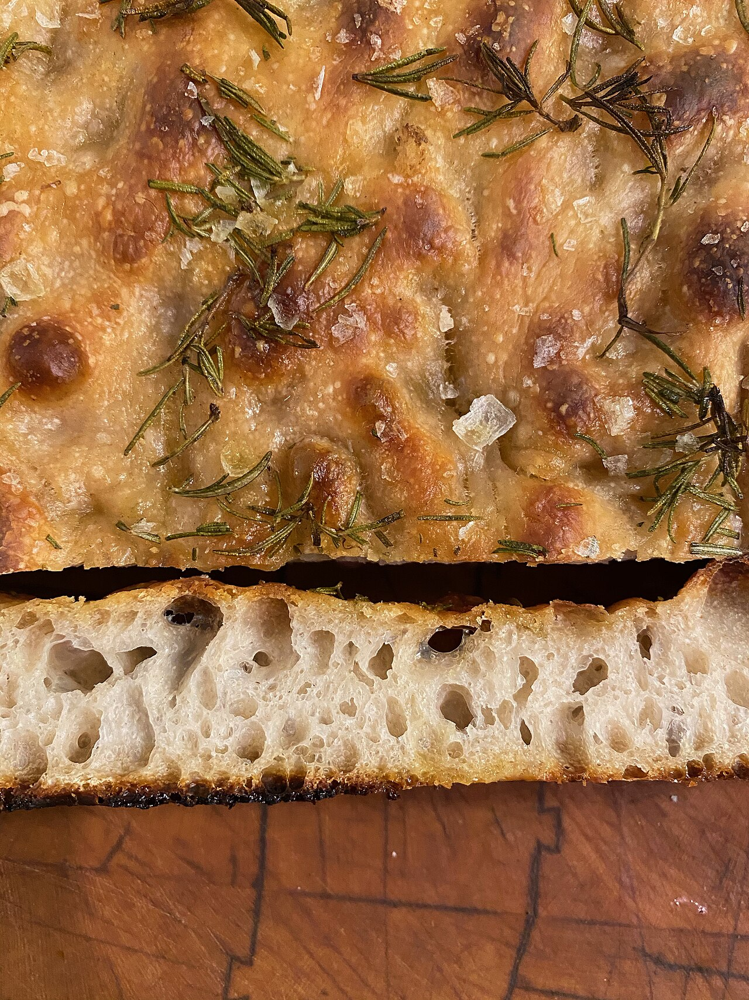

| | |
|---|---|
| Creator | Fred Benenson |
| Licence | CC-BY-SA-4.0 |
| Attribution | Fred Benenson · CC-BY-SA-4.0 · Wikimedia Commons |
| Source | https://commons.wikimedia.org/wiki/File:Focaccia_with_Crumb.jpg |
| Size | 1000×1333, 770 KB |

- [ ] This is a photograph of this dish, and I would put it on the card.

### Garlic Butter Bread · عيش بالتوم والزبدة

`garlic-bread` · italian · `baladi-bread`, `butter`, `garlic`, `parsley`, `salt`

Made here on baladi bread rather than a baguette, which is what an Egyptian kitchen actually has.

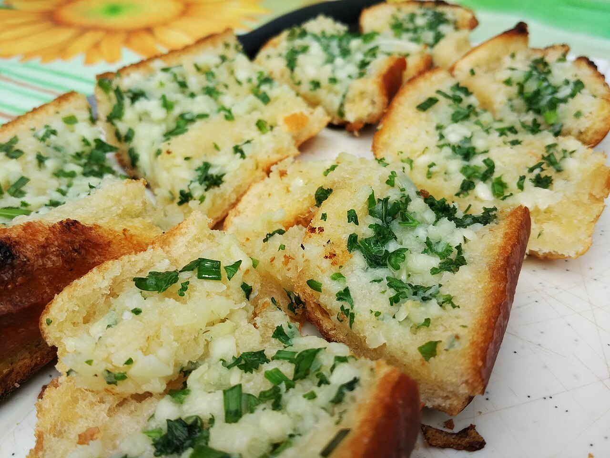

| | |
|---|---|
| Creator | Popo le Chien |
| Licence | CC-BY-SA-3.0 |
| Attribution | Popo le Chien · CC-BY-SA-3.0 · Wikimedia Commons |
| Source | https://commons.wikimedia.org/wiki/File:Garlicbread.jpg |
| Size | 1000×750, 257 KB |

- [ ] This is a photograph of this dish, and I would put it on the card.

### French Toast · عيش بالبيض

`french-toast` · american · `toast-bread`, `eggs`, `milk`, `cinnamon`, `butter`

Stale toast bread, five lines, and a breakfast a child can make. Breakfast is the thinnest meal type in the catalogue at 29 of 161.

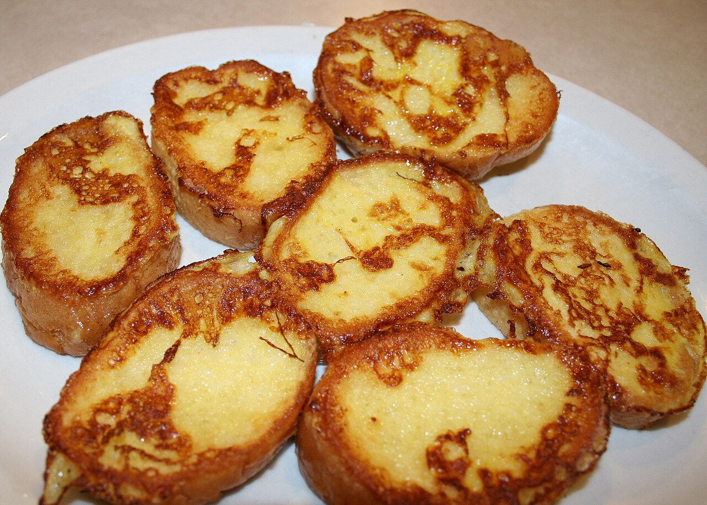

| | |
|---|---|
| Creator | Jonathunder |
| Licence | CC-BY-SA-3.0 |
| Attribution | Jonathunder · CC-BY-SA-3.0 · Wikimedia Commons |
| Source | https://commons.wikimedia.org/wiki/File:FrenchToast.JPG |
| Size | 1000×714, 303 KB |

- [ ] This is a photograph of this dish, and I would put it on the card.

### Crisp Potato Hash Browns · بطاطس مقرمشة

`hash-browns` · american · `potatoes`, `onions`, `sunflower-oil`, `salt`, `black-pepper`

Potatoes and onions, which is what is in the kitchen when nothing else is.

| | |
|---|---|
| Creator | jeffreyw |
| Licence | CC-BY-2.0 |
| Attribution | jeffreyw · CC-BY-2.0 · Wikimedia Commons |
| Source | https://commons.wikimedia.org/wiki/File:Mmm..._sliders_and_deep_fried_hash_browns_(7958927842).jpg |
| Size | 1000×686, 247 KB |

- [ ] This is a photograph of this dish, and I would put it on the card.

### Buttery Mashed Potatoes · بطاطس مهروسة

`mashed-potatoes` · american · `potatoes`, `butter`, `milk`, `salt`, `black-pepper`

The side dish the catalogue has never had, at five lines.

| | |
|---|---|
| Creator | Anna from Eagle, WI, USA |
| Licence | CC-BY-2.0 |
| Attribution | Anna from Eagle, WI, USA · CC-BY-2.0 · Wikimedia Commons |
| Source | https://commons.wikimedia.org/wiki/File:And_Then_There_Were_Leftovers.jpg |
| Size | 1000×750, 451 KB |

- [ ] This is a photograph of this dish, and I would put it on the card.

### Mango Yogurt Drink · لاسي المانجو

`mango-lassi` · indian · `mango`, `yogurt`, `milk`, `sugar`, `cardamom`

Egypt grows more mangoes than it knows what to do with between June and September.

| | |
|---|---|
| Creator | Miansari66 |
| Licence | CC0-1.0 |
| Attribution | _none required_ |
| Source | https://commons.wikimedia.org/wiki/File:Chilli_Garlic_Chuntney_and_Namkeen_Lassi.JPG |
| Size | 1000×750, 584 KB |

- [ ] This is a photograph of this dish, and I would put it on the card.

### Spiced Milk Tea · شاي بالحليب والبهارات

`masala-chai` · indian · `tea`, `milk`, `sugar`, `cardamom`, `cinnamon`

Five pantry items. The tea row is used by nothing at all.

| | |
|---|---|
| Creator | Wattamwarsamiksha |
| Licence | CC-BY-SA-4.0 |
| Attribution | Wattamwarsamiksha · CC-BY-SA-4.0 · Wikimedia Commons |
| Source | https://commons.wikimedia.org/wiki/File:Batata_bhaji_and_chai-Pune-Maharashtra.jpg |
| Size | 1000×1333, 394 KB |

- [ ] This is a photograph of this dish, and I would put it on the card.

### Turkish Coffee · قهوة تركي

`turkish-coffee` · turkish · `coffee`, `water`, `sugar`

Three ingredients and a kanaka. Drunk in Egypt at least as much as in Turkey; tagged Turkish because that is what the dish is called.

| | |
|---|---|
| Creator | Kaouther Bedoui |
| Licence | CC-BY-SA-4.0 |
| Attribution | Kaouther Bedoui · CC-BY-SA-4.0 · Wikimedia Commons |
| Source | https://commons.wikimedia.org/wiki/File:Cafe_Turque.jpg |
| Size | 1000×1005, 144 KB |

- [ ] This is a photograph of this dish, and I would put it on the card.

### Mashed Spiced Beans · فاصوليا مهروسة

`refried-beans` · mexican · `kidney-beans`, `onions`, `garlic`, `cumin`, `sunflower-oil`

A tin of beans, an onion and a pan. Legumes are the catalogue's joint-largest protein group and this is the cheapest five-line member of it.

| | |
|---|---|
| Creator | CarlosyFrancisca |
| Licence | CC-BY-SA-3.0 |
| Attribution | CarlosyFrancisca · CC-BY-SA-3.0 · Wikimedia Commons |
| Source | https://commons.wikimedia.org/wiki/File:Frijoles_con_queso,.jpg |
| Size | 958×718, 84 KB |

- [ ] This is a photograph of this dish, and I would put it on the card.

### No acceptable image (1)

These keep nothing. A generic photograph of something else is not a
substitute — it tells the user something false about what they are cooking.

| Dish | Why |
|---|---|
| Wheat Berries in Sweet Milk (`belila`) | no relevant openly-licensed image found |

