# Candidate photography — review before any of this ships

**Generated by `npm run images:review-candidates`. Do not edit by hand.**

None of these photographs is published. They are staged in
`assets/recipe-candidates/`, which the app does not bundle and does not index.
A staged photograph reaches a recipe card only through `npm run images:promote`,
by name, after its recipe exists.

**A photograph passing the automatic checks does not prove it depicts the right
dish.** The checks read a title, a licence, a category and a pixel count. They
cannot see the picture. `data/images/rejected.json` is the record of what that
misses: an aerial view of the Turkish town of Menemen for the dish named after
it, a grape vine for stuffed vine leaves, breaded oysters for scrambled eggs.
Every one passed every automatic test.

### To reject one

Add its Commons title to `data/images/rejected.json` with the reason, delete the
staged file and its manifest entry, and re-run the acquisition. The refusal is
permanent, applies to production as well, and both validators refuse a manifest
that contains a refused file.

## batch-1-small-pantry

24 dishes that are genuinely five ingredient lines or fewer — counting every line, including salt and oil. The catalogue has FOUR of those against a target of about 44, and a short list is the strongest predictor of a recipe a real Egyptian kitchen can actually reach: the dataset audit finds 0 or 1 exact matches for a three-item pantry today. No recipe is written yet. These are dish identities, sent to the photography preflight first, so that the recipes get written for the dishes that can honestly be illustrated rather than the other way round.

**24 candidates: 15 reviewed and shipped, 0 waiting to be looked at, 9 with nothing acceptable.**

### Already promoted (15)

Reviewed, written as recipes, and now on a card. Their photographs live in
`assets/recipes/` and are validated by `npm run images:check`.

| Dish | Creator | Licence |
|---|---|---|
| Hibiscus Tea (`karkade`) | stu_spivack | CC-BY-SA-2.0 |
| Warm Sahlab with Pistachios (`sahlab`) | DesignbyNur | CC-BY-SA-3.0 |
| Grilled Corn on the Cob (`dura-mashwiya`) | 100yen | CC-BY-SA-3.0 |
| Roasted Sweet Potato (`batata-mashwiya`) | 국립국어원 | CC-BY-SA-2.0 |
| Tahini Sauce with Lemon (`salatet-tahina`) | Gilabrand | CC-BY-SA-3.0 |
| Honey-Soaked Dough Balls (`lokmet-el-qadi`) | Aldousari | CC-BY-SA-3.0 |
| Peanut and Sesame Dukkah (`dukkah-baladi`) | Miansari66 | CC0-1.0 |
| Fresh Lemonade with Mint (`aseer-limon`) | HarshLight | CC-BY-2.0 |
| Tomato Soup (`shorbet-tamatem`) | Ella Olsson from Stockholm, Sweden | CC-BY-2.0 |
| Eggs with Basterma (`beid-bel-basterma`) | E4024 | CC-BY-SA-4.0 |
| Grilled Halloumi with Lemon (`grilled-halloumi`) | Unknown | CC-BY-SA-3.0 |
| Parmesan and Black Pepper Pasta (`parmesan-pepper-pasta`) | Camelia.boban | CC-BY-SA-4.0 |
| Olive Oil Flatbread (`focaccia`) | Fred Benenson | CC-BY-SA-4.0 |
| Garlic Butter Bread (`garlic-bread`) | Popo le Chien | CC-BY-SA-3.0 |
| French Toast (`french-toast`) | Jonathunder | CC-BY-SA-3.0 |

### No acceptable image (9)

These keep nothing. A generic photograph of something else is not a
substitute — it tells the user something false about what they are cooking.

| Dish | Why |
|---|---|
| Apricot Nectar (`qamar-el-din`) | refused on human review — see data/images/rejected.json |
| Wheat Berries in Sweet Milk (`belila`) | refused on human review — see data/images/rejected.json |
| Pink Pickled Turnips (`torshi-lift`) | refused on human review — see data/images/rejected.json |
| Crisp Potato Hash Browns (`hash-browns`) | refused on human review — see data/images/rejected.json |
| Buttery Mashed Potatoes (`mashed-potatoes`) | refused on human review — see data/images/rejected.json |
| Mango Yogurt Drink (`mango-lassi`) | refused on human review — see data/images/rejected.json |
| Spiced Milk Tea (`masala-chai`) | refused on human review — see data/images/rejected.json |
| Turkish Coffee (`turkish-coffee`) | refused on human review — see data/images/rejected.json |
| Mashed Spiced Beans (`refried-beans`) | refused on human review — see data/images/rejected.json |

## batch-2-short-mains

17 new dishes to go with the 13 batch-1 candidates being re-attempted, making 30. Batch 1 converted 11 of 24, and it leaned heavily on drinks, sides and sweets; this one is weighted toward things a household actually eats for lunch and dinner, and toward Egyptian, because the catalogue is 25.0% Egyptian against a ≥30% goal. Nine of the seventeen are Egyptian and none is an invented Egyptian variant of a foreign dish. Protein spread is deliberate: liver, sausage, whole chicken, eggs, white cheese and chicken breast rather than another round of the same three. Every list is five lines or fewer counting water, salt and oil.

**17 candidates: 8 reviewed and shipped, 0 waiting to be looked at, 9 with nothing acceptable.**

### Already promoted (8)

Reviewed, written as recipes, and now on a card. Their photographs live in
`assets/recipes/` and are validated by `npm run images:check`.

| Dish | Creator | Licence |
|---|---|---|
| Macaroni in Red Sauce (`makarona-bel-salsa`) | 10Rosso | CC-BY-2.0 |
| Rice with Vermicelli (`roz-bel-shareya`) | El Mono Español | CC-BY-SA-4.0 |
| Alexandrian Liver (`kebda-eskandarani`) | Turnopoems | CC-BY-SA-4.0 |
| Fried Aubergine with Garlic and Vinegar (`betingan-mely`) | HaJunkiyada | CC-BY-SA-4.0 |
| Spanish Potato Omelette (`tortilla-espanola`) | Kent Wang | CC-BY-SA-2.0 |
| Greek Spinach Rice (`spanakorizo`) | KaterinaStrak | CC-BY-SA-4.0 |
| Potato and Egg Salad (`potato-salad`) | SajjadF | CC-BY-SA-3.0 |
| Pocket Flatbread (`pita-bread`) | Azure Dragon of the East | CC-BY-SA-3.0 |

### No acceptable image (9)

These keep nothing. A generic photograph of something else is not a
substitute — it tells the user something false about what they are cooking.

| Dish | Why |
|---|---|
| Egyptian Sausage in Tomato (`sogo2-bel-salsa`) | no relevant openly-licensed image found |
| Whole Chicken in the Oven with Cumin (`firakh-bel-forn`) | File:Roasted chicken leg piece-MB20.jpg: refused on review — Two chicken leg quarters with parallel grill bars charred across them, on a bright green plastic plate. This recipe is a WHOLE bird roasted breast-down in an oven; the photograph is jointed tandoori-style grilled chicken, and the difference is the first thing anyone would see. Promoted in error on a first pass and reversed on a second look at full size — the thumbnail hid the grill marks. |
| Eggs Scrambled with Tomato (`beid-bel-tamatem`) | File:Tomato and egg soup.jpg: refused on review — Chinese tomato-and-egg SOUP in a broth bowl. Beid bel tamatem is eggs fried into tomatoes in a pan; a thin soup is a different dish. Second refusal for this slug. |
| White Cheese with Tomato and Mint (`gibna-bel-tamatem`) | no relevant openly-licensed image found |
| Cheese Sambousek (`sambousek`) | File:Samosas, snack food at Wikipedia's 16th Birthday celebration in Chittagong (01).jpg: refused on review — Fried samosas with a green potato-and-pea filling, photographed at an event. The shape is right and the filling visibly is not: this recipe is cheese sambousek. |
| Lemon and Oregano Chicken Skewers (`chicken-souvlaki`) | refused on human review — see data/images/rejected.json |
| Yogurt Flatbread (`naan`) | File:BUTTER NON with GOBI PANEER + VEG MIX.jpg: refused on review — A 'Retrica' app watermark burned into the bottom-right corner, over a dim purple-cast thali of two curries. Second refusal for this slug. |
| Crumbed Chicken Cutlet (`chicken-katsu`) | File:Bento of tonkatsu, jiaozi, California Rolls and rice with black sesame.jpg: refused on review — A takeaway styrofoam bento sitting on a computer keyboard, and the cutlet is tonkatsu - pork. Second refusal for this slug. |
| Cabbage and Carrot Slaw (`coleslaw`) | File:A traditional coleslaw with added honey, mixed nuts, dried apricots & mustard seed for serving.JPG: refused on review — A murky kitchen snapshot: the used mixing bowl and a smeared spoon fill the top of the frame and an unidentifiable dark bottle sits at the edge. Second refusal for this slug. |

## batch-3-egyptian-weeknight

30 candidates: 20 new and 10 second attempts at batch-2 dishes that were refused once. Fifteen of the thirty are Egyptian — half the pool — because the catalogue is 26.4% Egyptian against a ≥30% goal, and none of them is a foreign dish wearing an Egyptian name to move the number. The weighting is to real meals: a baked tilapia, white beans with beef, a tray of torly, chicken livers, two breakfasts built on cheese and eggs. The nine dishes refused twice in batches 1 and 2 are NOT here — they are retired from automated attempts and kept in the backlog for a human with a known-good source. Belila, gibna-bel-tamatem and sogo2-bel-salsa found nothing twice and are deferred.

**30 candidates: 9 reviewed and shipped, 1 waiting to be looked at, 20 with nothing acceptable.**

### Already promoted (9)

Reviewed, written as recipes, and now on a card. Their photographs live in
`assets/recipes/` and are validated by `npm run images:check`.

| Dish | Creator | Licence |
|---|---|---|
| Baked Mixed Vegetables in Tomato (`torly`) | Orientalist | CC0-1.0 |
| Dried Fruit Compote (`khoshaf`) | CallMeBarcode | CC-BY-SA-4.0 |
| Cheese Börek (`borek`) | Alice Wiegand | CC-BY-SA-3.0 |
| Chilled Tomato Soup (`gazpacho`) | Haydn Blackey | CC-BY-SA-2.0 |
| Greek Egg and Lemon Soup (`avgolemono`) | robin.norwood | CC-BY-SA-2.0 |
| Lentil and Chickpea Soup (`harira`) | Interstates | CC-BY-3.0 |
| Onion Soup with Cheese Toast (`french-onion-soup`) | Ludovic Péron | CC-BY-SA-3.0 |
| Macaroni in Red Sauce (`makarona-bel-salsa`) | 10Rosso | CC-BY-2.0 |
| Fried Aubergine with Garlic and Vinegar (`betingan-mely`) | HaJunkiyada | CC-BY-SA-4.0 |

### Spiced Bean Soup · شوربة فاصوليا بالكمون

`black-bean-soup` · mexican · `kidney-beans`, `onions`, `garlic`, `cumin`, `water`, `salt`

A tin of beans into a blender. Six lines, one pot, under half an hour.

| | |
|---|---|
| Creator | J Doll |
| Licence | CC-BY-3.0 |
| Attribution | J Doll · CC-BY-3.0 · Wikimedia Commons |
| Source | https://commons.wikimedia.org/wiki/File:Black_Bean_Soup_(140491813).jpeg |
| Size | 1000×667, 177 KB |

- [ ] This is a photograph of this dish, and I would put it on the card.

### No acceptable image (20)

These keep nothing. A generic photograph of something else is not a
substitute — it tells the user something false about what they are cooking.

| Dish | Why |
|---|---|
| Baked Tilapia with Cumin (`samak-bel-forn`) | File:Oreochromis-niloticus-Nairobi.JPG: refused on review — A live Nile tilapia swimming in an aquarium. The species is right and the food is absent. |
| White Beans with Beef (`fasolia-bel-lahma`) | no relevant openly-licensed image found |
| Chicken Livers with Onion (`kebda-firakh`) | File:Chickens in market.jpg: refused on review — Whole plucked chickens hanging in a butcher's window beside the scale. Raw poultry for sale, not chicken livers, not a cooked dish. |
| Eggs with White Cheese (`beid-bel-gibna`) | File:Eggs with cheese, mushrooms, and basil.jpg: refused on review — A dark, blurred home snapshot on a paper towel: American scrambled eggs under shredded cheese and sriracha, with mushrooms and spinach. Not eggs with Egyptian white cheese, and unusable quality besides. |
| Areesh Cheese with Oil and Tomato (`gibna-areesh`) | no relevant openly-licensed image found |
| Stuffed Ramadan Pancakes (`qatayef`) | File:Noura - Lebanese sweets.jpg: refused on review — A Lebanese sweet-shop table where the front plate is halawet el jibn - cream-filled semolina rolls. Qatayef are folded stuffed pancakes; this is a different sweet entirely. |
| Tamarind Drink (`tamr-hindi`) | File:Beverages in Coke bottles.JPG: refused on review — A street vendor's shelf of refilled PET bottles with commercial labels and a phone number printed across them. Commercial packaging, and not something anybody made at home. |
| Bread Pudding in Syrup (`eish-el-saraya`) | File:Rew13c05-745a Bread Pudding.JPG: refused on review — Western raisin bread pudding on a plate. Eish el saraya is rusk soaked in sugar syrup under a layer of ashta and pistachio, with no raisins and no baked sponge. |
| Lemon and Oregano Roast Potatoes (`greek-lemon-potatoes`) | no relevant openly-licensed image found |
| Tomato and Bread Salad (`panzanella`) | File:Proper Panzanella Salad, Jamies Italian, Leeds.jpg: refused on review — A tall glass of amber liquid at the top edge of the frame, from a restaurant chain's table, that cannot be confirmed as anything but beer. The same rule that refused the burger photograph applies when the drink is unidentifiable. |
| Potato-Stuffed Flatbread (`aloo-paratha`) | File:Aho ji nashta kijie.jpg: refused on review — A breakfast tray where a white-bread sev sandwich is as prominent as the parathas. The competing food is unrelated to the dish rather than something served with it. |
| Eggs in Spiced Tomato (`egg-curry`) | File:Egg curry pic.jpg: refused on review — An over-processed extreme close-up of a pan. The saturation is pushed so hard the egg is barely findable; nobody would read this as a dish. |
| Beans in Tomato Molasses (`baked-beans`) | File:020170717 Polish - english breakfast in London.jpg: refused on review — A full English breakfast: bacon, pork sausages, hash browns and an omelette, with the beans pushed to one edge. Pork in frame and the dish is not the subject. |
| Salted Rice Parcels (`onigiri`) | File:Black rice onigiri by Adonis Chen in Hsinchu.jpg: refused on review — The rice ball is still inside its convenience-store plastic wrapper and out of focus. Packaging, and the shape that makes an onigiri recognisable is hidden. |
| Eggs Scrambled with Tomato (`beid-bel-tamatem`) | File:Tomato and egg soup.jpg: refused on review — Chinese tomato-and-egg SOUP in a broth bowl. Beid bel tamatem is eggs fried into tomatoes in a pan; a thin soup is a different dish. Second refusal for this slug. |
| Cheese Sambousek (`sambousek`) | File:Samosas, snack food at Wikipedia's 16th Birthday celebration in Chittagong (01).jpg: refused on review — Fried samosas with a green potato-and-pea filling, photographed at an event. The shape is right and the filling visibly is not: this recipe is cheese sambousek. |
| Whole Chicken in the Oven with Cumin (`firakh-bel-forn`) | File:Roasted chicken leg piece-MB20.jpg: refused on review — Two chicken leg quarters with parallel grill bars charred across them, on a bright green plastic plate. This recipe is a WHOLE bird roasted breast-down in an oven; the photograph is jointed tandoori-style grilled chicken, and the difference is the first thing anyone would see. Promoted in error on a first pass and reversed on a second look at full size — the thumbnail hid the grill marks. |
| Yogurt Flatbread (`naan`) | File:BUTTER NON with GOBI PANEER + VEG MIX.jpg: refused on review — A 'Retrica' app watermark burned into the bottom-right corner, over a dim purple-cast thali of two curries. Second refusal for this slug. |
| Cabbage and Carrot Slaw (`coleslaw`) | File:A traditional coleslaw with added honey, mixed nuts, dried apricots & mustard seed for serving.JPG: refused on review — A murky kitchen snapshot: the used mixing bowl and a smeared spoon fill the top of the frame and an unidentifiable dark bottle sits at the edge. Second refusal for this slug. |
| Crumbed Chicken Cutlet (`chicken-katsu`) | File:Bento of tonkatsu, jiaozi, California Rolls and rice with black sesame.jpg: refused on review — A takeaway styrofoam bento sitting on a computer keyboard, and the cutlet is tonkatsu - pork. Second refusal for this slug. |

## batch-4-egyptian-everyday

30 candidates, 24 of them Egyptian — eighty per cent, against a two-thirds target — because the catalogue is 27.6% Egyptian and the goal is past 30%. Weighted hard to substantial everyday food rather than to whatever is easy to keep under five lines: seven one-pot or oven meals built on meat or poultry, four legume and vegetable mains, three soups people actually make for lunch, two fish, two breakfasts, two breads. Nothing already tried is here. The nine twice-refused dishes from batches 1 and 2, the exhausted batch-3 rejects, belila, gibna-bel-tamatem, sogo2-bel-salsa and the held black-bean-soup are all out of the pool and stay in history only. Eleven candidates also exist to use catalogue rows no recipe touches: black-eyed-peas, green-fava-beans, pumpkin, walnuts, herring, pigeon, veal, chicken-drumstick, molasses, green-peas, semit.

**30 candidates: 0 reviewed and shipped, 23 waiting to be looked at, 7 with nothing acceptable.**

### Black-Eyed Peas in Tomato and Oil · لوبيا بالزيت

`lobia-bel-zeit` · egyptian · `black-eyed-peas`, `tomatoes`, `onions`, `garlic`, `olive-oil`, `salt`

The cheapest hot lunch in this list and the black-eyed-pea row is used by nothing. One pot, no meat, keeps for days.

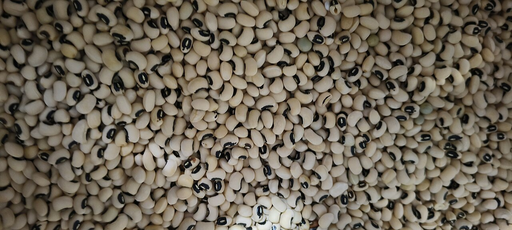

| | |
|---|---|
| Creator | Kuttykrishnan Photos |
| Licence | CC0-1.0 |
| Attribution | _none required_ |
| Source | https://commons.wikimedia.org/wiki/File:Black_eyed_peas_food.jpg |
| Size | 1000×450, 177 KB |

- [ ] This is a photograph of this dish, and I would put it on the card.

### Green Fava Beans with Garlic and Coriander · فول أخضر بالتوم والكزبرة

`ful-akhdar` · egyptian · `green-fava-beans`, `garlic`, `coriander`, `sunflower-oil`, `lemon`, `salt`

What Egypt eats in spring while the beans are green, and the row exists for exactly this with no recipe on it.

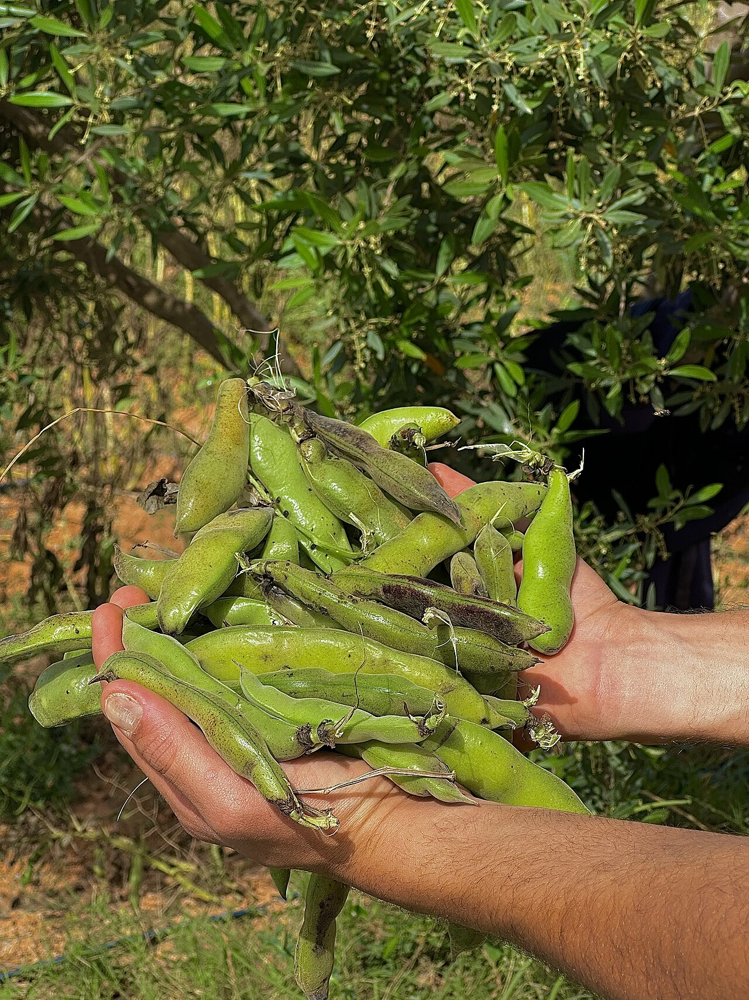

| | |
|---|---|
| Creator | Mhmd.abdrzg |
| Licence | CC-BY-SA-4.0 |
| Attribution | Mhmd.abdrzg · CC-BY-SA-4.0 · Wikimedia Commons |
| Source | https://commons.wikimedia.org/wiki/File:Freshly_Picked_Green_Fava_Beans_from_a_Libyan_Farm.jpg |
| Size | 1000×1333, 799 KB |

- [ ] This is a photograph of this dish, and I would put it on the card.

### Egyptian Chicken Soup · شوربة فراخ بلدي

`shorbet-firakh-baladi` · egyptian · `chicken-drumstick`, `onions`, `carrots`, `bay-leaf`, `cinnamon`, `water`, `salt`

A real gap: 192 recipes and not one plain chicken soup, which is the thing an Egyptian kitchen makes when somebody is ill.

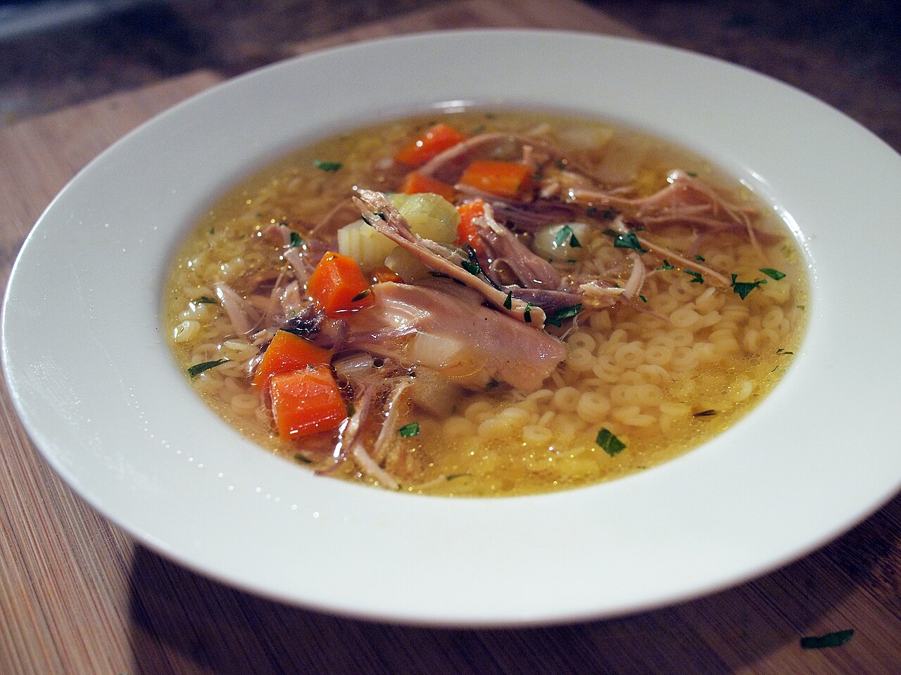

| | |
|---|---|
| Creator | Hoyabird8 |
| Licence | CC-BY-SA-3.0 |
| Attribution | Hoyabird8 · CC-BY-SA-3.0 · Wikimedia Commons |
| Source | https://commons.wikimedia.org/wiki/File:Chicken_Noodle_Soup.jpg |
| Size | 1000×750, 233 KB |

- [ ] This is a photograph of this dish, and I would put it on the card.

### Stuffed Courgettes · كوسة محشي

`mahshi-cosa` · egyptian · `zucchini`, `rice`, `tomatoes`, `onions`, `parsley`, `tomato-paste`, `salt`

Only cabbage mahshi exists. Courgette is the one most households actually make, and the two are not the same dish on a plate.

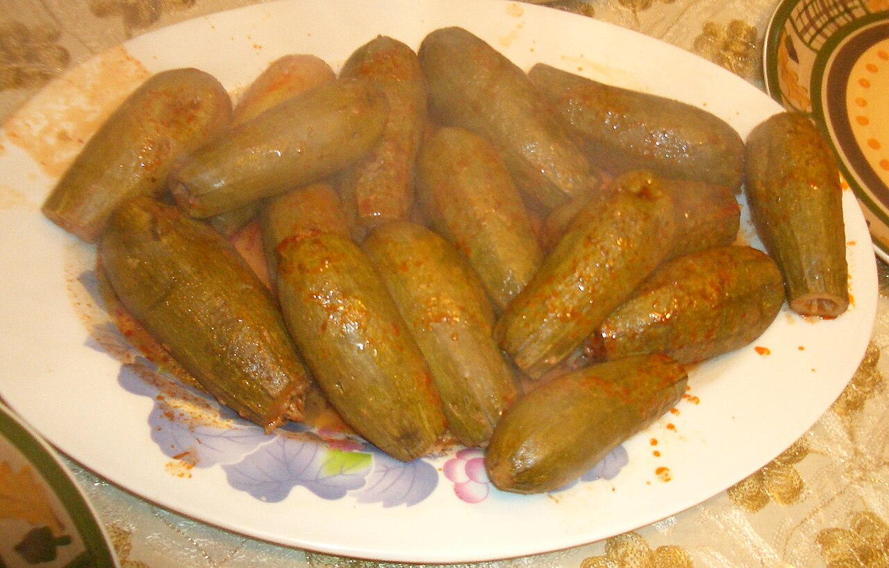

| | |
|---|---|
| Creator | Bazel |
| Licence | CC0-1.0 |
| Attribution | _none required_ |
| Source | https://commons.wikimedia.org/wiki/File:Kousa_Mahshi.jpg |
| Size | 1000×641, 195 KB |

- [ ] This is a photograph of this dish, and I would put it on the card.

### Smoked Herring with Onion and Lemon · رنجة

`renga` · egyptian · `herring`, `onions`, `lemon`, `olive-oil`, `cumin`

Sham el-Nessim on a plate. Five lines, no cooking, and the herring row is used by nothing.

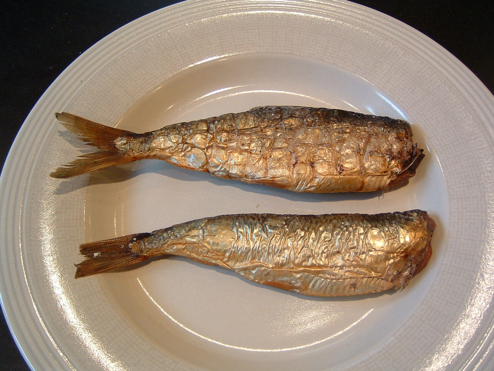

| | |
|---|---|
| Creator | Christopher Bertram (user: bristoleast) |
| Licence | CC-BY-SA-3.0 |
| Attribution | Christopher Bertram (user: bristoleast) · CC-BY-SA-3.0 · Wikimedia Commons |
| Source | https://commons.wikimedia.org/wiki/File:Buckling.jpg |
| Size | 1000×750, 308 KB |

- [ ] This is a photograph of this dish, and I would put it on the card.

### Baladi Flatbread · عيش بلدي

`eish-baladi` · egyptian · `flour`, `yeast`, `water`, `salt`

Four lines and the single most-eaten thing in the country. The catalogue bakes pita and focaccia and not this.

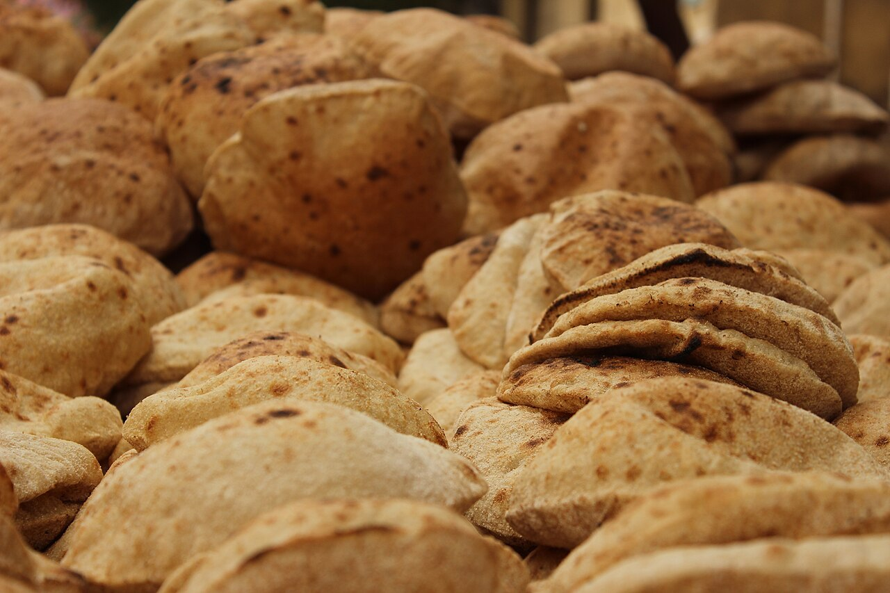

| | |
|---|---|
| Creator | Mohanad5ayman |
| Licence | CC-BY-SA-4.0 |
| Attribution | Mohanad5ayman · CC-BY-SA-4.0 · Wikimedia Commons |
| Source | https://commons.wikimedia.org/wiki/File:Bread_mohanad.JPG |
| Size | 1000×667, 174 KB |

- [ ] This is a photograph of this dish, and I would put it on the card.

### Pumpkin Soup · شوربة قرع عسلي

`shorbet-2ar3` · egyptian · `pumpkin`, `onions`, `garlic`, `stock-cube`, `water`, `salt`

Winter, cheap, and the pumpkin row has no recipe at all.

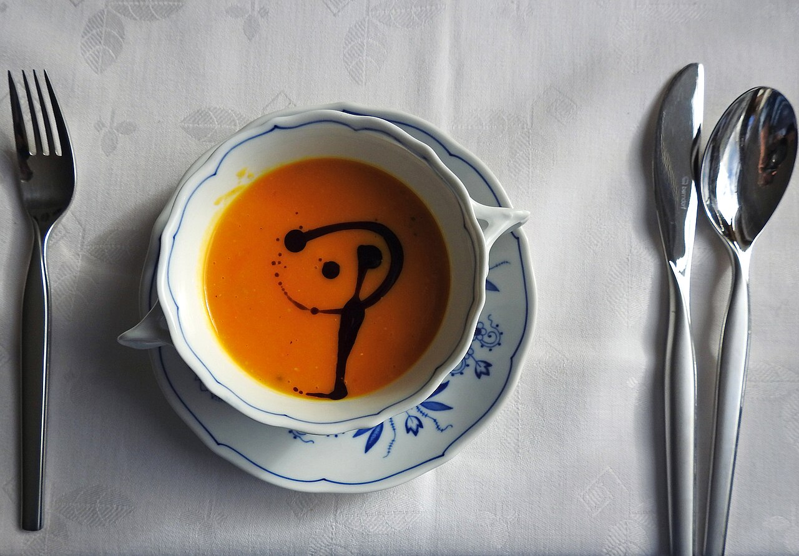

| | |
|---|---|
| Creator | Wald1siedel |
| Licence | CC-BY-SA-4.0 |
| Attribution | Wald1siedel · CC-BY-SA-4.0 · Wikimedia Commons |
| Source | https://commons.wikimedia.org/wiki/File:K%C3%BCrbissuppe_mit_Kern%C3%B6l.JPG |
| Size | 1000×696, 222 KB |

- [ ] This is a photograph of this dish, and I would put it on the card.

### Potatoes and Eggs · بطاطس بالبيض

`batates-bel-beid` · egyptian · `potatoes`, `eggs`, `onions`, `sunflower-oil`, `salt`

Five lines, one pan, and it is what an Egyptian kitchen makes when the fridge is nearly empty. Breakfast is still the thinnest meal type.

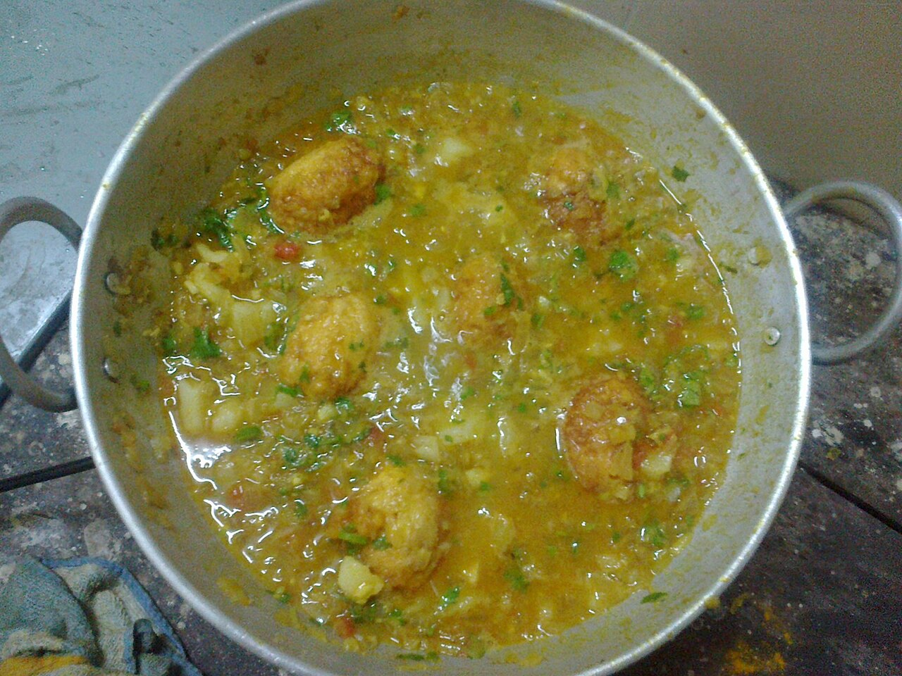

| | |
|---|---|
| Creator | Enigma410 |
| Licence | CC-BY-SA-4.0 |
| Attribution | Enigma410 · CC-BY-SA-4.0 · Wikimedia Commons |
| Source | https://commons.wikimedia.org/wiki/File:Potato_and_egg_curry.jpg |
| Size | 1000×750, 290 KB |

- [ ] This is a photograph of this dish, and I would put it on the card.

### Stuffed Pigeon · حمام محشي

`hamam-mahshi` · egyptian · `pigeon`, `rice`, `onions`, `butter`, `cinnamon`, `salt`

The dish Egyptians take visitors out for, and the pigeon row has no recipe. Harder photography, worth one attempt.

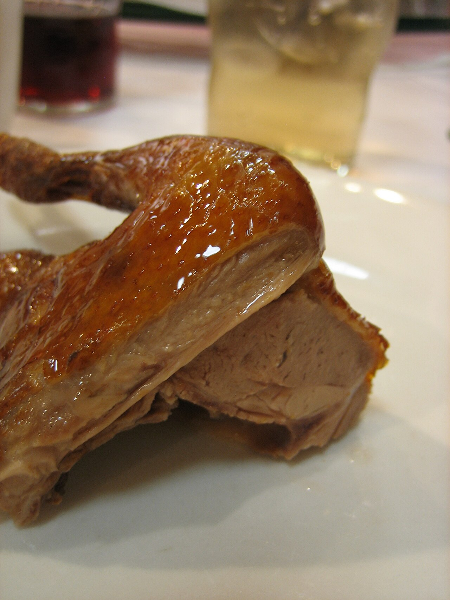

| | |
|---|---|
| Creator | Ernesto Andrade from Fremont, United States |
| Licence | CC-BY-2.0 |
| Attribution | Ernesto Andrade from Fremont, United States · CC-BY-2.0 · Wikimedia Commons |
| Source | https://commons.wikimedia.org/wiki/File:Chinese_squab.jpg |
| Size | 1000×1333, 285 KB |

- [ ] This is a photograph of this dish, and I would put it on the card.

### Oven-Braised Veal Shank · موزة في الفرن

`moza-bel-forn` · egyptian · `veal`, `onions`, `tomato-paste`, `bay-leaf`, `water`, `salt`

Friday lunch. Long, cheap cut, almost no work, and the veal row is used by nothing.

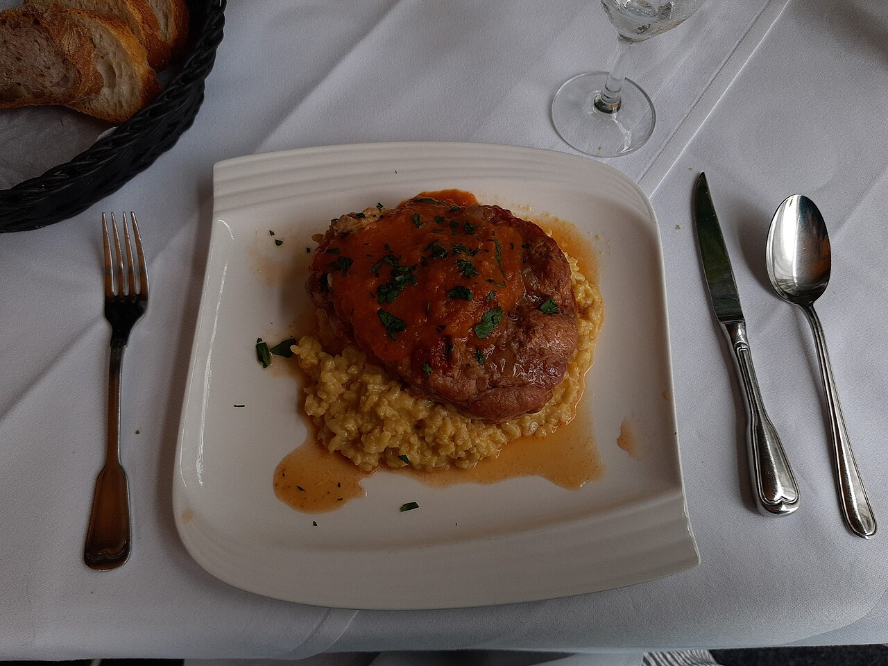

| | |
|---|---|
| Creator | Gerda Arendt |
| Licence | CC0-1.0 |
| Attribution | _none required_ |
| Source | https://commons.wikimedia.org/wiki/File:Osso_buco,_Breckenheim.jpg |
| Size | 1000×750, 268 KB |

- [ ] This is a photograph of this dish, and I would put it on the card.

### Oven Chicken Drumsticks · دبابيس فراخ في الفرن

`dababees-bel-forn` · egyptian · `chicken-drumstick`, `garlic`, `paprika`, `sunflower-oil`, `lemon`, `salt`

The cheapest chicken there is, one tray. The drumstick row was argued over at length in the ontology work and still has no recipe.

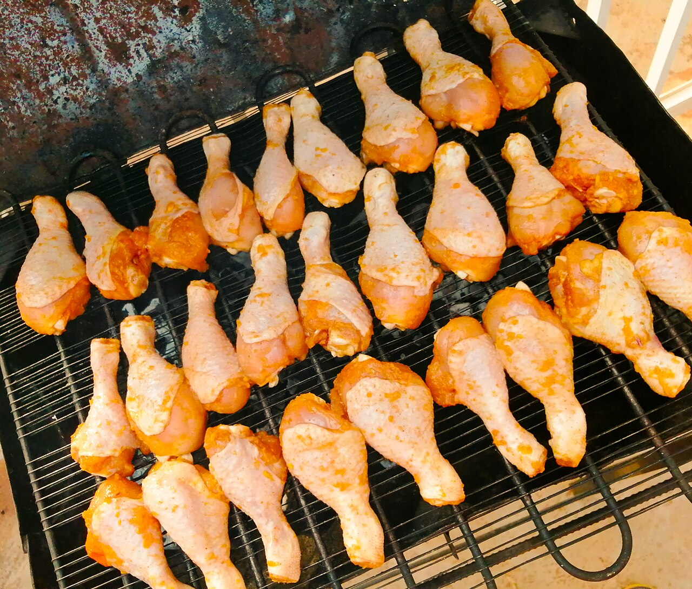

| | |
|---|---|
| Creator | ArtoftheArtist IAm |
| Licence | CC-BY-SA-4.0 |
| Attribution | ArtoftheArtist IAm · CC-BY-SA-4.0 · Wikimedia Commons |
| Source | https://commons.wikimedia.org/wiki/File:Chicken_Drumsticks_on_a_Grill.jpg |
| Size | 1000×853, 403 KB |

- [ ] This is a photograph of this dish, and I would put it on the card.

### Layered Ghee Pastry · فطير مشلتت

`feteer-meshaltet` · egyptian · `flour`, `ghee`, `water`, `salt`

Four lines. The cheese feteer in the catalogue is the stuffed one; this is the plain layered bread it is built from.

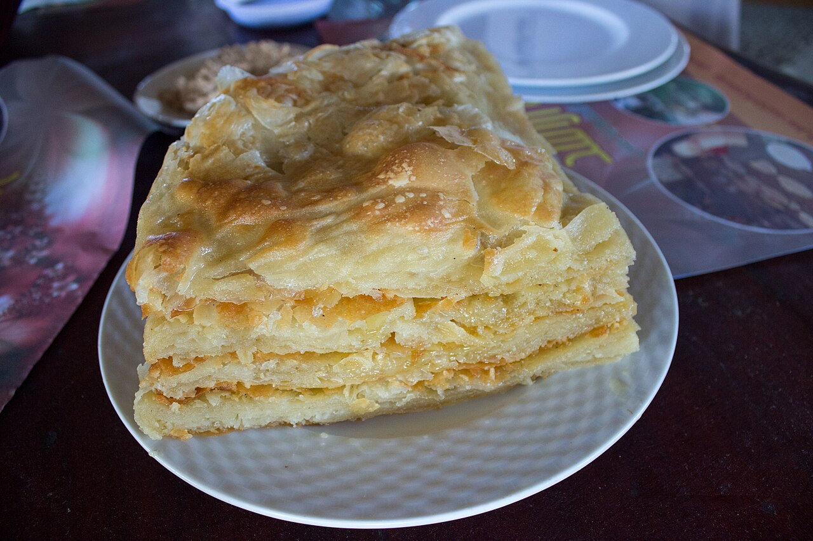

| | |
|---|---|
| Creator | Mohamed Ouda |
| Licence | CC-BY-SA-4.0 |
| Attribution | Mohamed Ouda · CC-BY-SA-4.0 · Wikimedia Commons |
| Source | https://commons.wikimedia.org/wiki/File:Egyptian-food-16.jpg |
| Size | 1000×667, 220 KB |

- [ ] This is a photograph of this dish, and I would put it on the card.

### Vegetable Soup · شوربة خضار

`shorbet-khodar` · egyptian · `carrots`, `potatoes`, `zucchini`, `green-peas`, `stock-cube`, `water`, `salt`

Ordinary on purpose: it is the soup that gets made on a weeknight, and nothing in the catalogue answers it.

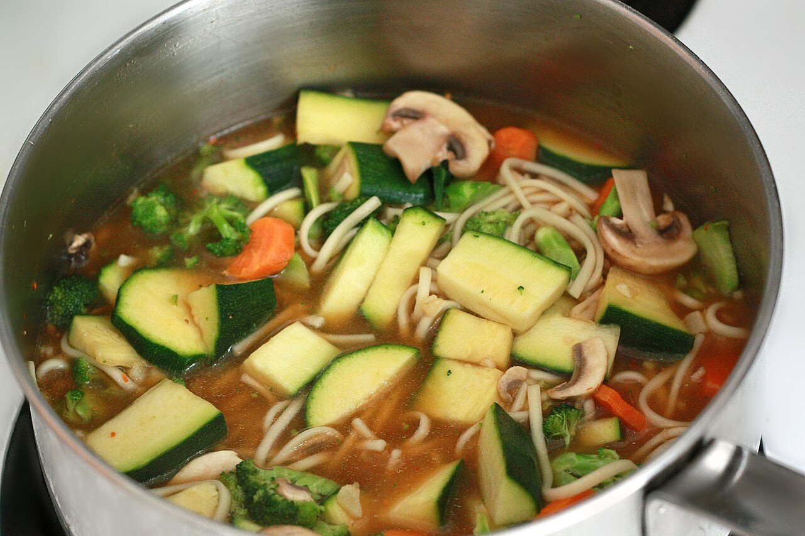

| | |
|---|---|
| Creator | Jennifer |
| Licence | CC-BY-2.0 |
| Attribution | Jennifer · CC-BY-2.0 · Wikimedia Commons |
| Source | https://commons.wikimedia.org/wiki/File:Vegetable_udon_noodle_soup.jpg |
| Size | 1000×667, 248 KB |

- [ ] This is a photograph of this dish, and I would put it on the card.

### Sesame Bread Rings · سميط

`semit` · egyptian · `flour`, `yeast`, `sesame-seeds`, `water`, `salt`

Street bread, five lines, and the semit row is unused. Identity risk on review: Turkish simit is the same shape and a different bread.

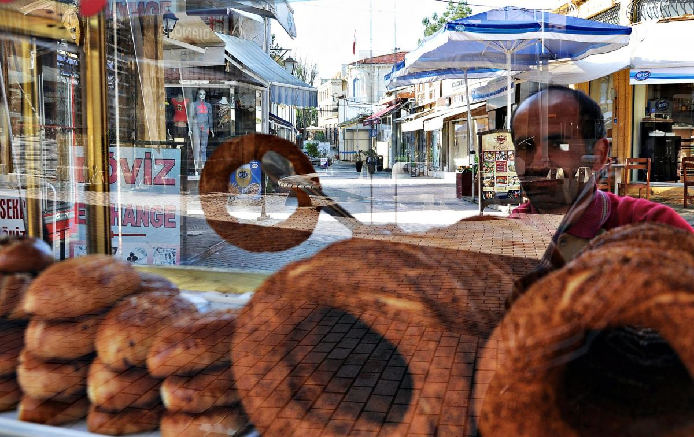

| | |
|---|---|
| Creator | Nicosia Turkish Municipality |
| Licence | CC-BY-SA-4.0 |
| Attribution | Nicosia Turkish Municipality · CC-BY-SA-4.0 · Wikimedia Commons |
| Source | https://commons.wikimedia.org/wiki/File:Simit_vendor_next_to_checkpoint,_Nicosia.jpg |
| Size | 1000×630, 180 KB |

- [ ] This is a photograph of this dish, and I would put it on the card.

### One-Pot Chicken and Rice · فراخ بالأرز

`firakh-bel-roz` · egyptian · `chicken-thigh`, `rice`, `onions`, `cinnamon`, `water`, `salt`

Chicken cooked on top of the rice so the rice takes the fat. One pot, six lines, feeds a family.

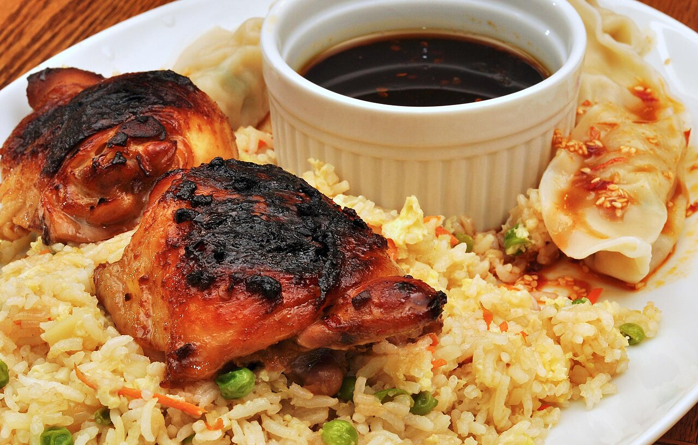

| | |
|---|---|
| Creator | jeffreyw |
| Licence | CC-BY-2.0 |
| Attribution | jeffreyw · CC-BY-2.0 · Wikimedia Commons |
| Source | https://commons.wikimedia.org/wiki/File:Asian_glazed_chicken_on_fried_rice_(6107408438).jpg |
| Size | 1000×639, 263 KB |

- [ ] This is a photograph of this dish, and I would put it on the card.

### Potato Eggah · عجة بالبطاطس

`eggah-bel-batates` · egyptian · `eggs`, `potatoes`, `onions`, `sunflower-oil`, `salt`

Five lines. The baladi eggah in the catalogue is the herb one; this is the thick potato one, and they are different meals.

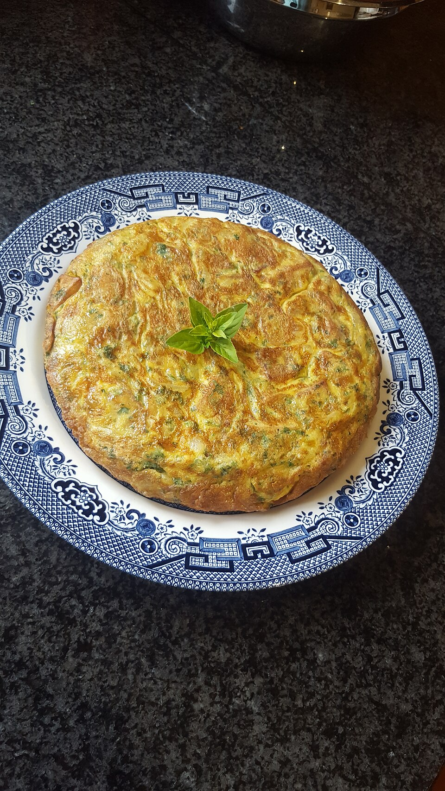

| | |
|---|---|
| Creator | Richard Avery |
| Licence | CC-BY-SA-4.0 |
| Attribution | Richard Avery · CC-BY-SA-4.0 · Wikimedia Commons |
| Source | https://commons.wikimedia.org/wiki/File:A_potato_omelette.jpg |
| Size | 800×1422, 568 KB |

- [ ] This is a photograph of this dish, and I would put it on the card.

### Meatballs in Tomato Sauce · كفتة بالصلصة

`kofta-bel-salsa` · egyptian · `ground-beef`, `onions`, `tomato-paste`, `garlic`, `water`, `salt`

Stovetop, thirty minutes, eaten over rice. Distinct from the baked kofta tagine and from the stewed beef already here.

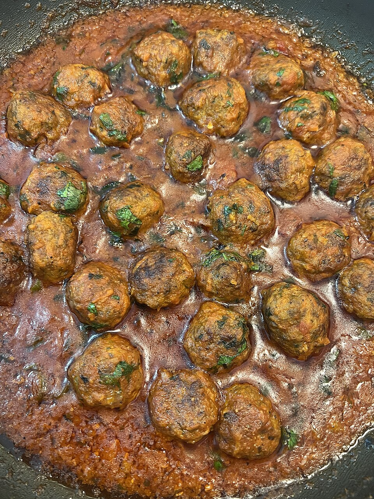

| | |
|---|---|
| Creator | HaJunkiyada |
| Licence | CC-BY-SA-4.0 |
| Attribution | HaJunkiyada · CC-BY-SA-4.0 · Wikimedia Commons |
| Source | https://commons.wikimedia.org/wiki/File:Liat_Portal_for_Foodie_Disorder_-_Meatballs_in_tomato_sauce.jpg |
| Size | 800×1067, 586 KB |

- [ ] This is a photograph of this dish, and I would put it on the card.

### Pasta in Minced Beef Sauce · مكرونة باللحمة المفرومة

`spaghetti-bolognese` · italian · `pasta`, `ground-beef`, `tomato-paste`, `onions`, `garlic`, `water`, `salt`

Not an Egyptian dish and completely normal in an Egyptian kitchen. The catalogue has plain tomato macaroni and bechamel and nothing with a meat sauce.

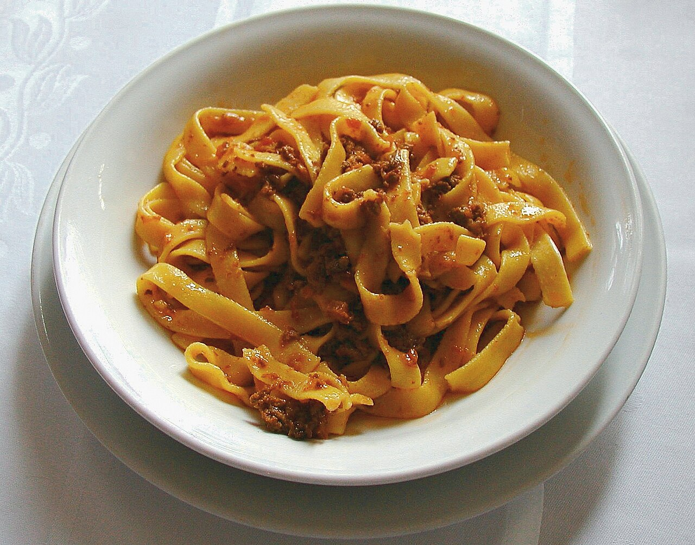

| | |
|---|---|
| Creator | Ivan Vighetto |
| Licence | CC-BY-SA-3.0 |
| Attribution | Ivan Vighetto · CC-BY-SA-3.0 · Wikimedia Commons |
| Source | https://commons.wikimedia.org/wiki/File:Tagliatelle_al_rag%C3%B9_(image_modified).jpg |
| Size | 1000×786, 315 KB |

- [ ] This is a photograph of this dish, and I would put it on the card.

### Beef in Cream Sauce · لحمة بالكريمة

`beef-stroganoff` · american · `beef-cubes`, `onions`, `mushroom`, `cream`, `butter`, `salt`

On the menu of nearly every Cairo family restaurant and made at home from cooking cream. Substantial, and nothing in the catalogue uses cream as a sauce.

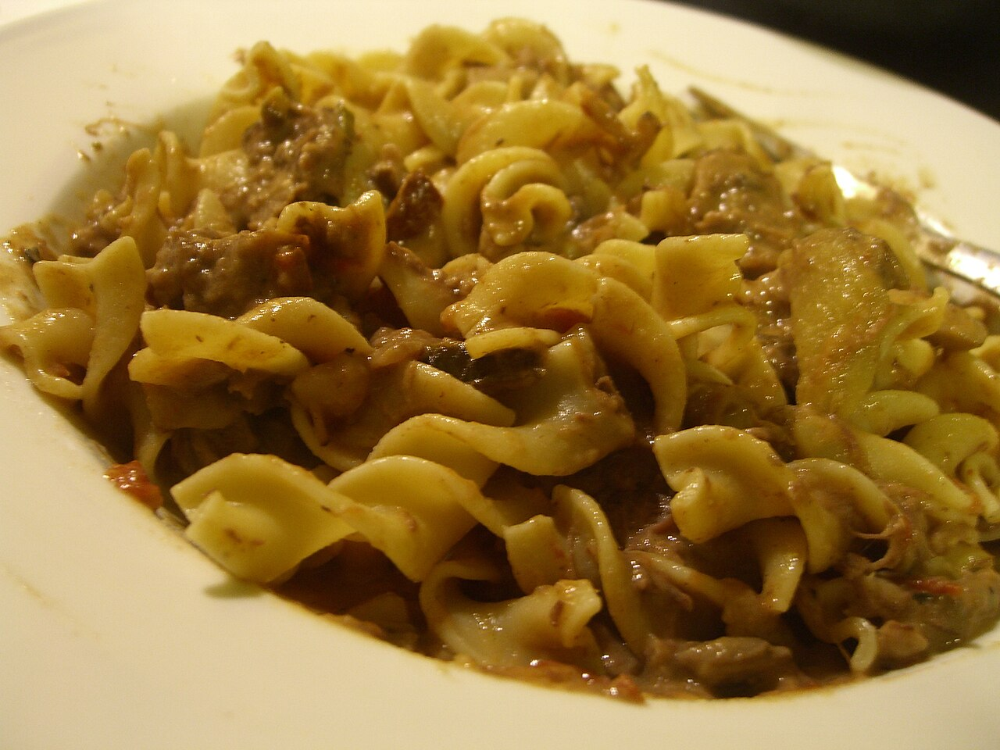

| | |
|---|---|
| Creator | benketaro |
| Licence | CC-BY-2.0 |
| Attribution | benketaro · CC-BY-2.0 · Wikimedia Commons |
| Source | https://commons.wikimedia.org/wiki/File:Beef_stroganoff_with_pasta.jpg |
| Size | 1000×750, 189 KB |

- [ ] This is a photograph of this dish, and I would put it on the card.

### Baked Potato with Cheese · بطاطس بالجبنة في الفرن

`baked-potato-cheese` · american · `potatoes`, `roumy-cheese`, `butter`, `black-pepper`, `salt`

Five lines and an oven. Made here with roumy, which is the hard cheese an Egyptian fridge actually holds.

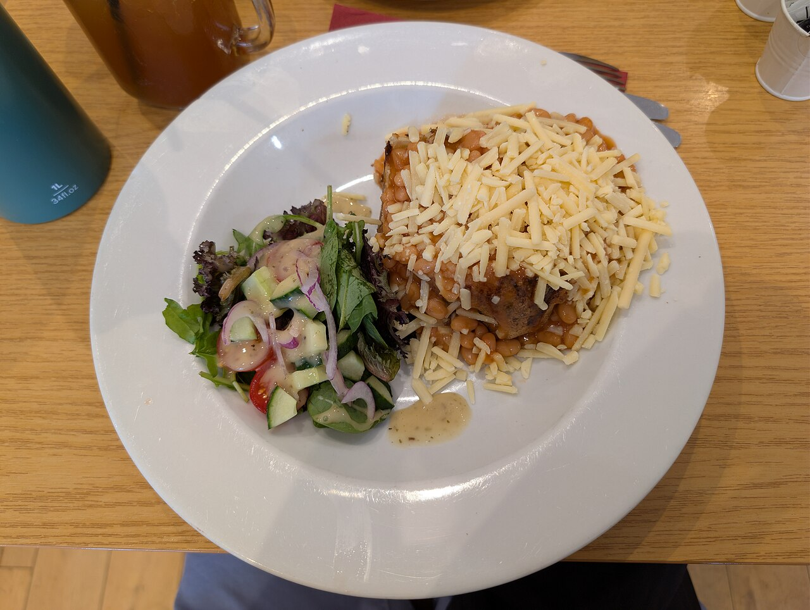

| | |
|---|---|
| Creator | Andy Li |
| Licence | CC0-1.0 |
| Attribution | _none required_ |
| Source | https://commons.wikimedia.org/wiki/File:Baked_potato_with_baked_beans_and_cheese_-_The_Verandah_2026-08-25.jpg |
| Size | 1000×753, 205 KB |

- [ ] This is a photograph of this dish, and I would put it on the card.

### Chicken and Sweetcorn Soup · شوربة فراخ بالذرة

`chicken-corn-soup` · asian · `chicken-breast`, `corn`, `cornflour`, `stock-cube`, `water`, `salt`

Ordered constantly in Egypt and made at home from a tin. The sweetcorn row is unused.

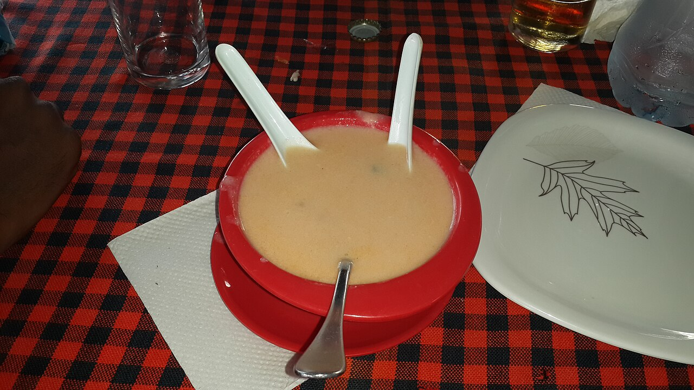

| | |
|---|---|
| Creator | Balaji Kasirajan |
| Licence | CC-BY-SA-4.0 |
| Attribution | Balaji Kasirajan · CC-BY-SA-4.0 · Wikimedia Commons |
| Source | https://commons.wikimedia.org/wiki/File:Chicken_corn_soup.jpg |
| Size | 1000×563, 219 KB |

- [ ] This is a photograph of this dish, and I would put it on the card.

### Potato and Leek Soup · شوربة بطاطس وكرات

`potato-leek-soup` · mediterranean · `potatoes`, `leek`, `butter`, `stock-cube`, `water`, `salt`

Six lines, one pot, blended or not. The leek row is used by nothing.

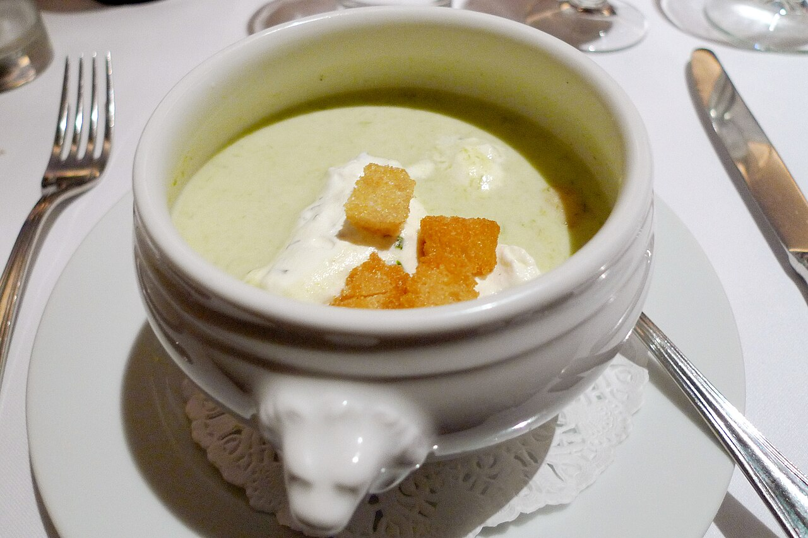

| | |
|---|---|
| Creator | Ewan Munro from London, UK |
| Licence | CC-BY-SA-2.0 |
| Attribution | Ewan Munro from London, UK · CC-BY-SA-2.0 · Wikimedia Commons |
| Source | https://commons.wikimedia.org/wiki/File:Mon_Plaisir,_Covent_Garden,_London_(3717184145).jpg |
| Size | 1000×667, 194 KB |

- [ ] This is a photograph of this dish, and I would put it on the card.

### Green Beans in Tomato with Beef · فاصوليا خضراء باللحمة

`green-bean-stew` · levantine · `green-beans`, `beef-cubes`, `tomatoes`, `tomato-paste`, `onions`, `garlic`, `salt`

Cooked from Beirut to Cairo and the green-bean row has no recipe. A different bean and a different dish from the white-bean stew that found nothing in batch 3.

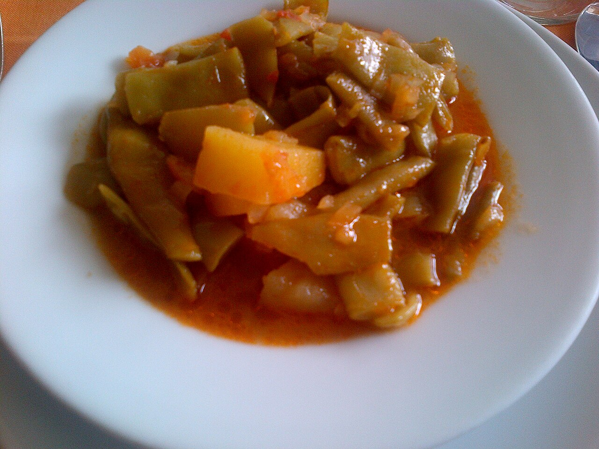

| | |
|---|---|
| Creator | E4024 |
| Licence | CC-BY-SA-4.0 |
| Attribution | E4024 · CC-BY-SA-4.0 · Wikimedia Commons |
| Source | https://commons.wikimedia.org/wiki/File:Taze_fasulye.jpg |
| Size | 1000×750, 244 KB |

- [ ] This is a photograph of this dish, and I would put it on the card.

### No acceptable image (7)

These keep nothing. A generic photograph of something else is not a
substitute — it tells the user something false about what they are cooking.

| Dish | Why |
|---|---|
| Potato and Beef Tagine (`tagen-batates-bel-lahma`) | no relevant openly-licensed image found |
| Grilled Kofta Skewers (`kofta-mashwiya`) | no relevant openly-licensed image found |
| Baked Fish in Tahini Sauce (`samak-bel-tahina`) | no relevant openly-licensed image found |
| Tahini with Black Honey (`tahina-bel-asal-eswed`) | no relevant openly-licensed image found |
| Circassian Chicken with Walnuts (`sharkasiya`) | no relevant openly-licensed image found |
| Peas and Beef Stew (`besela-bel-lahma`) | no relevant openly-licensed image found |
| Festive Rice with Nuts and Raisins (`roz-bel-khalta`) | no relevant openly-licensed image found |

