# Candidate photography — review before any of this ships

**Generated by `npm run images:review-candidates`. Do not edit by hand.**

None of these photographs is published. They are staged in
`assets/recipe-candidates/`, which the app does not bundle and does not index.
A staged photograph reaches a recipe card only through `npm run images:promote`,
by name, after its recipe exists.

**A photograph passing the automatic checks does not prove it depicts the right
dish.** The checks read a title, a licence, a category and a pixel count. They
cannot see the picture. `data/images/rejected.json` is the record of what that
misses: an aerial view of the Turkish town of Menemen for the dish named after
it, a grape vine for stuffed vine leaves, breaded oysters for scrambled eggs.
Every one passed every automatic test.

### To reject one

Add its Commons title to `data/images/rejected.json` with the reason, delete the
staged file and its manifest entry, and re-run the acquisition. The refusal is
permanent, applies to production as well, and both validators refuse a manifest
that contains a refused file.

## batch-1-small-pantry

24 dishes that are genuinely five ingredient lines or fewer — counting every line, including salt and oil. The catalogue has FOUR of those against a target of about 44, and a short list is the strongest predictor of a recipe a real Egyptian kitchen can actually reach: the dataset audit finds 0 or 1 exact matches for a three-item pantry today. No recipe is written yet. These are dish identities, sent to the photography preflight first, so that the recipes get written for the dishes that can honestly be illustrated rather than the other way round.

**24 candidates: 15 reviewed and shipped, 0 waiting to be looked at, 9 with nothing acceptable.**

### Already promoted (15)

Reviewed, written as recipes, and now on a card. Their photographs live in
`assets/recipes/` and are validated by `npm run images:check`.

| Dish | Creator | Licence |
|---|---|---|
| Hibiscus Tea (`karkade`) | stu_spivack | CC-BY-SA-2.0 |
| Warm Sahlab with Pistachios (`sahlab`) | DesignbyNur | CC-BY-SA-3.0 |
| Grilled Corn on the Cob (`dura-mashwiya`) | 100yen | CC-BY-SA-3.0 |
| Roasted Sweet Potato (`batata-mashwiya`) | 국립국어원 | CC-BY-SA-2.0 |
| Tahini Sauce with Lemon (`salatet-tahina`) | Gilabrand | CC-BY-SA-3.0 |
| Honey-Soaked Dough Balls (`lokmet-el-qadi`) | Aldousari | CC-BY-SA-3.0 |
| Peanut and Sesame Dukkah (`dukkah-baladi`) | Miansari66 | CC0-1.0 |
| Fresh Lemonade with Mint (`aseer-limon`) | HarshLight | CC-BY-2.0 |
| Tomato Soup (`shorbet-tamatem`) | Ella Olsson from Stockholm, Sweden | CC-BY-2.0 |
| Eggs with Basterma (`beid-bel-basterma`) | E4024 | CC-BY-SA-4.0 |
| Grilled Halloumi with Lemon (`grilled-halloumi`) | Unknown | CC-BY-SA-3.0 |
| Parmesan and Black Pepper Pasta (`parmesan-pepper-pasta`) | Camelia.boban | CC-BY-SA-4.0 |
| Olive Oil Flatbread (`focaccia`) | Fred Benenson | CC-BY-SA-4.0 |
| Garlic Butter Bread (`garlic-bread`) | Popo le Chien | CC-BY-SA-3.0 |
| French Toast (`french-toast`) | Jonathunder | CC-BY-SA-3.0 |

### No acceptable image (9)

These keep nothing. A generic photograph of something else is not a
substitute — it tells the user something false about what they are cooking.

| Dish | Why |
|---|---|
| Apricot Nectar (`qamar-el-din`) | refused on human review — see data/images/rejected.json |
| Wheat Berries in Sweet Milk (`belila`) | refused on human review — see data/images/rejected.json |
| Pink Pickled Turnips (`torshi-lift`) | refused on human review — see data/images/rejected.json |
| Crisp Potato Hash Browns (`hash-browns`) | refused on human review — see data/images/rejected.json |
| Buttery Mashed Potatoes (`mashed-potatoes`) | refused on human review — see data/images/rejected.json |
| Mango Yogurt Drink (`mango-lassi`) | refused on human review — see data/images/rejected.json |
| Spiced Milk Tea (`masala-chai`) | refused on human review — see data/images/rejected.json |
| Turkish Coffee (`turkish-coffee`) | refused on human review — see data/images/rejected.json |
| Mashed Spiced Beans (`refried-beans`) | refused on human review — see data/images/rejected.json |

## batch-2-short-mains

17 new dishes to go with the 13 batch-1 candidates being re-attempted, making 30. Batch 1 converted 11 of 24, and it leaned heavily on drinks, sides and sweets; this one is weighted toward things a household actually eats for lunch and dinner, and toward Egyptian, because the catalogue is 25.0% Egyptian against a ≥30% goal. Nine of the seventeen are Egyptian and none is an invented Egyptian variant of a foreign dish. Protein spread is deliberate: liver, sausage, whole chicken, eggs, white cheese and chicken breast rather than another round of the same three. Every list is five lines or fewer counting water, salt and oil.

**17 candidates: 8 reviewed and shipped, 0 waiting to be looked at, 9 with nothing acceptable.**

### Already promoted (8)

Reviewed, written as recipes, and now on a card. Their photographs live in
`assets/recipes/` and are validated by `npm run images:check`.

| Dish | Creator | Licence |
|---|---|---|
| Macaroni in Red Sauce (`makarona-bel-salsa`) | 10Rosso | CC-BY-2.0 |
| Rice with Vermicelli (`roz-bel-shareya`) | El Mono Español | CC-BY-SA-4.0 |
| Alexandrian Liver (`kebda-eskandarani`) | Turnopoems | CC-BY-SA-4.0 |
| Fried Aubergine with Garlic and Vinegar (`betingan-mely`) | HaJunkiyada | CC-BY-SA-4.0 |
| Spanish Potato Omelette (`tortilla-espanola`) | Kent Wang | CC-BY-SA-2.0 |
| Greek Spinach Rice (`spanakorizo`) | KaterinaStrak | CC-BY-SA-4.0 |
| Potato and Egg Salad (`potato-salad`) | SajjadF | CC-BY-SA-3.0 |
| Pocket Flatbread (`pita-bread`) | Azure Dragon of the East | CC-BY-SA-3.0 |

### No acceptable image (9)

These keep nothing. A generic photograph of something else is not a
substitute — it tells the user something false about what they are cooking.

| Dish | Why |
|---|---|
| Egyptian Sausage in Tomato (`sogo2-bel-salsa`) | no relevant openly-licensed image found |
| Whole Chicken in the Oven with Cumin (`firakh-bel-forn`) | File:Roasted chicken leg piece-MB20.jpg: refused on review — Two chicken leg quarters with parallel grill bars charred across them, on a bright green plastic plate. This recipe is a WHOLE bird roasted breast-down in an oven; the photograph is jointed tandoori-style grilled chicken, and the difference is the first thing anyone would see. Promoted in error on a first pass and reversed on a second look at full size — the thumbnail hid the grill marks. |
| Eggs Scrambled with Tomato (`beid-bel-tamatem`) | File:Tomato and egg soup.jpg: refused on review — Chinese tomato-and-egg SOUP in a broth bowl. Beid bel tamatem is eggs fried into tomatoes in a pan; a thin soup is a different dish. Second refusal for this slug. |
| White Cheese with Tomato and Mint (`gibna-bel-tamatem`) | no relevant openly-licensed image found |
| Cheese Sambousek (`sambousek`) | File:Samosas, snack food at Wikipedia's 16th Birthday celebration in Chittagong (01).jpg: refused on review — Fried samosas with a green potato-and-pea filling, photographed at an event. The shape is right and the filling visibly is not: this recipe is cheese sambousek. |
| Lemon and Oregano Chicken Skewers (`chicken-souvlaki`) | refused on human review — see data/images/rejected.json |
| Yogurt Flatbread (`naan`) | File:BUTTER NON with GOBI PANEER + VEG MIX.jpg: refused on review — A 'Retrica' app watermark burned into the bottom-right corner, over a dim purple-cast thali of two curries. Second refusal for this slug. |
| Crumbed Chicken Cutlet (`chicken-katsu`) | File:Bento of tonkatsu, jiaozi, California Rolls and rice with black sesame.jpg: refused on review — A takeaway styrofoam bento sitting on a computer keyboard, and the cutlet is tonkatsu - pork. Second refusal for this slug. |
| Cabbage and Carrot Slaw (`coleslaw`) | File:A traditional coleslaw with added honey, mixed nuts, dried apricots & mustard seed for serving.JPG: refused on review — A murky kitchen snapshot: the used mixing bowl and a smeared spoon fill the top of the frame and an unidentifiable dark bottle sits at the edge. Second refusal for this slug. |

## batch-3-egyptian-weeknight

30 candidates: 20 new and 10 second attempts at batch-2 dishes that were refused once. Fifteen of the thirty are Egyptian — half the pool — because the catalogue is 26.4% Egyptian against a ≥30% goal, and none of them is a foreign dish wearing an Egyptian name to move the number. The weighting is to real meals: a baked tilapia, white beans with beef, a tray of torly, chicken livers, two breakfasts built on cheese and eggs. The nine dishes refused twice in batches 1 and 2 are NOT here — they are retired from automated attempts and kept in the backlog for a human with a known-good source. Belila, gibna-bel-tamatem and sogo2-bel-salsa found nothing twice and are deferred.

**30 candidates: 9 reviewed and shipped, 0 waiting to be looked at, 1 held, 20 with nothing acceptable.**

### Already promoted (9)

Reviewed, written as recipes, and now on a card. Their photographs live in
`assets/recipes/` and are validated by `npm run images:check`.

| Dish | Creator | Licence |
|---|---|---|
| Baked Mixed Vegetables in Tomato (`torly`) | Orientalist | CC0-1.0 |
| Dried Fruit Compote (`khoshaf`) | CallMeBarcode | CC-BY-SA-4.0 |
| Cheese Börek (`borek`) | Alice Wiegand | CC-BY-SA-3.0 |
| Chilled Tomato Soup (`gazpacho`) | Haydn Blackey | CC-BY-SA-2.0 |
| Greek Egg and Lemon Soup (`avgolemono`) | robin.norwood | CC-BY-SA-2.0 |
| Lentil and Chickpea Soup (`harira`) | Interstates | CC-BY-3.0 |
| Onion Soup with Cheese Toast (`french-onion-soup`) | Ludovic Péron | CC-BY-SA-3.0 |
| Macaroni in Red Sauce (`makarona-bel-salsa`) | 10Rosso | CC-BY-2.0 |
| Fried Aubergine with Garlic and Vinegar (`betingan-mely`) | HaJunkiyada | CC-BY-SA-4.0 |

### Held (1)

Looked at, and nothing is wrong with the photograph — the dish is the
problem. These stay staged and unpublished until whatever is blocking them
is resolved, which is why they are not in `rejected.json`: that list is
permanent and global, and refusing a good file there would keep it out of
every future batch as well.

| Dish | Why it is held |
|---|---|
| Spiced Bean Soup (`black-bean-soup`) | The photograph is fine — a thick, dark bean purée dusted with paprika — but it is a photograph of BLACK beans and the ingredient catalogue has no black-bean row. The recipe this candidate would become is a kidney-bean soup, and putting this picture on it would illustrate a different legume. Held rather than refused: nothing is wrong with the file, and it becomes promotable the day a black-bean row exists. Not written into rejected.json for the same reason — that list is permanent and global. |

### No acceptable image (20)

These keep nothing. A generic photograph of something else is not a
substitute — it tells the user something false about what they are cooking.

| Dish | Why |
|---|---|
| Baked Tilapia with Cumin (`samak-bel-forn`) | File:Oreochromis-niloticus-Nairobi.JPG: refused on review — A live Nile tilapia swimming in an aquarium. The species is right and the food is absent. |
| White Beans with Beef (`fasolia-bel-lahma`) | no relevant openly-licensed image found |
| Chicken Livers with Onion (`kebda-firakh`) | File:Chickens in market.jpg: refused on review — Whole plucked chickens hanging in a butcher's window beside the scale. Raw poultry for sale, not chicken livers, not a cooked dish. |
| Eggs with White Cheese (`beid-bel-gibna`) | File:Eggs with cheese, mushrooms, and basil.jpg: refused on review — A dark, blurred home snapshot on a paper towel: American scrambled eggs under shredded cheese and sriracha, with mushrooms and spinach. Not eggs with Egyptian white cheese, and unusable quality besides. |
| Areesh Cheese with Oil and Tomato (`gibna-areesh`) | no relevant openly-licensed image found |
| Stuffed Ramadan Pancakes (`qatayef`) | File:Noura - Lebanese sweets.jpg: refused on review — A Lebanese sweet-shop table where the front plate is halawet el jibn - cream-filled semolina rolls. Qatayef are folded stuffed pancakes; this is a different sweet entirely. |
| Tamarind Drink (`tamr-hindi`) | File:Beverages in Coke bottles.JPG: refused on review — A street vendor's shelf of refilled PET bottles with commercial labels and a phone number printed across them. Commercial packaging, and not something anybody made at home. |
| Bread Pudding in Syrup (`eish-el-saraya`) | File:Rew13c05-745a Bread Pudding.JPG: refused on review — Western raisin bread pudding on a plate. Eish el saraya is rusk soaked in sugar syrup under a layer of ashta and pistachio, with no raisins and no baked sponge. |
| Lemon and Oregano Roast Potatoes (`greek-lemon-potatoes`) | no relevant openly-licensed image found |
| Tomato and Bread Salad (`panzanella`) | File:Proper Panzanella Salad, Jamies Italian, Leeds.jpg: refused on review — A tall glass of amber liquid at the top edge of the frame, from a restaurant chain's table, that cannot be confirmed as anything but beer. The same rule that refused the burger photograph applies when the drink is unidentifiable. |
| Potato-Stuffed Flatbread (`aloo-paratha`) | File:Aho ji nashta kijie.jpg: refused on review — A breakfast tray where a white-bread sev sandwich is as prominent as the parathas. The competing food is unrelated to the dish rather than something served with it. |
| Eggs in Spiced Tomato (`egg-curry`) | File:Egg curry pic.jpg: refused on review — An over-processed extreme close-up of a pan. The saturation is pushed so hard the egg is barely findable; nobody would read this as a dish. |
| Beans in Tomato Molasses (`baked-beans`) | File:020170717 Polish - english breakfast in London.jpg: refused on review — A full English breakfast: bacon, pork sausages, hash browns and an omelette, with the beans pushed to one edge. Pork in frame and the dish is not the subject. |
| Salted Rice Parcels (`onigiri`) | File:Black rice onigiri by Adonis Chen in Hsinchu.jpg: refused on review — The rice ball is still inside its convenience-store plastic wrapper and out of focus. Packaging, and the shape that makes an onigiri recognisable is hidden. |
| Eggs Scrambled with Tomato (`beid-bel-tamatem`) | File:Tomato and egg soup.jpg: refused on review — Chinese tomato-and-egg SOUP in a broth bowl. Beid bel tamatem is eggs fried into tomatoes in a pan; a thin soup is a different dish. Second refusal for this slug. |
| Cheese Sambousek (`sambousek`) | File:Samosas, snack food at Wikipedia's 16th Birthday celebration in Chittagong (01).jpg: refused on review — Fried samosas with a green potato-and-pea filling, photographed at an event. The shape is right and the filling visibly is not: this recipe is cheese sambousek. |
| Whole Chicken in the Oven with Cumin (`firakh-bel-forn`) | File:Roasted chicken leg piece-MB20.jpg: refused on review — Two chicken leg quarters with parallel grill bars charred across them, on a bright green plastic plate. This recipe is a WHOLE bird roasted breast-down in an oven; the photograph is jointed tandoori-style grilled chicken, and the difference is the first thing anyone would see. Promoted in error on a first pass and reversed on a second look at full size — the thumbnail hid the grill marks. |
| Yogurt Flatbread (`naan`) | File:BUTTER NON with GOBI PANEER + VEG MIX.jpg: refused on review — A 'Retrica' app watermark burned into the bottom-right corner, over a dim purple-cast thali of two curries. Second refusal for this slug. |
| Cabbage and Carrot Slaw (`coleslaw`) | File:A traditional coleslaw with added honey, mixed nuts, dried apricots & mustard seed for serving.JPG: refused on review — A murky kitchen snapshot: the used mixing bowl and a smeared spoon fill the top of the frame and an unidentifiable dark bottle sits at the edge. Second refusal for this slug. |
| Crumbed Chicken Cutlet (`chicken-katsu`) | File:Bento of tonkatsu, jiaozi, California Rolls and rice with black sesame.jpg: refused on review — A takeaway styrofoam bento sitting on a computer keyboard, and the cutlet is tonkatsu - pork. Second refusal for this slug. |

## batch-4-egyptian-everyday

30 candidates, 24 of them Egyptian — eighty per cent, against a two-thirds target — because the catalogue is 27.6% Egyptian and the goal is past 30%. Weighted hard to substantial everyday food rather than to whatever is easy to keep under five lines: seven one-pot or oven meals built on meat or poultry, four legume and vegetable mains, three soups people actually make for lunch, two fish, two breakfasts, two breads. Nothing already tried is here. The nine twice-refused dishes from batches 1 and 2, the exhausted batch-3 rejects, belila, gibna-bel-tamatem, sogo2-bel-salsa and the held black-bean-soup are all out of the pool and stay in history only. Eleven candidates also exist to use catalogue rows no recipe touches: black-eyed-peas, green-fava-beans, pumpkin, walnuts, herring, pigeon, veal, chicken-drumstick, molasses, green-peas, semit.

**30 candidates: 9 reviewed and shipped, 0 waiting to be looked at, 1 retired, 20 with nothing acceptable.**

### Already promoted (9)

Reviewed, written as recipes, and now on a card. Their photographs live in
`assets/recipes/` and are validated by `npm run images:check`.

| Dish | Creator | Licence |
|---|---|---|
| Egyptian Chicken Soup (`shorbet-firakh`) | Hoyabird8 | CC-BY-SA-3.0 |
| Stuffed Courgettes (`mahshi-cosa`) | Bazel | CC0-1.0 |
| Smoked Herring with Onion and Lemon (`renga`) | Christopher Bertram (user: bristoleast) | CC-BY-SA-3.0 |
| Baladi Flatbread (`eish-baladi`) | Mohanad5ayman | CC-BY-SA-4.0 |
| Pumpkin Soup (`shorbet-2ar3`) | Wald1siedel | CC-BY-SA-4.0 |
| Layered Ghee Pastry (`feteer-meshaltet`) | Mohamed Ouda | CC-BY-SA-4.0 |
| Meatballs in Tomato Sauce (`kofta-bel-salsa`) | HaJunkiyada | CC-BY-SA-4.0 |
| Pasta in Minced Beef Sauce (`pasta-minced-beef`) | Ivan Vighetto | CC-BY-SA-3.0 |
| Green Beans in Tomato with Beef (`green-bean-stew`) | E4024 | CC-BY-SA-4.0 |

### Retired (1)

Looked at, photograph fine, and the dish will never be written — the
catalogue already has it under another name. Unlike a hold, this does not
become promotable when the catalogue grows, because nothing is missing.
Kept out of `rejected.json` because the file itself is good; the
provenance is preserved in the candidate manifest so the decision stays
legible.

| Dish | Why it is retired |
|---|---|
| Potato Eggah (`eggah-bel-batates`) | A good photograph of a thick set potato omelette, and the dish is already in the catalogue: its ingredients are potatoes, eggs, onions, oil and salt, which is `tortilla-espanola` line for line. An Egyptian one differing only by using sunflower oil instead of olive oil would be a nationality relabel, not a recipe. RETIRED rather than held: this does not become writable when the catalogue grows, because nothing is missing — the concept is taken. Not in rejected.json either, because the photograph is fine and refusing it there would bar a good file from every future batch. |

### No acceptable image (20)

These keep nothing. A generic photograph of something else is not a
substitute — it tells the user something false about what they are cooking.

| Dish | Why |
|---|---|
| Black-Eyed Peas in Tomato and Oil (`lobia-bel-zeit`) | File:Black eyed peas food.jpg: refused on review — A dense mass of RAW DRIED black-eyed peas filling the frame. Raw produce, not a cooked dish — the same class as the heap of dry muesli already on this list. |
| Green Fava Beans with Garlic and Coriander (`ful-akhdar`) | File:Freshly Picked Green Fava Beans from a Libyan Farm.jpg: refused on review — Two hands holding freshly picked green fava bean PODS under an olive tree. The ingredient on the farm, not the dish in a pan. |
| Potato and Beef Tagine (`tagen-batates-bel-lahma`) | no relevant openly-licensed image found |
| Grilled Kofta Skewers (`kofta-mashwiya`) | no relevant openly-licensed image found |
| Baked Fish in Tahini Sauce (`samak-bel-tahina`) | no relevant openly-licensed image found |
| Tahini with Black Honey (`tahina-bel-asal-eswed`) | no relevant openly-licensed image found |
| Circassian Chicken with Walnuts (`sharkasiya`) | no relevant openly-licensed image found |
| Potatoes and Eggs (`batates-bel-beid`) | File:Potato and egg curry.jpg: refused on review — An Indian potato-and-egg curry in a big aluminium pot on a dirty outdoor surface. Turmeric gravy and fried egg balls; not the Egyptian pan of potatoes with eggs broken over them. |
| Stuffed Pigeon (`hamam-mahshi`) | File:Chinese squab.jpg: refused on review — Chinese roast squab: deep lacquered mahogany skin, dipping sauces, an unidentifiable amber drink behind it. Egyptian hamam mahshi is a small pale-gold bird stuffed with rice or freek. Same bird, different cuisine's dish. |
| Oven-Braised Veal Shank (`moza-bel-forn`) | File:Osso buco, Breckenheim.jpg: refused on review — Osso buco — a cross-cut veal shank on saffron risotto with a wine glass and a bread basket in frame. Egyptian moza is a whole braised shank; this is the Milanese dish, and the risotto is half the plate. |
| Oven Chicken Drumsticks (`dababees-bel-forn`) | File:Chicken Drumsticks on a Grill.jpg: refused on review — Two dozen RAW marinated drumsticks laid out on a cold grill rack, skin still pink. This is the prep step, not the meal, and raw poultry on a recipe card is worse than no photograph. |
| Vegetable Soup (`shorbet-khodar`) | File:Vegetable udon noodle soup.jpg: refused on review — A pan of Japanese udon noodle soup: wheat noodles, broccoli, mushrooms and courgette in a soy-brown broth. Not an Egyptian vegetable soup, and two of its main components are not in this recipe. |
| Sesame Bread Rings (`semit`) | File:Simit vendor next to checkpoint, Nicosia.jpg: refused on review — Shot through a shop window in Nicosia. Street reflections cover most of the frame — a bystander's face, exchange-bureau signage, and beer-brand parasols — and the bread is behind glass. |
| One-Pot Chicken and Rice (`firakh-bel-roz`) | File:Asian glazed chicken on fried rice (6107408438).jpg: refused on review — Glazed chicken thighs on egg fried rice with gyoza and a ramekin of soy dipping sauce. An Asian plate, not chicken cooked on top of the rice. |
| Peas and Beef Stew (`besela-bel-lahma`) | no relevant openly-licensed image found |
| Festive Rice with Nuts and Raisins (`roz-bel-khalta`) | no relevant openly-licensed image found |
| Beef in Cream Sauce (`beef-stroganoff`) | File:Beef stroganoff with pasta.jpg: refused on review — A dim, orange-cast close-up where egg noodles fill most of the frame and the beef is barely findable. The recipe has no pasta in it, and the photograph is too murky to read as food. |
| Baked Potato with Cheese (`baked-potato-cheese`) | File:Baked potato with baked beans and cheese - The Verandah 2026-08-25.jpg: refused on review — A jacket potato buried under BAKED BEANS and grated cheese, with a side salad and a juice jug. The beans are half the dish and this recipe does not contain them. |
| Chicken and Sweetcorn Soup (`chicken-corn-soup`) | File:Chicken corn soup.jpg: refused on review — A beige pool in a red bowl on a checked tablecloth, with a glass of amber liquid, a plastic bottle and somebody's arm in frame. Neither the chicken nor the corn is visible. |
| Potato and Leek Soup (`potato-leek-soup`) | File:Mon Plaisir, Covent Garden, London (3717184145).jpg: refused on review — A restaurant tureen of pale green soup with a cream quenelle and croutons, on a doily, with a wine glass behind. The file names a Covent Garden restaurant rather than a dish, so the identity cannot be confirmed — and neither the cream nor the croutons are in this recipe. |

## batch-5-short-and-underfed

28 candidates against the four measured deficits rather than against a percentage. THREE LAMB and FOUR SEAFOOD-OR-FISH, because lamb is 4 recipes of 201 and seafood is 4. SEVEN at five core lines or fewer, because honest short recipes are 29 against a ~44 target. Two breakfast/street snacks, because breakfast is 37 against 145 lunches. Nineteen are Egyptian, which is the natural consequence of going after those deficits rather than the aim: not one of these is a foreign dish relabelled, and `shorbet-2ar3` was just reclassified OUT of Egyptian in the same stage for exactly that reason. Fourteen candidates exist partly to use catalogue rows no recipe touches: lamb-chops, lamb-shank, crab, lupini-beans, artichoke, purslane, chard, turnip, roqaq, barley, ricotta, sumac, coconut-milk, dried-apricot. Nothing already tried is in the pool.

**28 candidates: 0 reviewed and shipped, 18 waiting to be looked at, 10 with nothing acceptable.**

### Grilled Lamb Chops · ريش ضاني مشوية

`riyash-danny-mashwiya` · egyptian · `lamb-chops`, `garlic`, `cumin`, `olive-oil`, `lemon`, `salt`

Four lamb recipes in 201, and the lamb-chops row has none. Five minutes a side over real heat.

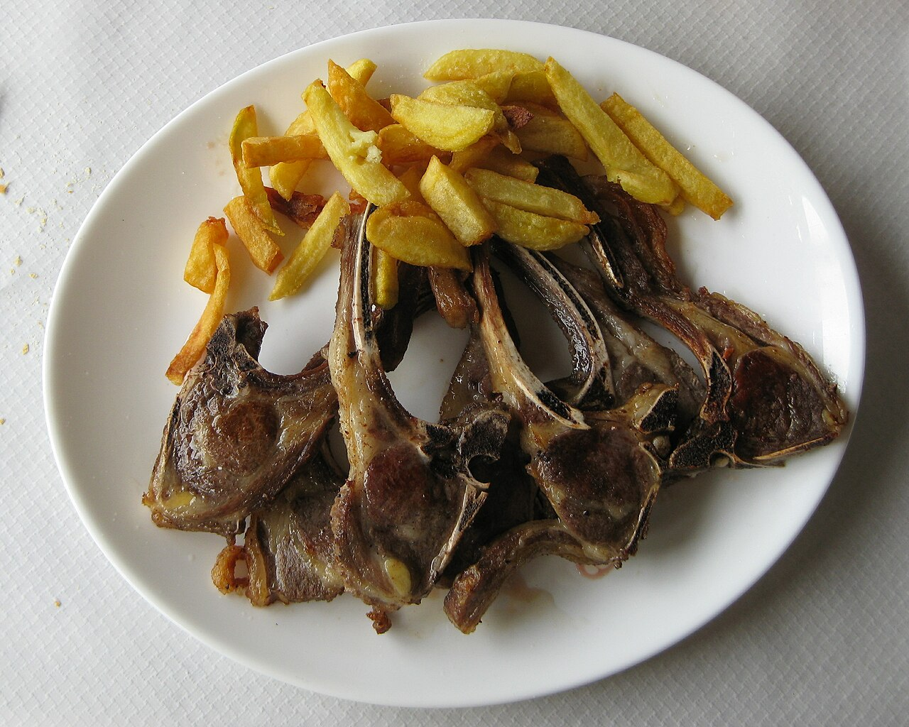

| | |
|---|---|
| Creator | Mike Cowlishaw |
| Licence | CC-BY-3.0 |
| Attribution | Mike Cowlishaw · CC-BY-3.0 · Wikimedia Commons |
| Source | https://commons.wikimedia.org/wiki/File:Chuletillas-El-Mazuco.jpg |
| Size | 1000×800, 285 KB |

- [ ] This is a photograph of this dish, and I would put it on the card.

### Braised Lamb Shank · موزة ضاني

`moza-danny` · egyptian · `lamb-shank`, `onions`, `tomato-paste`, `bay-leaf`, `water`, `salt`

Friday lunch, a cheap cut and almost no work. The lamb-shank row is unused. A veal shank was tried in batch 4 and got osso buco; this is a different cut, a different search and a different dish.

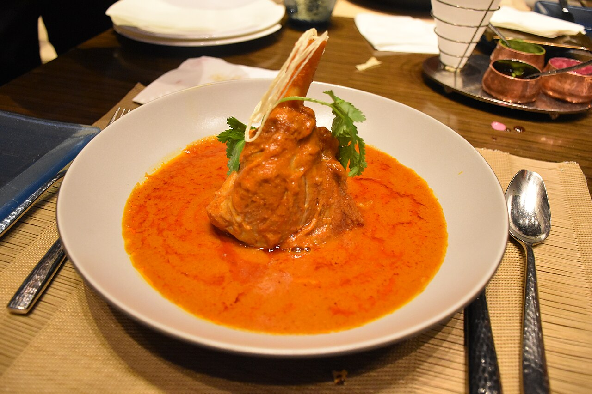

| | |
|---|---|
| Creator | Geoffreyrabbit |
| Licence | CC-BY-SA-4.0 |
| Attribution | Geoffreyrabbit · CC-BY-SA-4.0 · Wikimedia Commons |
| Source | https://commons.wikimedia.org/wiki/File:Lamb_shank_with_curry.jpg |
| Size | 1000×667, 206 KB |

- [ ] This is a photograph of this dish, and I would put it on the card.

### Crab in Tomato and Garlic · كابوريا بالصلصة

`kabooria` · egyptian · `crab`, `tomatoes`, `garlic`, `coriander`, `sunflower-oil`, `salt`

Alexandria in summer. The crab row is used by nothing at all.

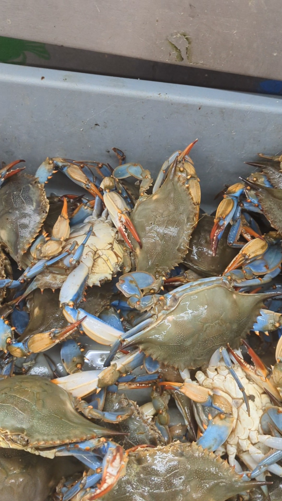

| | |
|---|---|
| Creator | 3steph14 |
| Licence | CC-BY-SA-4.0 |
| Attribution | 3steph14 · CC-BY-SA-4.0 · Wikimedia Commons |
| Source | https://commons.wikimedia.org/wiki/File:Blue_crab_at_a_USA_market.jpg |
| Size | 1000×1778, 411 KB |

- [ ] This is a photograph of this dish, and I would put it on the card.

### Fried Bolti · سمك بلطي مقلي

`samak-makli` · egyptian · `tilapia`, `flour`, `cumin`, `sunflower-oil`, `lemon`, `salt`

The fish Egypt actually eats, floured and deep fried. Grilled mullet and sayadeya are both in the catalogue; fried bolti is neither.

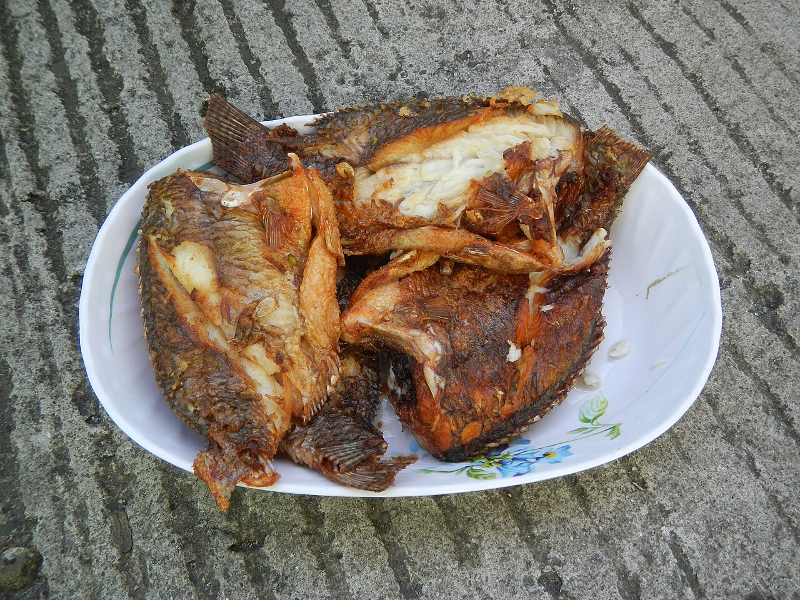

| | |
|---|---|
| Creator | Judgefloro |
| Licence | CC0-1.0 |
| Attribution | _none required_ |
| Source | https://commons.wikimedia.org/wiki/File:02036jfCuisine_of_Bulacanfvf_01.jpg |
| Size | 1000×750, 482 KB |

- [ ] This is a photograph of this dish, and I would put it on the card.

### Lupini Beans · ترمس

`termes` · egyptian · `lupini-beans`, `salt`, `water`, `lemon`

Four lines, no cooking beyond a long soak, and the lupini row has no recipe. Street food you eat out of a paper cone.

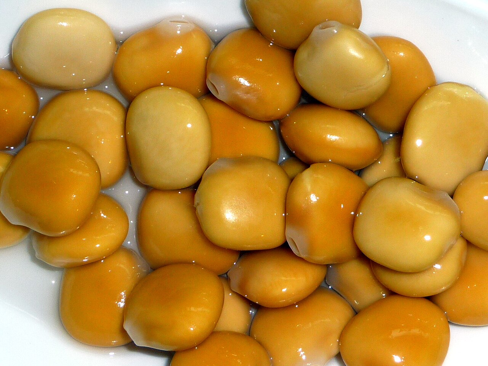

| | |
|---|---|
| Creator | Calapito |
| Licence | CC0-1.0 |
| Attribution | _none required_ |
| Source | https://commons.wikimedia.org/wiki/File:Lupinus_albus.JPG |
| Size | 1000×750, 216 KB |

- [ ] This is a photograph of this dish, and I would put it on the card.

### Boiled Eggs with Cumin and Salt · بيض مسلوق بالكمون

`beid-masloo2-bel-kammun` · egyptian · `eggs`, `cumin`, `salt`

Three lines. Breakfast is 37 recipes against 145 lunches, and this is what half of Egypt eats on the way to work.

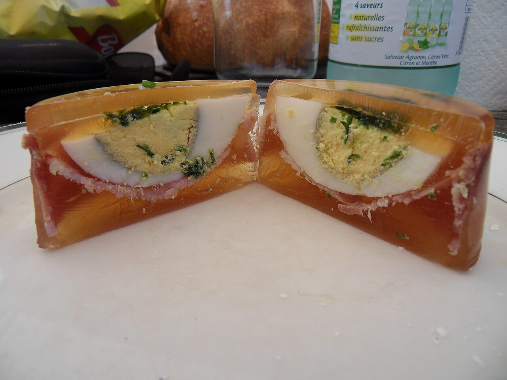

| | |
|---|---|
| Creator | Clément Bucco-Lechat |
| Licence | CC-BY-SA-3.0 |
| Attribution | Clément Bucco-Lechat · CC-BY-SA-3.0 · Wikimedia Commons |
| Source | https://commons.wikimedia.org/wiki/File:Aspic_ouvert_-_1.JPG |
| Size | 1000×750, 163 KB |

- [ ] This is a photograph of this dish, and I would put it on the card.

### Fried Cauliflower · قرنبيط مقلي

`arnabeet-makli` · egyptian · `cauliflower`, `flour`, `cumin`, `sunflower-oil`, `salt`

Five lines. The roasted cauliflower with tahini in the catalogue is a different dish in every respect but the vegetable.

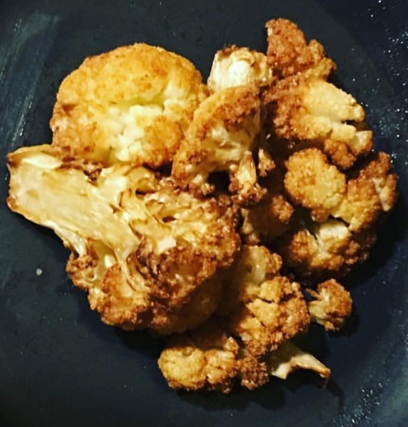

| | |
|---|---|
| Creator | Yallayallaletsgo |
| Licence | CC-BY-SA-4.0 |
| Attribution | Yallayallaletsgo · CC-BY-SA-4.0 · Wikimedia Commons |
| Source | https://commons.wikimedia.org/wiki/File:Israeli_fried_cauliflower.jpg |
| Size | 678×711, 164 KB |

- [ ] This is a photograph of this dish, and I would put it on the card.

### Artichokes in Oil and Lemon · أرضي شوكي بالزيت

`ardi-shoki-bel-zeit` · egyptian · `artichoke`, `olive-oil`, `lemon`, `garlic`, `coriander`, `salt`

Spring, and the artichoke row has no recipe.

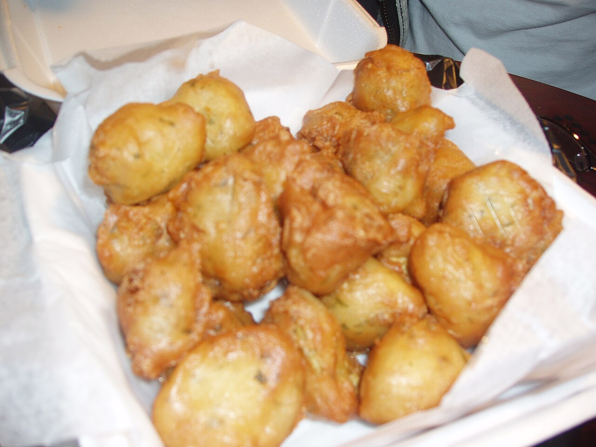

| | |
|---|---|
| Creator | Calbear22 |
| Licence | CC0-1.0 |
| Attribution | _none required_ |
| Source | https://commons.wikimedia.org/wiki/File:Fried_Artichoke_Hearts.JPG |
| Size | 1000×750, 171 KB |

- [ ] This is a photograph of this dish, and I would put it on the card.

### Chard and Lentils · سلق بالعدس

`selk-bel-3ads` · egyptian · `chard`, `lentils`, `onions`, `garlic`, `olive-oil`, `lemon`, `salt`

The chard row has no recipe. A thick pot rather than a soup, which is what separates it from the four lentil soups already here.

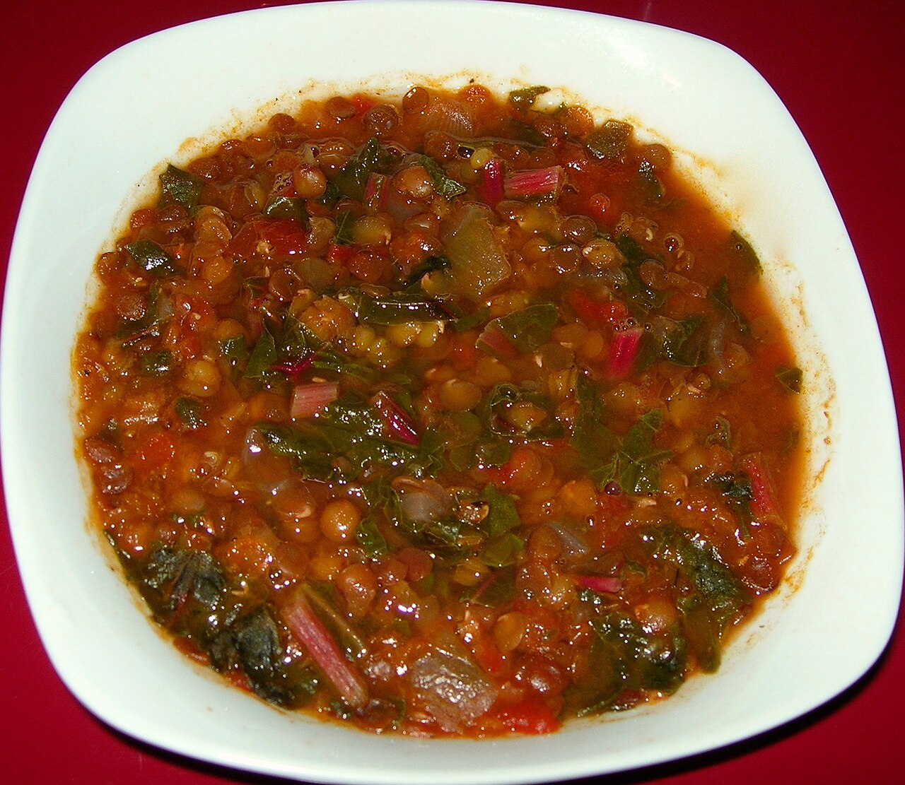

| | |
|---|---|
| Creator | Cajsa Lilliehook from Portland |
| Licence | CC-BY-SA-2.0 |
| Attribution | Cajsa Lilliehook from Portland · CC-BY-SA-2.0 · Wikimedia Commons |
| Source | https://commons.wikimedia.org/wiki/File:Red_Chard_and_Lentils_Soup_(10076154906).jpg |
| Size | 1000×868, 326 KB |

- [ ] This is a photograph of this dish, and I would put it on the card.

### Grilled Beef Kebab · كباب مشوي

`kabab-mashwi` · egyptian · `beef-cubes`, `onions`, `cumin`, `sunflower-oil`, `salt`

Chunks on a skewer, not mince. Five lines. Grilled kofta was searched for in batch 4 and found nothing; this is a different dish and a different search.

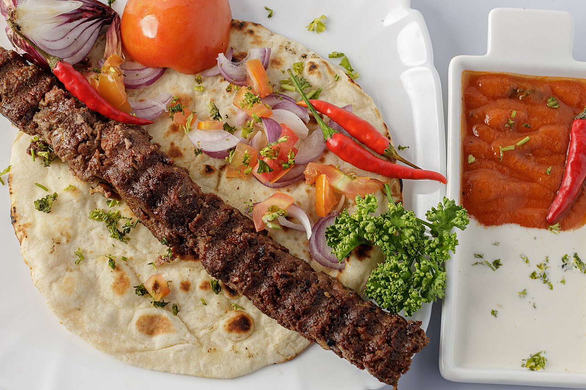

| | |
|---|---|
| Creator | Cyapoj |
| Licence | CC-BY-SA-4.0 |
| Attribution | Cyapoj · CC-BY-SA-4.0 · Wikimedia Commons |
| Source | https://commons.wikimedia.org/wiki/File:Beef_Kebab_and_Pita.jpg |
| Size | 1000×667, 314 KB |

- [ ] This is a photograph of this dish, and I would put it on the card.

### Stuffed Roast Chicken · فرخة محشية بالأرز

`farkha-mahshiya` · egyptian · `whole-chicken`, `rice`, `onions`, `butter`, `cinnamon`, `nuts-mix`, `salt`

The festive version of the bird already in the catalogue: stuffed with spiced rice rather than rubbed with cumin.

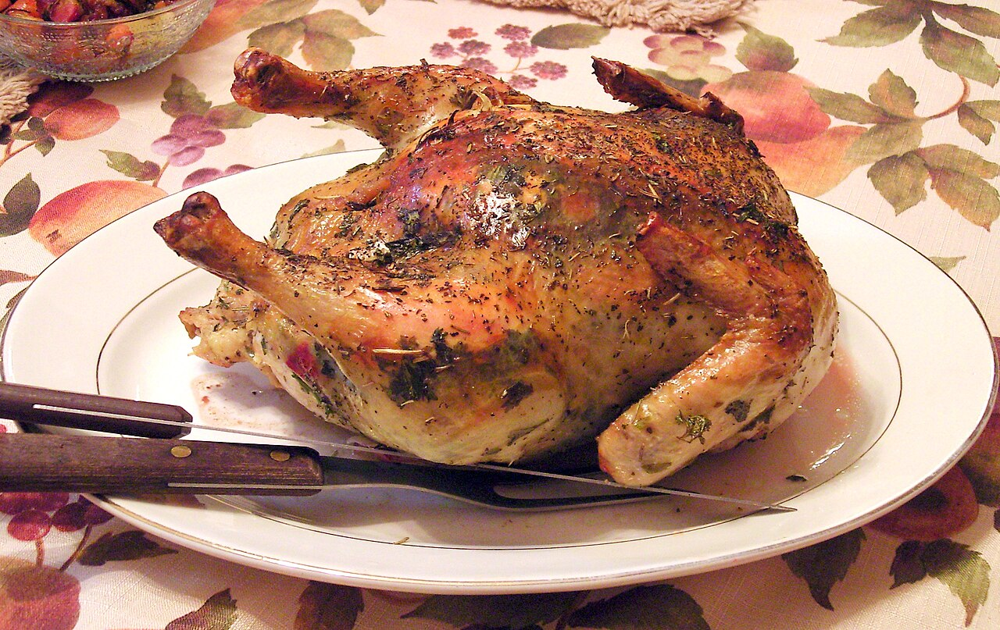

| | |
|---|---|
| Creator | James D Kirk |
| Licence | CC-BY-SA-2.0 |
| Attribution | James D Kirk · CC-BY-SA-2.0 · Wikimedia Commons |
| Source | https://commons.wikimedia.org/wiki/File:Stuffed_roast_chicken.jpg |
| Size | 1000×631, 338 KB |

- [ ] This is a photograph of this dish, and I would put it on the card.

### Beef Shawarma · شاورما لحمة

`beef-shawarma` · levantine · `beef-steak`, `onions`, `vinegar`, `cumin`, `cinnamon`, `garlic`, `salt`

Chicken shawarma is here; beef is the other half of every shawarma counter and a different marinade.

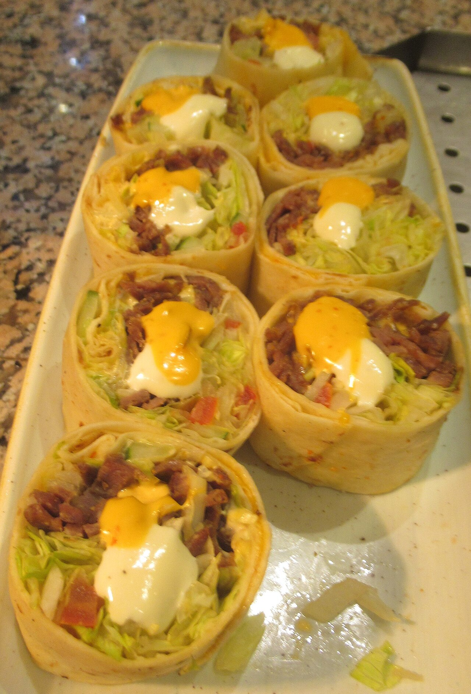

| | |
|---|---|
| Creator | P1898 |
| Licence | CC-BY-4.0 |
| Attribution | P1898 · CC-BY-4.0 · Wikimedia Commons |
| Source | https://commons.wikimedia.org/wiki/File:Beef_shawarma_Rice_servings.jpg |
| Size | 1000×1471, 493 KB |

- [ ] This is a photograph of this dish, and I would put it on the card.

### Sumac Chicken with Onions · مسخن

`dajaj-mosakhan` · levantine · `chicken-thigh`, `onions`, `sumac`, `olive-oil`, `baladi-bread`, `nuts-mix`

A kilo of onions, sumac and bread underneath to catch the juices. Nothing in the catalogue uses sumac as the main seasoning.

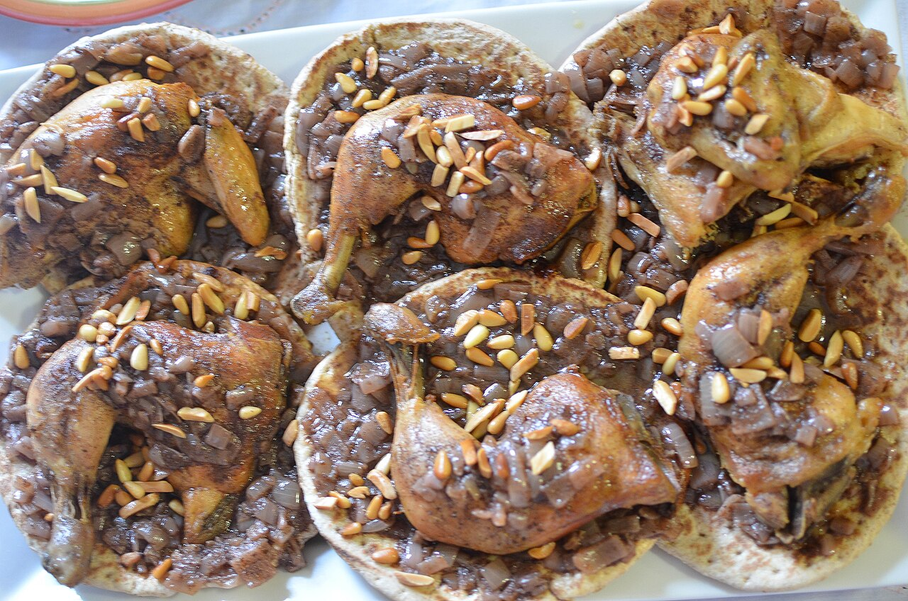

| | |
|---|---|
| Creator | Kokaly |
| Licence | CC-BY-SA-3.0 |
| Attribution | Kokaly · CC-BY-SA-3.0 · Wikimedia Commons |
| Source | https://commons.wikimedia.org/wiki/File:Mushakhan_Dish.jpg |
| Size | 1000×662, 344 KB |

- [ ] This is a photograph of this dish, and I would put it on the card.

### Lamb Curry · كاري ضاني

`lamb-curry` · indian · `lamb`, `onions`, `yogurt`, `curry-powder`, `ginger`, `garlic`, `salt`

Lamb again, from the other direction, and genuinely cooked in Egyptian homes.

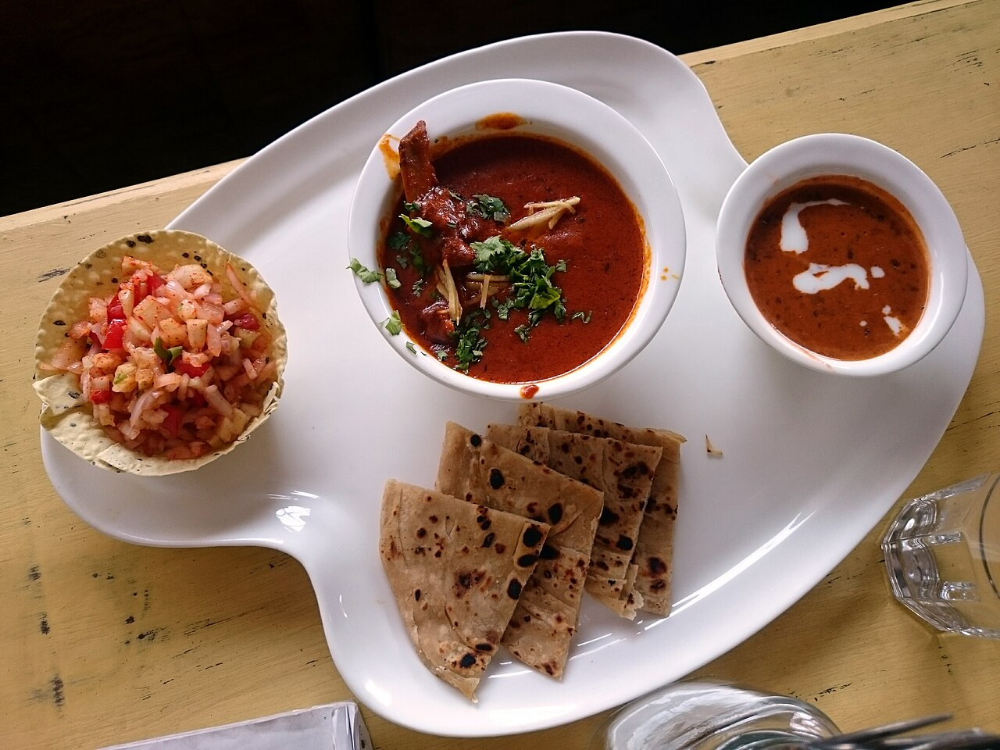

| | |
|---|---|
| Creator | Aashita Kawatra |
| Licence | CC-BY-SA-4.0 |
| Attribution | Aashita Kawatra · CC-BY-SA-4.0 · Wikimedia Commons |
| Source | https://commons.wikimedia.org/wiki/File:Rogan_josh-dal_makhani-lacha_parantha.jpg |
| Size | 1000×750, 234 KB |

- [ ] This is a photograph of this dish, and I would put it on the card.

### Fish Curry · كاري سمك

`fish-curry` · indian · `tilapia`, `coconut-milk`, `turmeric`, `ginger`, `garlic`, `coriander`, `salt`

Fish is 11 of 201 recipes. This one is a sauce rather than a grill or a bake.

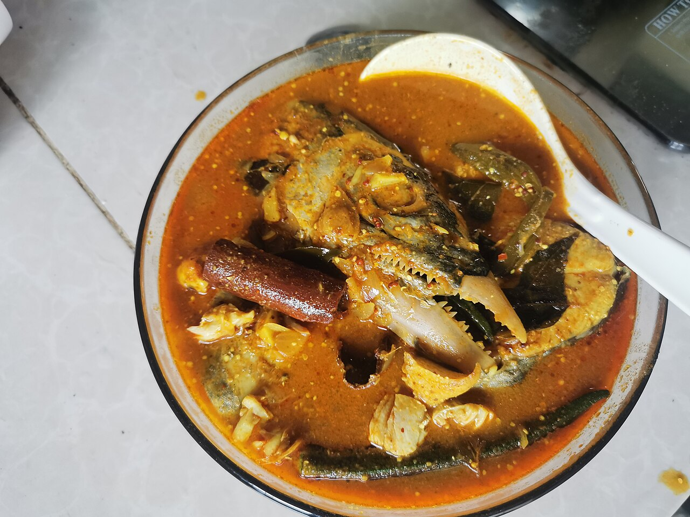

| | |
|---|---|
| Creator | Mdsheth1986 |
| Licence | CC-BY-SA-4.0 |
| Attribution | Mdsheth1986 · CC-BY-SA-4.0 · Wikimedia Commons |
| Source | https://commons.wikimedia.org/wiki/File:Kari_Ikan_Sri_Lanka.jpg |
| Size | 1000×750, 243 KB |

- [ ] This is a photograph of this dish, and I would put it on the card.

### Prawn and Garlic Pasta · مكرونة بالجمبري

`prawn-pasta` · italian · `pasta`, `shrimp`, `garlic`, `chili-flakes`, `olive-oil`, `parsley`, `salt`

Seafood and a weeknight pasta at the same time. The garlic prawns already here are a pan dish with no pasta in them.

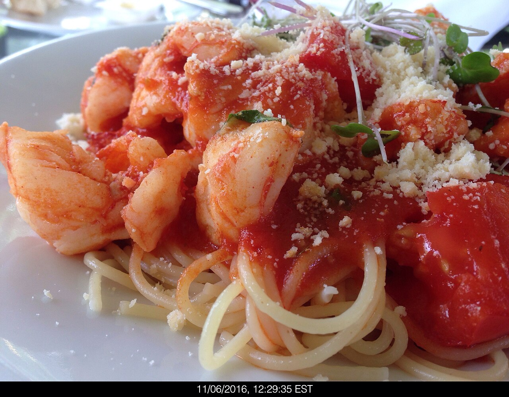

| | |
|---|---|
| Creator | FranHogan |
| Licence | CC-BY-SA-4.0 |
| Attribution | FranHogan · CC-BY-SA-4.0 · Wikimedia Commons |
| Source | https://commons.wikimedia.org/wiki/File:Shrimp_pasta.jpg |
| Size | 1000×781, 258 KB |

- [ ] This is a photograph of this dish, and I would put it on the card.

### Baked Fish with Potatoes · سمك بالبطاطس في الفرن

`baked-fish-potatoes` · mediterranean · `sea-bass`, `potatoes`, `lemon`, `olive-oil`, `garlic`, `oregano`, `salt`

One tray, fish and its side together. Distinct from the sayadeya rice and from the grilled bream.

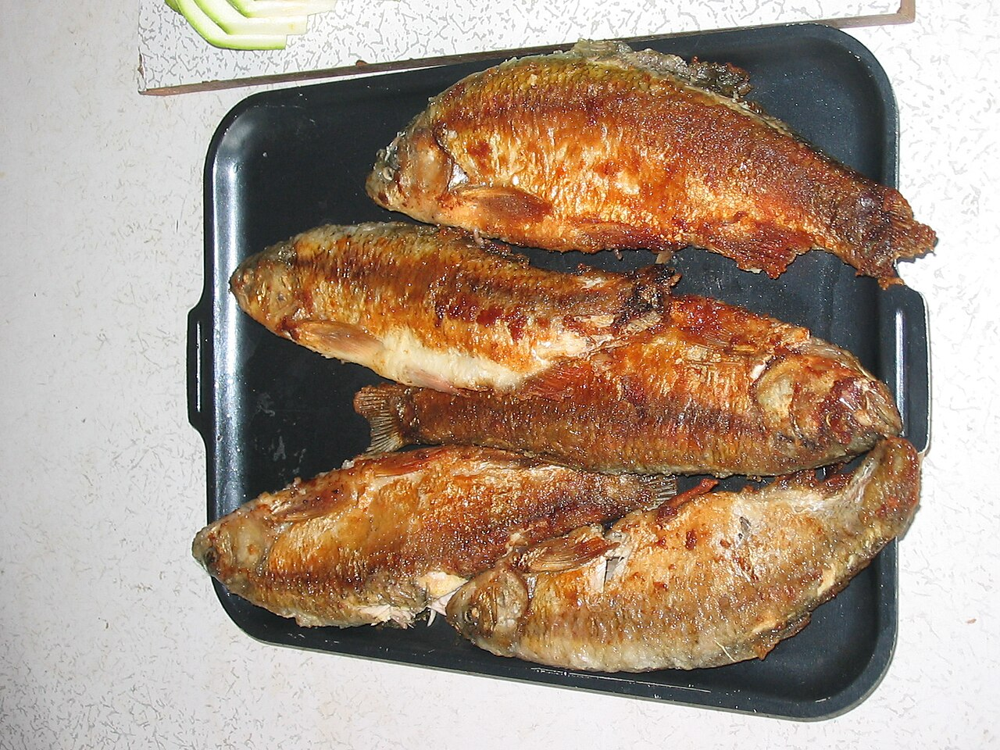

| | |
|---|---|
| Creator | Игоревич |
| Licence | CC0-1.0 |
| Attribution | _none required_ |
| Source | https://commons.wikimedia.org/wiki/File:Roasted_roach.jpg |
| Size | 1000×750, 382 KB |

- [ ] This is a photograph of this dish, and I would put it on the card.

### Barley and Vegetable Soup · شوربة شعير بالخضار

`shorbet-sha3eer` · mediterranean · `barley`, `carrots`, `celery`, `onions`, `stock-cube`, `water`, `salt`

Cheap, filling, keeps for days, and the barley row has no recipe.

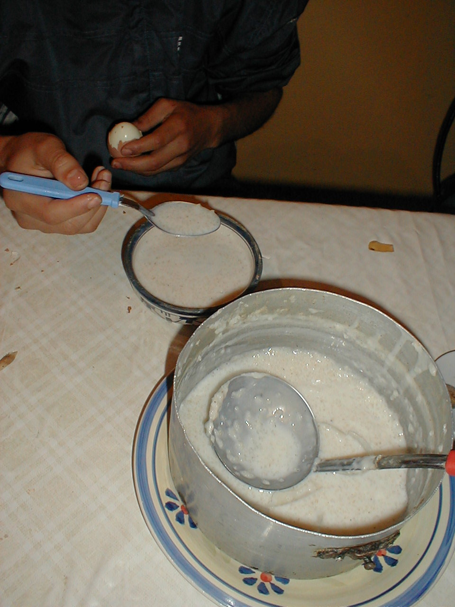

| | |
|---|---|
| Creator | Lucyin |
| Licence | CC-BY-SA-4.0 |
| Attribution | Lucyin · CC-BY-SA-4.0 · Wikimedia Commons |
| Source | https://commons.wikimedia.org/wiki/File:Ary-7sowa.jpg |
| Size | 960×1280, 319 KB |

- [ ] This is a photograph of this dish, and I would put it on the card.

### No acceptable image (10)

These keep nothing. A generic photograph of something else is not a
substitute — it tells the user something false about what they are cooking.

| Dish | Why |
|---|---|
| Prawns in Tomato Sauce (`gambari-bel-salsa`) | no relevant openly-licensed image found |
| Hot Chickpeas with Cumin (`hommos-el-sham`) | no relevant openly-licensed image found |
| Purslane with Garlic (`rigla-bel-zeit`) | no relevant openly-licensed image found |
| Turnips with Beef (`lift-bel-lahma`) | no relevant openly-licensed image found |
| Braised Cabbage with Beef (`koronb-bel-lahma`) | no relevant openly-licensed image found |
| Spinach with Beef (`sabanekh-bel-lahma`) | no relevant openly-licensed image found |
| Roqaq Pie with Minced Beef (`roqaq-bel-lahma`) | no relevant openly-licensed image found |
| Kofta Baked in Tahini (`kofta-bel-tahina`) | no relevant openly-licensed image found |
| Lamb Tagine with Apricots (`lamb-tagine-apricot`) | no relevant openly-licensed image found |
| Spinach and Ricotta Pasta (`spinach-ricotta-pasta`) | no relevant openly-licensed image found |

